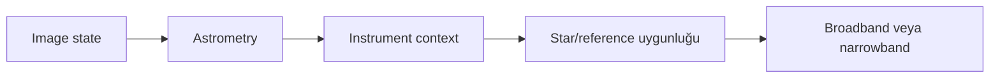
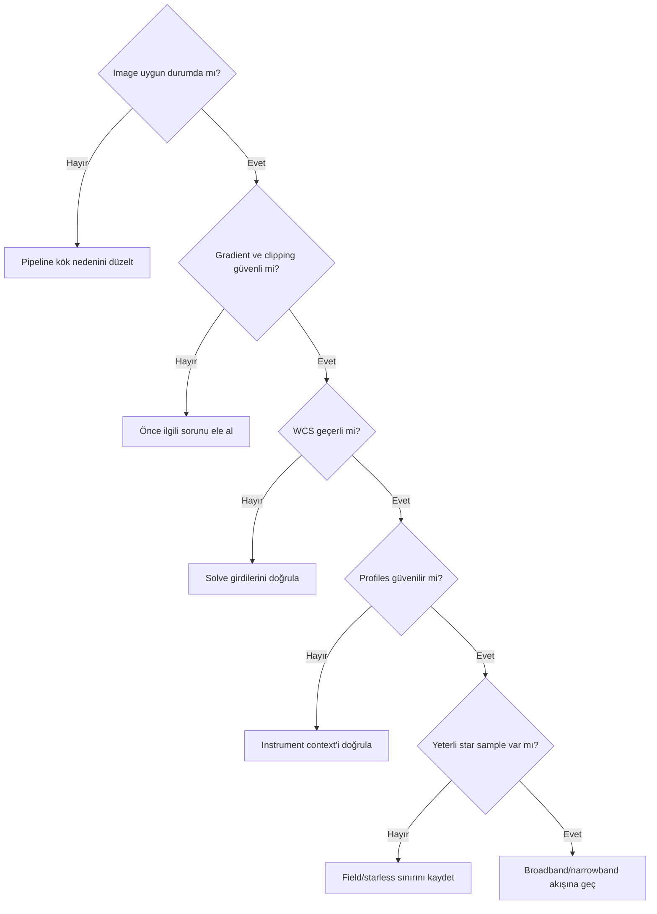
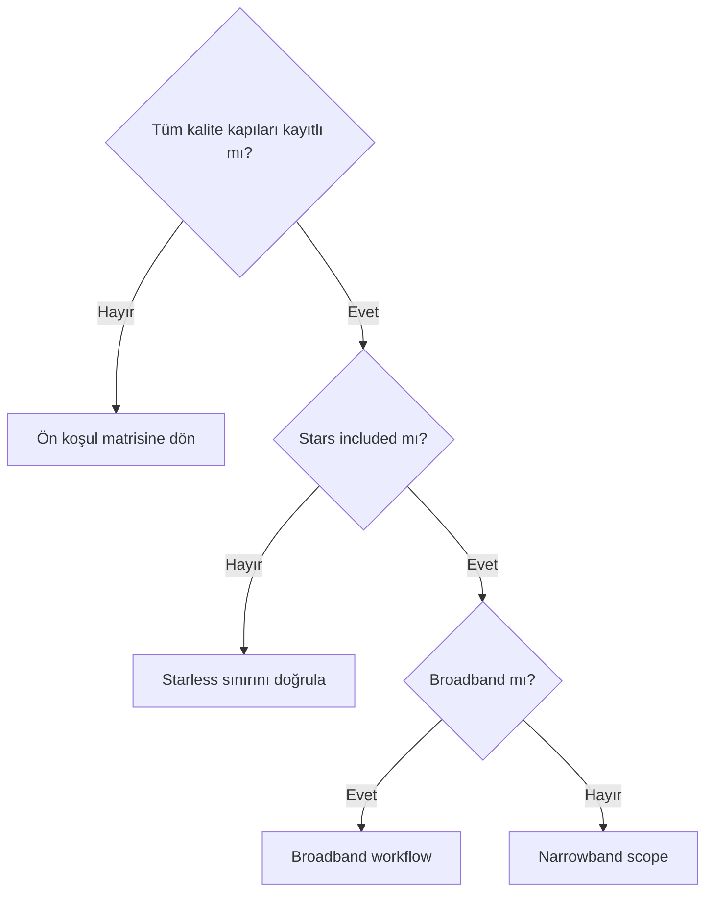

# SPCC Ön Koşulları

## Amaç

SPCC öncesinde image state, astrometry, instrument profile ve reference uygunluğunu process reçetesi vermeden denetlemek.

## Kavramsal açıklama

Ön koşullar sonuç garantisi değil, belirsizliği azaltan kalite kapılarıdır. Exact SPCC input kabulü, linear/nonlinear davranışı, CFA/starless desteği ve fallback mekanizmaları PixInsight 1.9.3 üzerinde doğrulanmalıdır.

## Ön koşullar

| Kontrol | Neden önemlidir? | Eksikse olası sonuç | Doğrulama yöntemi |
| --- | --- | --- | --- |
| Linear/nonlinear state | Channel ilişkisinin yorumlanması | İş Akışı belirsizliği | History ve histogram; exact UI bekliyor |
| Debayer/CFA state | OSC channel üretimi | Yanlış channel interpretation | CFA metadata ve pipeline |
| Mono RGB combination | SPCC input yapısı | Eksik/yanlış channels | Channel names/dimensions |
| Stars included | Catalog sample olasılığı | Match/sample yetersizliği | Star population |
| Channel clipping | Renk bilgisi kaybı | Geri kurulamaz sample color | Histogram/readout |
| Saturation | Star sample kalitesi | Rejection veya bias | Star maxima/log |
| Gradient | Spatial color değişimi | Reference/response bias | Background maps |
| Calibration artefact | Instrument dışı patern | Yanlış color sonucu | Masters ve diagnostics |
| Channel alignment | Aynı source ölçümü | Color fringe/mismatch | Registration kontrolü |
| Geçerli WCS | Image-sky ilişki | Query/match hatası | WCS overlay/solve log |
| Target coordinates | Solve başlangıç bağlamı | Yanlış sky field | Header/solver |
| Plate scale | Search scale bağlamı | Catalog/image mismatch | WCS scale |
| Focal length/pixel size | Başlangıç scale tahmini | Yanıltıcı solve input | Acquisition records |
| Sensor profile | Detector response bağlamı | Generic/yanlış model riski | Profile kaynağı ve UI |
| Filter set/profile | Passband bağlamı | Response mismatch | Filter records/profile |
| Optical train | Toplam response bağlamı | Eksik instrument modeli | Acquisition log |
| Star sample sayısı | Response tahmini | Kararsız/yetersiz sample | Detection/match log |
| Dust/crowding/field | Reference bias riski | Seçim/rejection etkisi | Image ve log |
| Data scope | Broadband/narrowband ayrımı | Yanlış hedef beklentisi | Channel/filter kaydı |

Astrometric çözüm için target coordinates, WCS, plate scale, focal length, pixel size, image dimensions ve observation metadata farklı roller oynayabilir; hiçbir alan exact UI doğrulaması olmadan evrensel zorunlu sayılmaz. Geçerli WCS bazı acquisition alanlarından daha doğrudan olabilir.

Sensor/camera, filter transmission, optical train ve OSC CFA response instrument context'i oluşturur. Generic response seçeneği varsa exact davranışı ve sınırlaması doğrulanmalıdır. Reference uygunluğu star density, saturation, crowding, galaxy/nebula dominance, dust extinction ve field size ile değişebilir.

## Ne zaman değerlendirilir?

- Her SPCC denemesinden önce
- Input, solve, profile veya star sample hatasında
- Broadband ve narrowband pipeline ayrılırken

## Ne zaman tek başına yeterli değildir?

- Process UI/default davranışını kanıtlamak için
- Gerçek response modelini doğrulamak için
- Görsel olarak iyi sonucu teknik kabul saymak için

## Uygulama veya teşhis yaklaşımı

1. Image state ve channel integrity'yi kaydedin.
2. Gradient/calibration artefact/clipping'i kontrol edin.
3. WCS ve image scale'i doğrulayın.
4. Sensor/filter/optical context'in kaynağını kaydedin.
5. Star/reference population'ı inceleyin.
6. Broadband/narrowband/starless kapsamına göre sonraki sayfaya geçin.

## Gerçek kullanım senaryosu

OSC broadband master için CFA/debayer geçmişi, WCS, clipping, gradient, sensor/filter context ve star sample logu toplanır. Process çalıştırılmış veya başarılı sayılmaz; `SPCC-BB-OSC-01` bekler.

## Görsel planı

!!! example "Görsel doğrulama ölçütü — astrometri ve WCS"
    **PixInsight sürümü:** 1.9.3  
    **Target veya veri:** Solved broadband master  
    **Ekran veya çıktı:** WCS/metadata ve astrometry alanı  
    **Kanıtlanacak konu:** Exact astrometry UI ile geçerli solution kanıtı  
    **Önerilen dosya adı:** `spcc-193-astrometry-wcs-v01.png`

!!! example "Görsel doğrulama ölçütü — cihaz profilleri"
    **PixInsight sürümü:** 1.9.3  
    **Target veya veri:** Mono LRGB ve OSC örnekleri  
    **Ekran veya çıktı:** Sensor ve filter profile seçim ekranları  
    **Kanıtlanacak konu:** Database/profile seçeneklerinin exact adları ve eşleşmesi  
    **Önerilen dosya adı:** `spcc-193-sensor-filter-profiles-v01.png`

## Ön kontrol kabul matrisi

| Girdi | Kabul kanıtı | Başarısızlıkta yapılacak |
|---|---|---|
| WCS | Star overlay alan boyunca uyumlu | ImageSolver ile metadata’yı düzelt |
| Pixel size/focal length | Scale ile measured field uyumlu | Acquisition değerlerini doğrula |
| Gaia DR3/SP | Database seçili ve query log başarılı | Kurulum/path ve coverage kontrolü |
| Filter profile | Gerçek passband ile eşleşiyor | Custom curve veya güvenilir profile |
| Sensor QE | Kamera/sensor modeliyle eşleşiyor | Generic profile riskini belgeleyin |
| Stars | Unsaturated ve alana dağılmış samples | Clipping/detection sorununu çöz |

## Sık yapılan hatalar

1. Yanlış WCS'yi geçerli kabul etmek.
2. Focal length/pixel size değerlerini evrensel zorunluluk saymak.
3. Clipped stars'ı reference population'a dahil etmek.
4. Generic profile riskini kaydetmemek.
5. Starless ve narrowband kapsamını broadband ile karıştırmak.

## Sorun giderme

| Belirti | İlk kontrol | Sonraki adım |
| --- | --- | --- |
| Scale mismatch | WCS/plate scale | Metadata ve solve |
| Profiles yok | Instrument kayıtları | UI/database doğrulaması |
| Star sample az | Saturation/field | Log ve source population |
| Color gradient | Background maps | Gradient diagnostics |
| Starless input | İş Akışı hedefi | Stars-included alternatifini değerlendir |

## SSS

??? question "Linear image zorunlu mu?"
    Exact SPCC requirement bekliyor; stretch öncesi veri genel workflow açısından daha uygun olabilir.
??? question "WCS varsa focal length gerekir mi?"
    Fallback ve zorunluluk process/sürüm bazında doğrulanmalıdır.
??? question "Generic response güvenilir mi?"
    Exact seçenek ve sınırları gerçek UI/data testi gerektirir.
??? question "Starless data neden riskli?"
    Catalog star samples'ı bulunmayabilir; exact process davranışı bekliyor.
??? question "Gradient SPCC ile giderilir mi?"
    Hayır; gradient modeling ayrı işlemdir.

## Hızlı Referans

!!! tip "Tek sayfalık kontrol listesi"
    - [ ] Image/CFA/RGB state kaydedildi
    - [ ] Gradient, artefact, clipping kontrol edildi
    - [ ] WCS ve scale geçerli
    - [ ] Profiles kaynaklı ve güvenilir
    - [ ] Star population değerlendirildi
    - [ ] Scope ayrıldı

## Karar Ağacı

## Teknik doğrulama durumu

| Kategori | Durum |
| --- | --- |
| UI-6 | Input, astrometry ve profile fields bekliyor |
| DOC-6 | Input acceptance ve fallback bekliyor |
| DATA-6 | OSC/LRGB/narrowband prerequisites testleri bekliyor |
| IMG-6 | Astrometry/profile görselleri bekliyor |

## İlgili bölümler

- [SPCC Ana Referans](spcc.md)
- [SPCC Broadband](spcc-broadband.md)
- [SPCC Narrowband](spcc-narrowband.md)
- [Gradient Diagnostics](../04-gradient/gradient-diagnostics.md)
