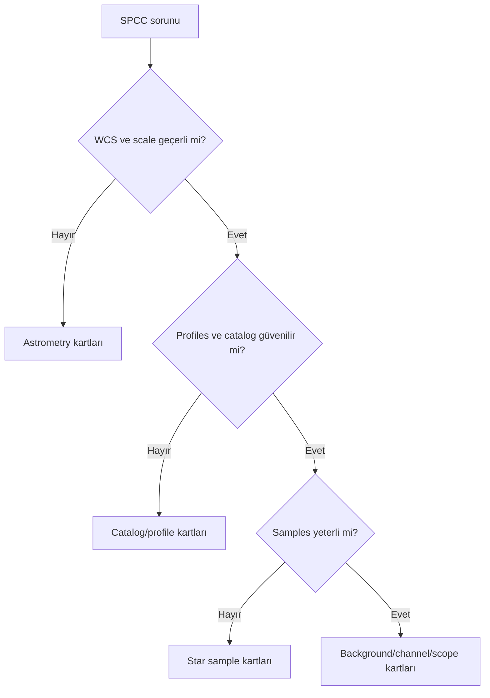
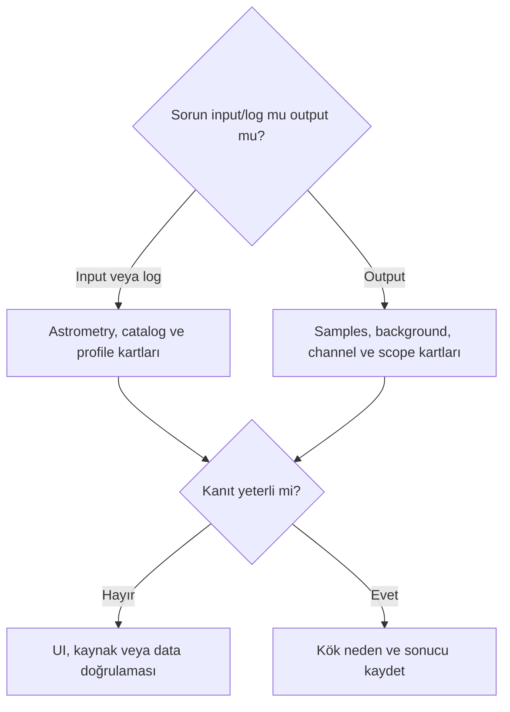

# SPCC Sorun Giderme

## Amaç

SPCC hata, output ve yorumlama sorunlarını astrometry, metadata, catalog, instrument profile, star sample, background, channel response, narrowband scope, display ve process comparison sınıflarına ayırmak.

## Kavramsal açıklama

Kartlar kesin parametre reçetesi vermez. Sıra: input sınıfı → astrometry/metadata → catalog/profiles → samples → gradient/clipping → output/log → gerçek veri kaydı.

## Hata sınıfları

| Sınıf | Kartlar |
| --- | --- |
| Astrometry | 1, 2, 10–13, 27 |
| Metadata | 10–13 |
| Catalog | 3, 4, 27 |
| Instrument profile | 7–9 |
| Star sample | 5, 6, 18, 19, 25 |
| Background | 20–23, 28 |
| Channel response | 14–19, 29 |
| Narrowband scope | 15, 24, 25 |
| Display interpretation | 14–17, 28 |
| İşlem comparison | 30 |

```mermaid
flowchart LR
    error["SPCC belirti veya log"] --> class["Hata sınıfı"]
    class --> input["Input ve astrometry"]
    input --> profiles["Catalog ve profiles"]
    profiles --> samples["Star samples"]
    samples --> output["Output ve display"]
    output --> record["Kanıt kaydı"]
```

## Ön koşullar

- Original input, process instance veya UI state, tam log ve output
- WCS/metadata, profile ve star sample kayıtları
- Aynı display koşulunda channel statistics

## Ne zaman değerlendirilir?

SPCC çalışmadığında, log uyarısı verdiğinde veya output stars/target/background üzerinde şüpheli olduğunda.

## Ne zaman tek başına yeterli değildir?

UI/documentation doğrulaması, acquisition kök nedeni veya gerçek data A-B testi yerine geçmez.

## Uygulama veya teşhis yaklaşımı

1. İlk belirtiyi ve ilk log hatasını kaydedin.
2. İlgili sınıf/kartı seçin.
3. Astrometry, profile, samples, gradient ve clipping sırasını koruyun.
4. Original/output/log kanıtını saklayın.
5. Doğrulanmamış UI çözümü veya değer kullanmayın.



## 1. Astrometric solution bulunamadı

**Belirti:** Geçerli WCS algılanmaz.  
**Muhtemel nedenler:** WCS eksik/bozuk olabilir.  
**Önce kontrol et:** Header, WCS ve solve logu.  
**Olası müdahaleler:** Astrometry girdilerini doğrula.  
**Yapılmaması gerekenler:** Rastgele coordinates yazma.  
**Doğrulama yöntemi:** WCS overlay ve solve logu.  
**İlgili bölüm:** [İlgili sayfa](spcc-prerequisites.md)  
**UI veya kaynak durumu:** 1.9.3 WCS davranışı bekliyor.

## 2. Plate solve başarısız

**Belirti:** Image sky coordinates'e çözülemez.  
**Muhtemel nedenler:** Scale/coordinates/field hatası olabilir.  
**Önce kontrol et:** WCS, plate scale ve target field.  
**Olası müdahaleler:** Solver girdilerini kontrollü test et.  
**Yapılmaması gerekenler:** Sabit focal length reçetesi verme.  
**Doğrulama yöntemi:** Solve log ve catalog overlay.  
**İlgili bölüm:** [İlgili sayfa](spcc-prerequisites.md)  
**UI veya kaynak durumu:** Solver fallback bekliyor.

## 3. Catalog query başarısız

**Belirti:** Catalog kaynakları alınamaz.  
**Muhtemel nedenler:** WCS, query, erişim veya catalog sorunu.  
**Önce kontrol et:** Log, sky field ve bağlantı durumu.  
**Olası müdahaleler:** Kök nedeni logdan sınıflandır.  
**Yapılmaması gerekenler:** Catalog adı uydurma.  
**Doğrulama yöntemi:** Query log ve tekrar üretim.  
**İlgili bölüm:** [İlgili sayfa](spcc.md)  
**UI veya kaynak durumu:** Catalog options bekliyor.

## 4. Yetersiz yıldız eşleşmesi

**Belirti:** Match/sample sayısı yetersiz görünür.  
**Muhtemel nedenler:** WCS, low density, crowding veya detection.  
**Önce kontrol et:** Catalog overlay ve source listesi.  
**Olası müdahaleler:** Field ve detection kanıtını incele.  
**Yapılmaması gerekenler:** Threshold reçetesi verme.  
**Doğrulama yöntemi:** Matched/unmatched overlay.  
**İlgili bölüm:** [İlgili sayfa](spcc-prerequisites.md)  
**UI veya kaynak durumu:** Detection davranışı bekliyor.

## 5. Yıldız örnekleri reddedildi

**Belirti:** Samples logda reddedilir.  
**Muhtemel nedenler:** Saturation, shape, measurement veya model.  
**Önce kontrol et:** Rejection log ve star cores.  
**Olası müdahaleler:** Sample population'ı sınıflandır.  
**Yapılmaması gerekenler:** Rejection control adı uydurma.  
**Doğrulama yöntemi:** Log ve star cutouts.  
**İlgili bölüm:** [İlgili sayfa](spcc.md)  
**UI veya kaynak durumu:** Rejection algoritması bekliyor.

## 6. Saturated stars nedeniyle düşük örnek sayısı

**Belirti:** Bright cores ölçüme katılmaz görünebilir.  
**Muhtemel nedenler:** Acquisition clipping/saturation.  
**Önce kontrol et:** Channel maxima ve log.  
**Olası müdahaleler:** Unclipped population'ı değerlendir.  
**Yapılmaması gerekenler:** Clipped bilgiyi SPCC ile onarma.  
**Doğrulama yöntemi:** Readout, histogram ve log.  
**İlgili bölüm:** [İlgili sayfa](spcc-broadband.md)  
**UI veya kaynak durumu:** Exact rejection bekliyor.

## 7. Sensor profile bulunamadı

**Belirti:** Sensor eşleşmesi yoktur.  
**Muhtemel nedenler:** Database kapsamı/metadata farklı olabilir.  
**Önce kontrol et:** Camera/sensor kaydı ve UI.  
**Olası müdahaleler:** Profile kaynağını doğrula.  
**Yapılmaması gerekenler:** Yakın modeli eşdeğer sayma.  
**Doğrulama yöntemi:** UI/database ve acquisition log.  
**İlgili bölüm:** [İlgili sayfa](spcc-prerequisites.md)  
**UI veya kaynak durumu:** Sensor database bekliyor.

## 8. Filter profile bulunamadı

**Belirti:** Filter set eşleşmesi yoktur.  
**Muhtemel nedenler:** Profile/database adı veya passband eksik.  
**Önce kontrol et:** Filter records ve UI.  
**Olası müdahaleler:** Transmission kaynağını doğrula.  
**Yapılmaması gerekenler:** Profile davranışı uydurma.  
**Doğrulama yöntemi:** UI ve filter documentation.  
**İlgili bölüm:** [İlgili sayfa](spcc-prerequisites.md)  
**UI veya kaynak durumu:** Filter database bekliyor.

## 9. Generic response kullanımı şüphesi

**Belirti:** Output generic modelle ilişkili olabilir.  
**Muhtemel nedenler:** Exact profile bulunmamış olabilir.  
**Önce kontrol et:** Log ve selected response context.  
**Olası müdahaleler:** Generic/profile A-B testi planla.  
**Yapılmaması gerekenler:** Generic modeli gerçek instrument sayma.  
**Doğrulama yöntemi:** Log, profiles ve output kıyası.  
**İlgili bölüm:** [İlgili sayfa](spcc.md)  
**UI veya kaynak durumu:** Fallback davranışı bekliyor.

## 10. Yanlış focal length

**Belirti:** Scale tahmini tutarsızdır.  
**Muhtemel nedenler:** Acquisition metadata hatalıdır.  
**Önce kontrol et:** WCS plate scale ve header.  
**Olası müdahaleler:** Geçerli astrometry ile karşılaştır.  
**Yapılmaması gerekenler:** Alanı evrensel zorunlu sayma.  
**Doğrulama yöntemi:** Solve log ve scale ölçümü.  
**İlgili bölüm:** [İlgili sayfa](spcc-prerequisites.md)  
**UI veya kaynak durumu:** Metadata fallback bekliyor.

## 11. Yanlış pixel size

**Belirti:** Image scale tahmini tutarsızdır.  
**Muhtemel nedenler:** Header/acquisition değeri hatalıdır.  
**Önce kontrol et:** WCS scale ve sensor record.  
**Olası müdahaleler:** Kaynak kaydı düzeltip solve test et.  
**Yapılmaması gerekenler:** Tahmini değer girme.  
**Doğrulama yöntemi:** Before/after solve logu.  
**İlgili bölüm:** [İlgili sayfa](spcc-prerequisites.md)  
**UI veya kaynak durumu:** Fallback bekliyor.

## 12. Yanlış target coordinates

**Belirti:** Yanlış sky field sorgulanır.  
**Muhtemel nedenler:** Coordinates/header hatası olabilir.  
**Önce kontrol et:** WCS footprint ve target.  
**Olası müdahaleler:** Sky position kaynağını doğrula.  
**Yapılmaması gerekenler:** Görsel tahminle koordinat üretme.  
**Doğrulama yöntemi:** Catalog overlay.  
**İlgili bölüm:** [İlgili sayfa](spcc-prerequisites.md)  
**UI veya kaynak durumu:** Coordinate kullanım davranışı bekliyor.

## 13. Eski veya bozuk WCS metadata

**Belirti:** Overlay image ile uyuşmaz.  
**Muhtemel nedenler:** Transform stale/corrupt olabilir.  
**Önce kontrol et:** Stars ile WCS overlay.  
**Olası müdahaleler:** Astrometry'yi yeniden doğrula.  
**Yapılmaması gerekenler:** WCS varlığını geçerlilik sayma.  
**Doğrulama yöntemi:** Residual/overlay ve solve logu.  
**İlgili bölüm:** [İlgili sayfa](spcc-prerequisites.md)  
**UI veya kaynak durumu:** WCS acceptance bekliyor.

## 14. SPCC sonrası görüntü yeşil

**Belirti:** Global veya spatial green cast görülür.  
**Muhtemel nedenler:** Profile, gradient, CFA veya display.  
**Önce kontrol et:** Original/output maps ve STF.  
**Olası müdahaleler:** Kök nedeni response/gradient/display olarak ayır.  
**Yapılmaması gerekenler:** Tek channel scaling reçetesi verme.  
**Doğrulama yöntemi:** Channels, log ve background map.  
**İlgili bölüm:** [İlgili sayfa](spcc-broadband.md)  
**UI veya kaynak durumu:** Gerçek data testi bekliyor.

## 15. SPCC sonrası görüntü kırmızı

**Belirti:** Red dominance görülür.  
**Muhtemel nedenler:** Profile, target, mapping veya display.  
**Önce kontrol et:** Broadband/narrowband scope ve channels.  
**Olası müdahaleler:** Scope ve instrument context'i doğrula.  
**Yapılmaması gerekenler:** Narrowband palette'i calibration sanma.  
**Doğrulama yöntemi:** Original/output/log.  
**İlgili bölüm:** [İlgili sayfa](spcc-narrowband.md)  
**UI veya kaynak durumu:** Gerçek data testi bekliyor.

## 16. SPCC sonrası görüntü mavi

**Belirti:** Blue dominance görülür.  
**Muhtemel nedenler:** Response, extinction, gradient veya display.  
**Önce kontrol et:** Profiles, stars ve spatial maps.  
**Olası müdahaleler:** Log/model ve display'i karşılaştır.  
**Yapılmaması gerekenler:** White reference değeri uydurma.  
**Doğrulama yöntemi:** Channel statistics ve log.  
**İlgili bölüm:** [İlgili sayfa](spcc-broadband.md)  
**UI veya kaynak durumu:** Gerçek data testi bekliyor.

## 17. SPCC sonrası görüntü soluk

**Belirti:** Saturation düşük görünür.  
**Muhtemel nedenler:** Relative scaling veya STF/rendering.  
**Önce kontrol et:** STF, statistics ve original.  
**Olası müdahaleler:** Display etkisini pixel değişiminden ayır.  
**Yapılmaması gerekenler:** Color grading ile sonucu gizleme.  
**Doğrulama yöntemi:** Equal-display comparison.  
**İlgili bölüm:** [İlgili sayfa](spcc-broadband.md)  
**UI veya kaynak durumu:** Gerçek data testi bekliyor.

## 18. Yıldız renkleri kayboldu

**Belirti:** Stars color diversity azalır.  
**Muhtemel nedenler:** Clipping, saturation, sample/model veya processing.  
**Önce kontrol et:** Star cores, log ve history.  
**Olası müdahaleler:** Unclipped stars ile kıyasla.  
**Yapılmaması gerekenler:** Kayıp bilgiyi SPCC'ye yükleme.  
**Doğrulama yöntemi:** Star cutouts ve channel readout.  
**İlgili bölüm:** [İlgili sayfa](spcc-broadband.md)  
**UI veya kaynak durumu:** Sample behavior bekliyor.

## 19. Yıldız çekirdekleri beyaz

**Belirti:** Star cores tüm channels'da clipped görünür.  
**Muhtemel nedenler:** Acquisition/processing saturation.  
**Önce kontrol et:** Channel maxima.  
**Olası müdahaleler:** Clipping kök nedenini kaydet.  
**Yapılmaması gerekenler:** SPCC'nin bilgiyi geri getirdiğini iddia etme.  
**Doğrulama yöntemi:** Histogram/readout.  
**İlgili bölüm:** [İlgili sayfa](spcc-broadband.md)  
**UI veya kaynak durumu:** Gerçek data testi bekliyor.

## 20. Background renkli kaldı

**Belirti:** Spatial veya global color görülür.  
**Muhtemel nedenler:** Gradient, gerçek sky veya reference.  
**Önce kontrol et:** Background maps ve previews.  
**Olası müdahaleler:** Gradient ve neutrality'yi ayrı değerlendir.  
**Yapılmaması gerekenler:** SPCC'yi gradient removal sayma.  
**Doğrulama yöntemi:** Spatial channel maps.  
**İlgili bölüm:** [İlgili sayfa](background-neutrality.md)  
**UI veya kaynak durumu:** Background controls bekliyor.

## 21. Background aşırı nötrleşti

**Belirti:** Sky color/diffuse signal azalır.  
**Muhtemel nedenler:** Yanlış reference veya over-neutralization.  
**Önce kontrol et:** Reference region ve target.  
**Olası müdahaleler:** Original/model/output kıyası yap.  
**Yapılmaması gerekenler:** RGB'yi sıfıra zorlamayı doğru sayma.  
**Doğrulama yöntemi:** Preview statistics ve difference.  
**İlgili bölüm:** [İlgili sayfa](background-neutrality.md)  
**UI veya kaynak durumu:** Exact statistics bekliyor.

## 22. Galaxy halo rengi değişti

**Belirti:** Outer halo hue/level değişir.  
**Muhtemel nedenler:** Gradient/reference/model contamination.  
**Önce kontrol et:** Halo mask, profiles ve background.  
**Olası müdahaleler:** Signal preservation testi planla.  
**Yapılmaması gerekenler:** Halo'yu background sayma.  
**Doğrulama yöntemi:** Original/output/difference.  
**İlgili bölüm:** [İlgili sayfa](spcc-broadband.md)  
**UI veya kaynak durumu:** M31 testi bekliyor.

## 23. Reflection nebula rengi bastırıldı

**Belirti:** Diffuse reflected color azalır.  
**Muhtemel nedenler:** Reference, gradient veya stellar model mismatch.  
**Önce kontrol et:** Nebula extent ve model.  
**Olası müdahaleler:** Target/background ayrımını yeniden kur.  
**Yapılmaması gerekenler:** Nebulayı neutral background sayma.  
**Doğrulama yöntemi:** Original/output/model.  
**İlgili bölüm:** [İlgili sayfa](spcc-broadband.md)  
**UI veya kaynak durumu:** Gerçek data testi bekliyor.

## 24. Narrowband nebula rengi anlamsız görünüyor

**Belirti:** SHO/HOO palette beklenmedik görünür.  
**Muhtemel nedenler:** Mapping, SNR veya scope karışıklığı.  
**Önce kontrol et:** Channel masters ve palette history.  
**Olası müdahaleler:** SPCC scope ile grading'i ayır.  
**Yapılmaması gerekenler:** SPCC'yi palette generator sayma.  
**Doğrulama yöntemi:** Channels/log/output.  
**İlgili bölüm:** [İlgili sayfa](spcc-narrowband.md)  
**UI veya kaynak durumu:** NB UI/model bekliyor.

## 25. Starless görüntüde sonuç alınamadı

**Belirti:** Process sample/result üretemez.  
**Muhtemel nedenler:** Catalog star samples yoktur.  
**Önce kontrol et:** Stars-included state ve log.  
**Olası müdahaleler:** Starless kapsamı ve alternatif workflow'u doğrula.  
**Yapılmaması gerekenler:** Stars varmış gibi sample varsayma.  
**Doğrulama yöntemi:** Log ve input comparison.  
**İlgili bölüm:** [İlgili sayfa](spcc-narrowband.md)  
**UI veya kaynak durumu:** Exact input behavior bekliyor.

## 26. Process log hata veriyor

**Belirti:** Console/log hata kaydı içerir.  
**Muhtemel nedenler:** Input, WCS, query, profile veya sample sorunu.  
**Önce kontrol et:** İlk hata ve preceding context.  
**Olası müdahaleler:** Hata sınıfını ilgili karta yönlendir.  
**Yapılmaması gerekenler:** Mesajı görmeden çözüm uydurma.  
**Doğrulama yöntemi:** Tam log ve UI state.  
**İlgili bölüm:** [İlgili sayfa](spcc.md)  
**UI veya kaynak durumu:** Log/output behavior bekliyor.

## 27. Catalog ile image scale uyuşmuyor

**Belirti:** Catalog overlay ölçekte kayar.  
**Muhtemel nedenler:** WCS/plate scale/metadata tutarsızdır.  
**Önce kontrol et:** WCS transform ve dimensions.  
**Olası müdahaleler:** Astrometry'yi yeniden doğrula.  
**Yapılmaması gerekenler:** Focal length'i rastgele değiştirip kabul etme.  
**Doğrulama yöntemi:** Overlay ve solve residual.  
**İlgili bölüm:** [İlgili sayfa](spcc-prerequisites.md)  
**UI veya kaynak durumu:** Scale fallback bekliyor.

## 28. Gradient SPCC sonrasında belirginleşti

**Belirti:** Color gradient daha görünür olur.  
**Muhtemel nedenler:** Relative scaling/STF var olan gradient'i açığa çıkarabilir.  
**Önce kontrol et:** Pre-SPCC maps ve STF.  
**Olası müdahaleler:** Gradient kök nedenine dön.  
**Yapılmaması gerekenler:** SPCC'yi gradient düzeltmesi sayma.  
**Doğrulama yöntemi:** Equal-display maps.  
**İlgili bölüm:** [İlgili sayfa](spcc-broadband.md)  
**UI veya kaynak durumu:** Gerçek data testi bekliyor.

## 29. Channel clipping oluştu

**Belirti:** Output channel min/max sınırına dayanır.  
**Muhtemel nedenler:** Input clipping veya transformation etkisi.  
**Önce kontrol et:** Before/after histogram/readout.  
**Olası müdahaleler:** Sonucu kabul etme; log/modeli incele.  
**Yapılmaması gerekenler:** Clipping'i saturation ile örtme.  
**Doğrulama yöntemi:** Statistics ve pixel readout.  
**İlgili bölüm:** [İlgili sayfa](spcc-broadband.md)  
**UI veya kaynak durumu:** Output behavior bekliyor.

## 30. SPCC sonucu önceki PCC sonucuyla uyuşmuyor

**Belirti:** İki process farklı color result üretir.  
**Muhtemel nedenler:** Reference/model/profile/UI farkları olabilir.  
**Önce kontrol et:** Aynı input, WCS, references ve logs.  
**Olası müdahaleler:** Kontrollü A-B test ve Sprint 3.3 kaydı.  
**Yapılmaması gerekenler:** Bir sonucu otomatik doğru sayma.  
**Doğrulama yöntemi:** Original/SPCC/PCC/log comparison.  
**İlgili bölüm:** [İlgili sayfa](spcc.md)  
**UI veya kaynak durumu:** PCC ayrıntıları Sprint 3.3.

## Gerçek kullanım senaryosu

Catalog query hatası veren bir M31 testi için tam log, WCS overlay, image scale ve catalog state saklanır. Çözüm üretilmiş sayılmaz; ilgili UI/DOC kaydı bekler.

## Görsel planı

!!! example "Görsel doğrulama ölçütü — process log başarı"
    **PixInsight sürümü:** 1.9.3  
    **Target veya veri:** Broadband test input  
    **Ekran veya çıktı:** Tam başarı logu ve output  
    **Kanıtlanacak konu:** Gerçek output/log davranışı  
    **Önerilen dosya adı:** `spcc-193-log-success-v01.png`

!!! example "Görsel doğrulama ölçütü — process log hata"
    **PixInsight sürümü:** 1.9.3  
    **Target veya veri:** Kontrollü hatalı input  
    **Ekran veya çıktı:** Tam error logu  
    **Kanıtlanacak konu:** Gerçek error string ve kök neden  
    **Önerilen dosya adı:** `spcc-193-log-error-v01.png`

!!! example "Görsel doğrulama ölçütü — katalog match ve reddetme"
    **PixInsight sürümü:** 1.9.3  
    **Target veya veri:** Star-rich ve saturated fields  
    **Ekran veya çıktı:** Match overlay ve rejection logu  
    **Kanıtlanacak konu:** Catalog samples ve saturated rejection  
    **Önerilen dosya adı:** `spcc-193-catalog-match-rejection-v01.png`

!!! example "Görsel doğrulama ölçütü — saturated star reddetme"
    **PixInsight sürümü:** 1.9.3  
    **Target veya veri:** Saturated ve unclipped star field karşılaştırması  
    **Ekran veya çıktı:** Star cutouts, readout ve rejection logu  
    **Kanıtlanacak konu:** Saturation ile gerçek sample rejection ilişkisi  
    **Önerilen dosya adı:** `spcc-193-saturated-star-rejection-v01.png`

!!! example "Görsel doğrulama ölçütü — starless hata"
    **PixInsight sürümü:** 1.9.3  
    **Target veya veri:** Starless narrowband image  
    **Ekran veya çıktı:** UI ve tam log  
    **Kanıtlanacak konu:** Starless input için gerçek process davranışı  
    **Önerilen dosya adı:** `spcc-193-starless-error-v01.png`

## Hızlı semptom matrisi

| Semptom | İlk kontrol | Düzeltici sıra |
|---|---|---|
| Gaia catalog bulunamıyor | Database path, dosya seti ve query log | Gaia Preferences → path → coverage → tekrar query |
| Filter seçimi yanlış | Acquisition filter ve profile curve | Doğru profile/custom curve → yeniden calibration |
| Focal length/pixel size yanlış | WCS scale ve field overlay | Metadata → solve → SPCC |
| Plate solve başarısız | Coordinates, scale, star shape | Girdiyi düzelt → ImageSolver → overlay |
| White reference yanlış | Seçilen reference anlamı | Reference hedefini belirle → clone üzerinde A/B |
| Green/magenta/cyan/yellow sonuç | Gradient, clipping, profile, later color operations | Linear SPCC çıktısına dön → sınıfı ayır → düzelt |
| Oversaturated stars | Linear histogram ve nonlinear history | Stretch/Curves adımını geri al; star mask kullan |

## Sık yapılan hatalar

1. İlk log hatası yerine son mesajı çözmeye çalışmak.
2. UI kontrol veya default değeri uydurmak.
3. Display cast'i response hatası saymak.
4. Narrowband palette sorununu broadband calibration'a yüklemek.
5. PCC/SPCC farkında birini otomatik doğru saymak.

## Sorun giderme

Kartlar yukarıdaki sınıf sırasıyla uygulanır; çözülmeyen durum UI-6/DOC-6/DATA-6 kaydına dönüştürülür.

## SSS

??? question "Hangi parameter değiştirilmelidir?"
    Sabit reçete verilmez; önce hata sınıfı ve 1.9.3 UI doğrulanır.
??? question "Log başarı yazıyorsa sonuç doğru mudur?"
    Hayır; stars, target, background, clipping ve metadata ayrıca doğrulanır.
??? question "PCC farklıysa SPCC hatalı mıdır?"
    Tek başına değil; model/reference/log farkları kontrollü test edilir.
??? question "Green cast SPCC hatası mıdır?"
    Gradient, CFA, profile ve display kök nedenleri ayrılmalıdır.
??? question "Starless hata nasıl çözülür?"
    Exact input davranışı ve star-reference gereksinimi doğrulanmadan çözüm uydurulmaz.

## Hızlı Referans

!!! tip "Tek sayfalık kontrol listesi"
    - [ ] Tam log ve ilk hata saklandı
    - [ ] WCS/scale kontrol edildi
    - [ ] Catalog/profiles kontrol edildi
    - [ ] Samples/saturation incelendi
    - [ ] Gradient/clipping/display ayrıldı
    - [ ] İlgili doğrulama kaydı açıldı

## Karar Ağacı



## Teknik doğrulama durumu

| Kategori | Durum |
| --- | --- |
| UI-6 | Gerçek error strings/controls bekliyor |
| DOC-6 | Error/rejection/fallback davranışı bekliyor |
| DATA-6 | Otuz kartın yeniden üretimi bekliyor |
| IMG-6 | Log/hata atlası bekliyor |

## Ayrıca İnceleyin

- [SPCC Ana Referans](spcc.md)
- [SPCC Ön Koşulları](spcc-prerequisites.md)
- [SPCC Broadband](spcc-broadband.md)
- [SPCC Narrowband](spcc-narrowband.md)

## İlgili Süreçler

- [SPCC](spcc.md)
- [SPCC Ön Koşulları](spcc-prerequisites.md)
- [SPCC Broadband İş Akışı](spcc-broadband.md)
- [SPCC Narrowband Kapsamı](spcc-narrowband.md)
- [PCC](pcc.md)
- [BackgroundNeutralization](background-neutralization-process.md)

## İlgili İş Akışları

- [LRGB Galaksi](../15-workflows/lrgb-galaxy.md)
- [Broadband Nebula](../15-workflows/broadband-nebula.md)
- [OSC İş Akışı](../15-workflows/osc-workflow.md)
- [Mono İş Akışı](../15-workflows/mono-workflow.md)

## Önceki Bölüm

[← SPCC Narrowband Kapsamı](spcc-narrowband.md)

## Sonraki Bölüm

[PCC →](pcc.md)
