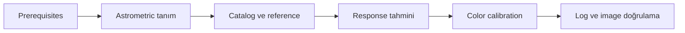
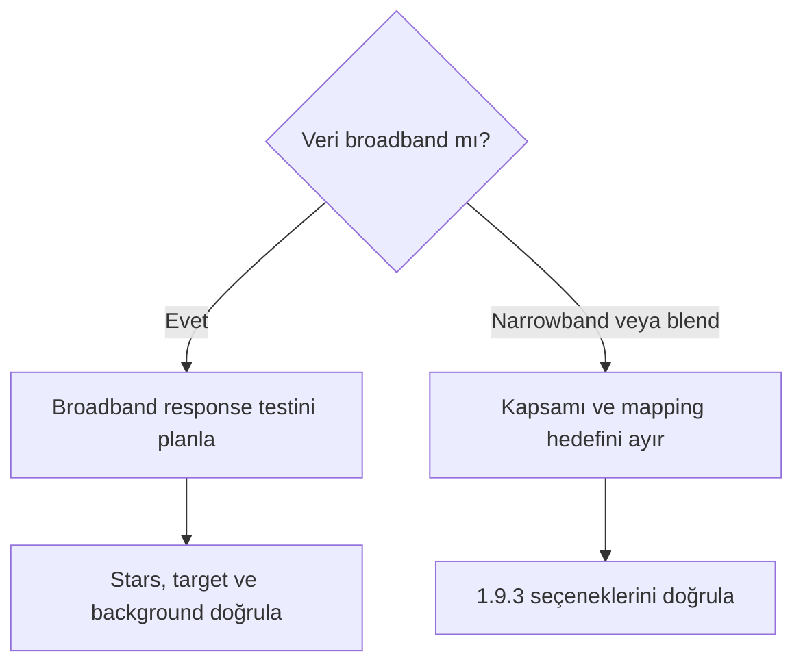
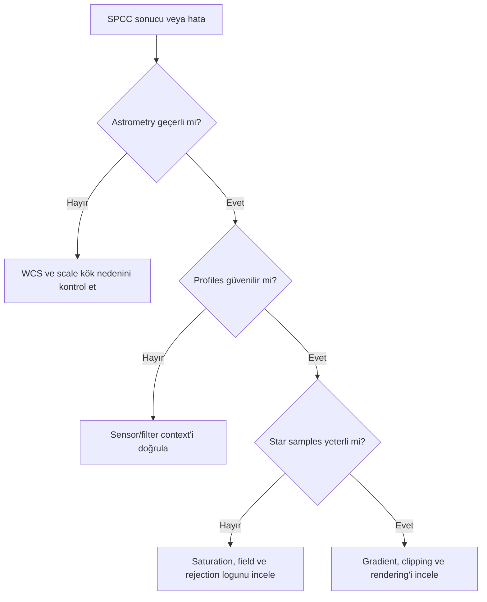
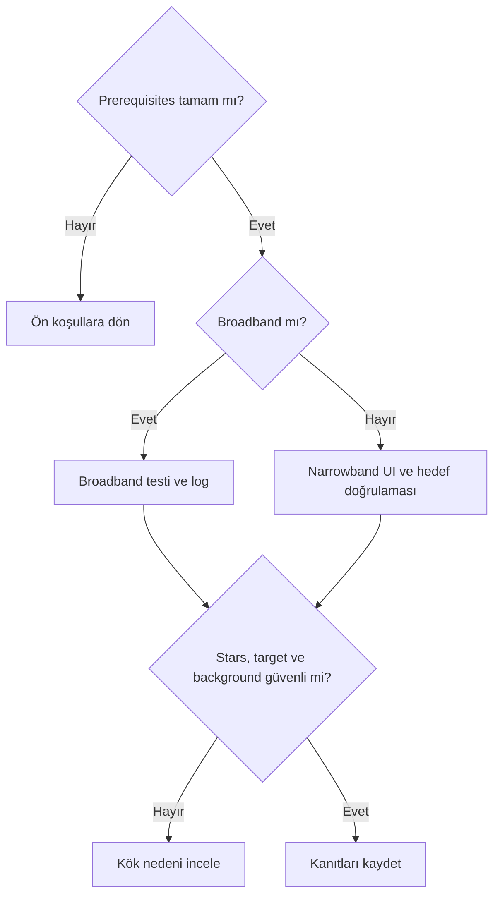

# SpectrophotometricColorCalibration

!!! warning "PixInsight 1.9.3 doğrulama sınırı"
    Görsel kanıt, process adını, menü yolunu, beş section başlığını ve görünen kontrol etiketlerini doğrular. Ekranın içinde sürüm numarası görünmediğinden 1.9.3 sürüm kimliği kısmi kanıttır. Catalog seçeneklerinin tamamı, sensor/filter database davranışı, varsayılan değerler, narrowband sonucu, output ve process davranışı doğrulanmayı bekler.

## Amaç

SPCC'yi instrument response, catalog/spectral reference, astrometry ve ölçülebilir yıldız örnekleri üzerinden renk cevabı tahmin eden bir color calibration yaklaşımı olarak açıklamak; PCC, gradient correction ve color grading'den ayırmak.

## Kavramsal açıklama

Spectrophotometric yaklaşım, görüntü yıldızları ile catalog/spectral reference arasındaki ilişkiyi sensor response, filter transmission, optical response ve atmosfer bağlamıyla değerlendirebilir. Exact response model, sample selection ve coefficient üretimi PixInsight 1.9.3 documentation ile doğrulanmalıdır.

SPCC ile PCC aynı photometric bağlamı paylaşabilir; SPCC instrument/filter/sensor response ilişkisini daha kapsamlı modellemeyi amaçlayabilir. Exact farklar sürüm documentation'ıyla doğrulanmalıdır. PCC “geçersiz” veya SPCC “üstün” kabul edilmez; ayrıntılı ve tarafsız karşılaştırma [PCC rehberindedir](pcc.md).

Astrometric solution, catalog query ve star detection/matching referans örneklerini kurmaya yardımcı olabilir. Saturated stars, clipping, düşük star density, crowded field, dust extinction, galaxy/nebula dominance ve metadata hatası sonucu sınırlayabilir. Log ve diagnostic mesajları kabul/ret kararının parçasıdır.

!!! note "Üç background kavramı"
    `background neutrality` genel reference kavramıdır. SPCC içinde background ile ilişkili controls varsa exact ad ve davranışları UI doğrulaması bekler. Bağımsız `BackgroundNeutralization` ise ayrı bir PixInsight processidir. Bunların hiçbiri gradient correction ile aynı işlem değildir ve background reference her veri için otomatik olarak zorunlu varsayılmaz.

Mono LRGB'de birleşik RGB channels ve filter set; OSC'de CFA/debayer ve sensor response geçmişi önemlidir. Luminance ayrı bir intensity kaynağıdır; RGB channel calibration'ın otomatik ikamesi değildir. Starless data, catalog star sample gerektiren workflow için temel referansı taşımayabilir; exact process davranışı doğrulanmalıdır.

Genellikle stretch öncesi çalışma channel ilişkilerini değerlendirmek açısından daha uygun olabilir. SPCC'nin exact linear/nonlinear davranışı PixInsight 1.9.3 üzerinde doğrulanmalıdır. SPCC gradient, residual color gradient, clipping, calibration artefact veya estetik palette sorunlarını onarma aracı değildir.

## Ön koşullar

- Calibration ve gradient durumu denetlenmiş image
- Linear/nonlinear durum kaydı ve unclipped channels
- Geçerli veya doğrulanabilir astrometric solution
- Güvenilir sensor/filter/optical context
- Uygun, unsaturated star samples ve process loguna erişim
- Broadband/narrowband hedefinin açıkça sınıflandırılması

## Ne zaman değerlendirilir?

- Broadband OSC veya mono LRGB birleşik RGB veride catalog/reference tabanlı response değerlendirmesi gerektiğinde
- Astrometry, instrument profile ve star population denetlenebildiğinde
- Original, calibrated output ve log birlikte karşılaştırılabildiğinde

## Ne zaman tek başına yeterli değildir?

- Gradient, flat/dark artefact veya clipping varsa
- Starless ya da star sample'ı yetersiz veride
- Narrowband palette mapping, continuum subtraction veya star color reconstruction hedefleniyorsa
- Saturation ve color grading amacıyla

## Doğrulanmış kavramsal kontroller

| Kontrol grubu | Amaç | Sonuç değerlendirmesi |
| --- | --- | --- |
| Astrometry | Image ile sky coordinates ilişkisi | WCS/solve ve scale tutarlılığı |
| Catalog/reference | Image sources için referans bağlamı | Match/sample uygunluğu |
| Sensor response | Detector channel response bağlamı | Profile doğruluğu ve generic risk |
| Filter response | Passband bilgisini tanımlamak | Filter set ve acquisition eşleşmesi |
| White reference | Calibration hedefini tanımlamak | Referans anlamı ve color sonucu |
| Background | Reference/neutrality riskini denetlemek | Gradient ve diffuse signal kontrolü |
| Star sample | Ölçülebilir yıldızları değerlendirmek | Saturation/rejection/log |
| Output validation | Sonucu kabul veya reddetmek | Clipping, stars, target, background, metadata |

## Görsel kanıtla doğrulanan UI

- Process adı: `SpectrophotometricColorCalibration`.
- Menü yolu: `Process → ColorCalibration → SpectrophotometricColorCalibration`.
- Section başlıkları: `Calibration`, `Catalog Search`, `Signal Evaluation`, `Background Neutralization`, `Region of Interest`.
- Kanıt dosyaları: `validation/ui/pi-1.9.3/spcc/screenshots/`.
- Ayrıntılı sınıflandırma: `validation/ui/pi-1.9.3/spcc/spcc-evidence-matrix.md`.

!!! note "Görülen değer ile varsayılan ayrımı"
    Görsellerde seçili değerler ve checkbox durumları okunabilmektedir; ancak processin yeni veya resetlenmiş olduğu kanıtlanmadığı için bunlar default olarak sunulmaz.

## UI doğrulama durumu

| UI alanı | Doğrulanması gereken bilgi | Doğrulama yöntemi | Durum |
| --- | --- | --- | --- |
| İşlem menu location | Exact menü yolu | Menü ekranı | Doğrulandı |
| Section names | Exact panel/section adları | UI ekranları | Doğrulandı |
| Catalog selector | `Catalog` etiketi ve görünen seçim doğrulandı; tüm seçenekler/davranış bekliyor | UI + documentation | Kısmen doğrulandı |
| White reference controls | `White reference` etiketi ve görünen seçim doğrulandı; tüm seçenekler/anlam bekliyor | UI + documentation | Kısmen doğrulandı |
| Sensor database | Profile lookup/fallback | UI + kontrollü test | Bekliyor |
| Filter database | Filter lookup/fallback | UI + kontrollü test | Bekliyor |
| Narrowband controls | `Narrowband filters mode` etiketi ve mevcut checkbox durumu görüldü; kapsam/sonuç bekliyor | UI + birincil kaynak | Kısmen doğrulandı |
| Background neutralization controls | Section, `Lower limit` ve `Upper limit` etiketleri doğrulandı; ilişki/output bekliyor | UI + test | Kısmen doğrulandı |
| Star rejection controls | Signal Evaluation etiketleri görüldü; seçim/rejection davranışı bekliyor | UI + log | Kısmen doğrulandı |
| Output/log controls | Output etiketleri görüldü; üretilen çıktı ve mesajlar bekliyor | UI + console/log | Kısmen doğrulandı |
| Default values | 1.9.3 defaults | Temiz process instance | Bekliyor |

## SPCC ve PCC karşılaştırması

| Değerlendirme alanı | SPCC | PCC |
| --- | --- | --- |
| Reference model | Spectrophotometric yaklaşım; exact model bekliyor | Photometric yaklaşım; exact model Sprint 3.3 |
| Instrument response | Sensor/filter profile bağlamı olabilir | Sürüm/process documentation gerekir |
| Filter/sensor profile | UI/database davranışı bekliyor | Exact kapsam Sprint 3.3 |
| Astrometric requirement | İşlem-bazlı doğrulama bekliyor | İşlem-bazlı doğrulama bekliyor |
| Star catalog dependence | Catalog/reference eşleşmesi beklenir | Catalog/reference davranışı doğrulanmalı |
| Broadband scope | Gerçek veri testi gerekir | Gerçek veri testi gerekir |
| Narrowband scope | Özel model/seçenek varsa doğrulanmalı | Sprint 3.3 doğrulaması gerekir |
| UI/version dependence | Yüksek | Yüksek |
| Validation need | Log, stars, target, background | Log, stars, target, background |
| Legacy workflow relevance | Mutlak üstünlük kurulmaz | Kullanım bağlamı Sprint 3.3'te incelenir |

## Uygulama veya teşhis yaklaşımı

1. [SPCC Ön Koşulları](spcc-prerequisites.md) matrisini tamamlayın.
2. Broadband veya narrowband kapsamını kaydedin.
3. Astrometry, catalog/reference ve instrument context'i doğrulayın.
4. Processi bir clone üzerinde, 1.9.3 UI bilgisi kaydedilerek test edin.
5. Log, rejected/matched samples ve output statistics'i saklayın.
6. Original/output'u aynı display koşulunda stars, target ve background üzerinde karşılaştırın.

## Gerçek kullanım senaryosu

M31 mono LRGB birleşik RGB master için SPCC testi planlanır. WCS, filter/sensor context, unsaturated stars, gradient ve clipping denetlenir. Output, log ve original saklanır. Henüz sonuç üretilmemiştir; `SPCC-BB-M31-01` gerçek veri bekler.

## Görsel planı

!!! example "Görsel doğrulama ölçütü — SPCC ana arayüz"
    **PixInsight sürümü:** 1.9.3  
    **Target veya veri:** Broadband RGB test master  
    **Ekran veya çıktı:** Ana process UI ve sürüm bilgisi  
    **Kanıtlanacak konu:** Exact section/control adları ve process varlığı  
    **Önerilen dosya adı:** `spcc-193-main-interface-v01.png`

!!! example "Görsel doğrulama ölçütü — katalog ve referans"
    **PixInsight sürümü:** 1.9.3  
    **Target veya veri:** Solved broadband field  
    **Ekran veya çıktı:** Catalog/reference UI ve query logu  
    **Kanıtlanacak konu:** Exact catalog/reference seçenekleri  
    **Önerilen dosya adı:** `spcc-193-catalog-reference-v01.png`

!!! example "Görsel doğrulama ölçütü — sensör profili"
    **PixInsight sürümü:** 1.9.3  
    **Target veya veri:** OSC ve mono camera records  
    **Ekran veya çıktı:** Sensor database/profile UI  
    **Kanıtlanacak konu:** Lookup ve fallback davranışı  
    **Önerilen dosya adı:** `spcc-193-sensor-profile-v01.png`

!!! example "Görsel doğrulama ölçütü — filtre profili"
    **PixInsight sürümü:** 1.9.3  
    **Target veya veri:** Mono LRGB filter set  
    **Ekran veya çıktı:** Filter database/profile UI  
    **Kanıtlanacak konu:** Exact filter seçenekleri ve eşleşme  
    **Önerilen dosya adı:** `spcc-193-filter-profile-v01.png`

!!! example "Görsel doğrulama ölçütü — beyaz referans"
    **PixInsight sürümü:** 1.9.3  
    **Target veya veri:** Broadband star field  
    **Ekran veya çıktı:** White reference UI ve output  
    **Kanıtlanacak konu:** Exact seçenekler ve sonuç etkisi  
    **Önerilen dosya adı:** `spcc-193-white-reference-v01.png`

!!! example "Görsel doğrulama ölçütü — background neutralization"
    **PixInsight sürümü:** 1.9.3  
    **Target veya veri:** Gradient-denetlenmiş broadband image  
    **Ekran veya çıktı:** Background controls ve reference  
    **Kanıtlanacak konu:** SPCC içi background davranışı  
    **Önerilen dosya adı:** `spcc-193-background-controls-v01.png`

!!! example "Görsel doğrulama ölçütü — narrowband seçenekleri"
    **PixInsight sürümü:** 1.9.3  
    **Target veya veri:** SHO/HOO test images  
    **Ekran veya çıktı:** Doğrulanmış narrowband UI  
    **Kanıtlanacak konu:** Seçeneklerin varlığı, adı ve kapsamı  
    **Önerilen dosya adı:** `spcc-193-narrowband-controls-v01.png`

## SPCC neden modern iş akışı’da PCC’nin yerini aldı?

SPCC, Gaia DR3/SP spectral verisini ve seçilen filter/sensor response eğrilerini birlikte değerlendirerek PCC’nin broadband color-index yaklaşımından daha ayrıntılı bir instrument modeli sunar. Doğru profiles ve WCS mevcut olduğunda acquisition sistemine daha yakın response tahmini hedeflenir. PCC yine legacy karşılaştırma ve SPCC ön koşullarının sağlanamadığı durumlarda referans olabilir.

!!! warning "Üstünlük mutlak değildir"
    Yanlış filter profile ile çalışan SPCC, doğru bağlamla çalışan daha basit bir yöntemden güvenilir kabul edilemez. Model ayrıntısı girdi doğruluğunun yerine geçmez.

## İş Akışındaki Yeri ve performans

Calibration → integration → gradient correction → plate solve → SPCC → BlurXTerminator/NoiseXTerminator → stretch genel broadband sırasıdır. Gaia database erişimi, source detection ve spectral fit büyük görüntülerde süre, bellek ve disk erişimini etkileyebilir.

## Sık yapılan hatalar

1. Doğrulanmamış UI adlarını güncel sürümden aktarmak.
2. SPCC sonucunu doğru renk garantisi saymak.
3. Gradient ve clipping'i SPCC ile düzeltmeye çalışmak.
4. Generic profile kullanımını gerçek instrument profile ile eş tutmak.
5. Narrowband palette mapping'i broadband calibration saymak.
6. Log ve rejected samples'ı incelememek.

## Sorun giderme

| Belirti | İlk kontrol | Ayrıntı |
| --- | --- | --- |
| İşlem başlamıyor | UI, input state, log | [Sorun Giderme](spcc-troubleshooting.md) |
| Catalog/match hatası | WCS, scale, connectivity/log | [Ön Koşullar](spcc-prerequisites.md) |
| Color cast | Gradient, profiles, display | [Broadband](spcc-broadband.md) |
| Narrowband sonuç anlamsız | İş Akışı hedefi ve mode doğrulaması | [Narrowband](spcc-narrowband.md) |
| Star colors yok | Saturation/clipping/rejection | [Sorun Giderme](spcc-troubleshooting.md) |

## SSS

??? question "SPCC doğru renk garantisi verir mi?"
    Hayır; catalog/model/instrument varsayımları ve rendering sınırları vardır.
??? question "SPCC PCC'den her zaman daha iyi midir?"
    Hayır; mutlak üstünlük kurulmaz ve PCC Sprint 3.3'te ayrıca ele alınır.
??? question "SPCC gradient'i düzeltir mi?"
    Gradient correction ayrı bir kök neden ve modelleme işlemidir.
??? question "Starless image kullanılabilir mi?"
    Star sample gerektiren workflow için temel referans eksik olabilir; exact davranış doğrulanmalıdır.
??? question "Narrowband SPCC yapılabilir mi?"
    Process'e özgü seçenek/model varsa 1.9.3 UI ve kaynakla doğrulanmalı; palette mapping ile karıştırılmamalıdır.
??? question "Linear image zorunlu mu?"
    General workflow stretch öncesini tercih edebilir; exact SPCC gereksinimi 1.9.3 üzerinde bekliyor.

## Hızlı Referans

!!! tip "Tek sayfalık kontrol listesi"
    - [ ] Image state, gradient ve clipping kontrol edildi
    - [ ] WCS/astrometry geçerli
    - [ ] Sensor/filter context güvenilir
    - [ ] Star samples ve log incelendi
    - [ ] Broadband/narrowband kapsamı ayrıldı
    - [ ] Original/output aynı display ile kıyaslandı

## Karar Ağacı

## Teknik doğrulama durumu

| Kategori | Durum |
| --- | --- |
| UI-6 | Tüm exact UI ve defaults bekliyor |
| DOC-6 | Response, database, rejection ve output davranışı bekliyor |
| DATA-6 | Broadband/narrowband testleri bekliyor |
| IMG-6 | Ana UI ve alt alan görselleri bekliyor |

## İlgili bölümler

- [SPCC Ön Koşulları](spcc-prerequisites.md)
- [SPCC Broadband](spcc-broadband.md)
- [SPCC Narrowband](spcc-narrowband.md)
- [SPCC Sorun Giderme](spcc-troubleshooting.md)
- [Photometric Calibration Teorisi](photometric-calibration-theory.md)
