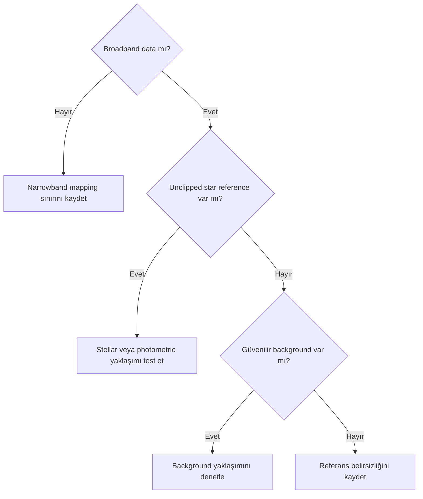

# White Balance

## Amaç

White balance kavramını consumer photography'deki görünüm ayarından ayırarak astronomik channel scaling ve referans seçimi bağlamında açıklamak.

## Kavramsal açıklama

White balance, seçilmiş neutral reference altında channel response farklarını ölçekleyerek nötr kabul edilen yapının nötr gösterilmesini amaçlar. Referans beyaz fiziksel olarak “renksiz her nesne” değildir; kullanılan gözlem ve rendering sistemine bağlı bir referanstır.

Consumer photography çoğunlukla bilinen aydınlatıcı ve kamera profili üzerinden hoş/öngörülebilir görünüm hedefler. Astrophotography'de gökyüzü, yıldız population, instrument response ve diffuse signal aynı varsayımları karşılamayabilir. Kamera üreticisi veya daylight white balance katsayıları başlangıç metadata'sı olabilir; astronomical calibration'ın evrensel yerine geçmez.

OSC veride CFA, debayer ve kamera katsayıları; mono LRGB'de filter transmission, exposure ve sensor response değerlendirilir. Star-based balance yıldız population'ını, background-based balance seçilmiş background bölgesini, photometric calibration katalog referansını kullanır.

### Dört ayrı renk kararı

| Kavram | Amaç | Birbirine karıştırılmaması gereken konu |
| --- | --- | --- |
| Instrumental balance | Sensor, filter ve optics kaynaklı relative channel response farklarını ele almak | Exposure sürelerini doğrudan balance coefficient saymak |
| Reference-based color calibration | Star, catalog veya background referansıyla channel ilişkisi kurmak | Kamera üreticisi katsayısını bilimsel referans saymak |
| Display white point | Ekran/çıktı ortamında beyazın rendering'ini tanımlamak | Image data calibration'ı saymak |
| Artistic color grading | Renkleri estetik hedefle değiştirmek | Ölçümsel calibration sonucu gibi sunmak |

OSC üretici white balance katsayıları, mono LRGB channel calibration'a eşdeğer değildir. Mono LRGB exposure süreleri SNR ve ölçüm aralığını etkileyebilir; tek başına color balance coefficient olarak kullanılmaz.

!!! info "Narrowband kapsamı"
    Ha, OIII ve SII geniş bant RGB kanalları değildir. Narrowband yıldız verisi filter bandpass nedeniyle broadband stellar color ilişkisini eksik temsil edebilir. Fiziksel broadband stellar color calibration, narrowband channel normalization, palette mapping, star color reconstruction ve estetik channel mixing ayrı hedeflerdir. Process'e özgü narrowband seçenekleri Sprint 3.2 kapsamındadır.

## Ön koşullar

- Lineer ve unclipped channel data
- Calibration ve gradient kontrolü
- Referansın yıldız, background veya catalog olduğunun kaydı
- OSC için doğru CFA/debayer metadata'sı; mono için channel/filter kaydı

## Ne zaman kullanılır?

- Broadband RGB/LRGB relative channel response değerlendirilirken
- OSC kamera katsayılarının sınırı incelenirken
- Star/background/photometric referansları karşılaştırılırken

## Ne zaman kullanılmaz?

- HOO/SHO palette'ine doğal broadband white balance dayatmak için
- Gradient veya color clipping'i gizlemek için
- Estetik color grading'i bilimsel calibration diye sunmak için

## Uygulama veya değerlendirme yaklaşımı

| Yaklaşım | Referans | Avantaj | Risk | Uygun kullanım bağlamı |
| --- | --- | --- | --- | --- |
| Kamera white balance | Üretici katsayıları | Acquisition başlangıç görünümü | Astronomik response'u temsil etmeyebilir | OSC metadata incelemesi |
| Background neutralization | Seçilmiş background | Color cast tanısına yardımcı olabilir | Gerçek diffuse signal nötr sanılabilir | Güvenilir background bulunan veri |
| Yıldız tabanlı dengeleme | Stellar population | Hedef dışı referans sağlayabilir | Saturation, extinction ve population bias | Yeterli unclipped yıldız alanı |
| Photometric calibration | Catalog star colors | İzlenebilir katalog referansı | Solve/match/metadata sınırları | Broadband ve uygun star field |
| Manuel channel scaling | Kullanıcı tanımlı oran | Kontrollü deney | Keyfî veya sabit reçete riski | Belgelenmiş özel test |
| Estetik color grading | Görsel hedef | İfade özgürlüğü | Calibration ile karışabilir | Teknik kalibrasyondan sonra |

1. Data'nın lineer ve unclipped olduğunu doğrulayın.
2. Calibration/gradient sorunlarını eleyin.
3. Referans türünü ve sınırlamalarını seçin.
4. Channel scaling sonucunu stars, background ve target üzerinde karşılaştırın.
5. Teknik calibration kaydını sonraki saturation/color grading'den ayrı tutun.

## Gerçek kullanım senaryosu

OSC broadband master'da üretici white balance katsayılarıyla kırmızı baskın bir görünüm oluşur. Katsayılar kesin doğru kabul edilmez; CFA metadata, gradient, channel clipping ve photometric/star reference uygunluğu kontrol edilir. Sonuç gerçek veri testi bekler.

## Photometric ve manual calibration karşılaştırması

| Karar | Photometric/spectrophotometric | Manual |
|---|---|---|
| Reference | Catalog ve instrument modeli | Seçilmiş stars/ROI veya katsayı |
| Tekrarlanabilirlik | Metadata/profiles doğruysa yüksek | Seçim kaydı tutulursa mümkündür |
| Catalog ihtiyacı | Var | Yok olabilir |
| Ana risk | Yanlış WCS/profile | Yanlış white/background reference |
| Kullanım | Broadband yıldızlı alan | Özel filtre veya kontrollü transfer |

White reference görüntüyü beyaz yapmak değildir; response çözümünün hangi spektral referansa göre normalize edildiğini tanımlar.

## Sık yapılan hatalar

1. Daylight white balance'ı evrensel astronomical reference saymak.
2. Background'u otomatik olarak gri kabul etmek.
3. Saturated yıldızları stellar reference olarak kullanmak.
4. HOO/SHO'ya broadband white balance uygulamak.
5. Color grading'i calibration sonucu gibi kaydetmek.

## Sorun giderme

| Belirti | Olası neden | İlk kontrol |
| --- | --- | --- |
| OSC kırmızı/yeşil baskın | CFA/white balance/gradient | Metadata ve channel statistics |
| Star colors yok | Clipping veya scaling | Star core maxima |
| Background nötr, target bozuk | Yanlış reference | Model ve target signal |
| LRGB kanalları uyuşmuyor | Exposure/response farkı | Filter ve acquisition kaydı |
| HOO tek renk | Mapping ve channel SNR | Ha/OIII ayrı masters |

## SSS

??? question "Daylight white balance yeterli midir?"
    Tek başına güvenilir astronomical calibration kanıtı değildir.
??? question "Background her zaman neutral mıdır?"
    Hayır; airglow, dust, unresolved stars ve light pollution etkileyebilir.
??? question "Mono LRGB'de white balance var mı?"
    Relative channel balance vardır; referans ve response açıkça kaydedilmelidir.
??? question "Narrowband white balance yapılır mı?"
    Broadband doğal renk kavramı doğrudan uygulanmaz; palette/channel mapping ayrı değerlendirilir.
??? question "Manual scaling yanlış mıdır?"
    Belgeli özel amaçla değerlendirilebilir; evrensel sabit oran olarak sunulmamalıdır.

## Hızlı Referans

!!! tip "Tek sayfalık kontrol listesi"
    - [ ] Referans türü kaydedildi
    - [ ] Data lineer ve unclipped
    - [ ] Gradient/calibration kontrol edildi
    - [ ] OSC CFA veya LRGB filter zinciri kontrol edildi
    - [ ] Narrowband ile broadband ayrıldı
    - [ ] Grading calibration'dan ayrı tutuldu

## Karar Ağacı

## Teknik doğrulama durumu

| Kategori | Durum |
| --- | --- |
| UI-5 | Kamera/PixInsight control eşlemesi bekliyor |
| DOC-5 | Channel scaling ve reference yaklaşımı kaynak bekliyor |
| DATA-5 | OSC ve mono LRGB testleri bekliyor |
| IMG-5 | Ayrı görsel planı yok; diğer sayfalardaki zincirler kullanılacak |

## İlgili bölümler

- [Astronomik Renk Teorisi](color-theory.md)
- [Photometric Calibration Teorisi](photometric-calibration-theory.md)
- [Background Neutrality](background-neutrality.md)
- [SPCC](spcc.md)
- [PCC](pcc.md)
