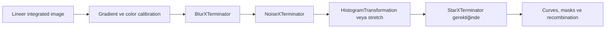

# AI Eklentileri

## Amaç

BlurXTerminator, NoiseXTerminator ve StarXTerminator araçlarını tek düğmeli “iyileştirme” olarak değil; ölçülebilir girdi koşulları, sınırlamalar ve geri dönüş testleri olan model tabanlı işlemler olarak konumlandırmaktır.

## Teori ve bilimsel sınır

Bu araçlar eğitim örneklerinden öğrenilmiş ilişkileri yeni görüntüye uygular. Çıktı, yalnız girdide ölçülebilen bilginin deterministik yeniden inşası olarak kabul edilemez. Özellikle çok düşük SNR, doygun çekirdek, kötü sampling veya ciddi optik kusur bulunan bölgelerde modelin ürettiği yapı gerçek gökyüzü sinyalinden ayrıştırılamayabilir.

!!! warning "Hallucination riski"
    “Doğal görünen” detay, fiziksel doğruluk kanıtı değildir. Sonuç farklı strength değerleri, orijinal veri ve mümkünse bağımsız yüksek SNR referansıyla karşılaştırılmalıdır.

## İş akışındaki görevler

Bu sıra evrensel reçete değildir. BlurXTerminator’ın güncel AI modeli lineer veri ister; NoiseXTerminator lineer veya nonlinear çalışabilir; StarXTerminator seçimi yıldızlı/yıldızsız dalların nasıl işleneceğine bağlıdır.

## Araç karşılaştırması

| Araç | Ana görev | En kritik girdi | Başlıca risk |
|---|---|---|---|
| [BlurXTerminator](blurxterminator.md) | PSF correction ve kontrollü sharpening | Lineer, noise reduction görmemiş veri | Ring, koyu halo ve gerçek dışı küçük yapı |
| [NoiseXTerminator](noisexterminator.md) | Noise bileşenlerini azaltma | Noise karakteri korunmuş veri | Plastiksi doku ve zayıf sinyal kaybı |
| [StarXTerminator](starxterminator.md) | Stars ve starless katman üretme | İyi örneklenmiş yıldız profilleri | Nebula düğümünü yıldız sanma, star residual |

## Hedefe göre karar matrisi

| Hedef/veri | Öncelik | Neden |
|---|---|---|
| Galaxy | Çekirdek ve dust lane doğruluğu | Aşırı sharpening kompakt sahte yapı üretir |
| Emission nebula | Filament korunumu | Düşük SNR lifleri noise ile karışabilir |
| Reflection nebula | Yumuşak geçiş korunumu | Denoise renk/doku geçişini silebilir |
| Dense star field | Star residual denetimi | Star removal hatası alan boyunca birikir |
| Wide field | Tile/ölçek tutarlılığı | Model artefact'ı geniş alanda tekrarlanabilir |
| Heavy light pollution | Önce gradient tanısı | AI aracı background modelinin yerine geçmez |

## Process interaction matrisi

| Process | AI araçlarıyla ilişki | Neden |
|---|---|---|
| [StarAlignment](../03-kalibrasyon/star-alignment.md) | Önce tamamlanır | Geometrik hata AI ile gizlenmemelidir |
| [ImageIntegration](../03-kalibrasyon/image-integration.md) | Ana lineer girdiyi üretir | Rejection ve weighting önce doğrulanır |
| [SPCC](../05-color-calibration/spcc.md) | Genellikle lineer AI aşamasından önce | Yıldız response ölçümü korunur |
| [HistogramTransformation](../07-stretch/histogram-transformation.md) | BXT’den sonra; NXT kararına göre | AI4 BXT lineer girdi ister |
| [MaskedStretch](../07-stretch/masked-stretch.md) / [GHS](../07-stretch/generalized-hyperbolic-stretch.md) | Star/starless dallarda ayrı test | Farklı stretch recombination dengesini değiştirir |
| [CurvesTransformation](../13-final/curves-transformation.md) | Nonlinear local color/contrast | AI sonucundaki artefact’ı büyütebilir |
| [SCNR](../13-final/scnr.md) | Starless veya birleşik dalda kontrollü | Magenta star ve green suppression riski |
| [ColorMask](../11-maskeler/color-mask.md) / [RangeMask](../11-maskeler/range-mask.md) | Bölgesel koruma ve düzeltme | Global strength yerine lokal kontrol sağlar |
| [PixelMath](../10-pixelmath/index.md) | Star recombination ve kanal işlemleri | Layer matematiği açıkça kaydedilir |

## Performans

CPU/GPU hızı kullanılan işletim sistemi, donanım, plugin sürümü, model ve görüntü boyutuna bağlıdır. GPU seçeneğinin varlığı veya destek matrisi kurulu plugin belgeleriyle doğrulanmalıdır. Büyük drizzle görüntülerinde bellek baskısını azaltmak için önce küçük Preview üzerinde parametre testi yapın; final işlemi tam çözünürlükte çalıştırın.

## En iyi uygulamalar

- Her aracı orijinalden türetilmiş ayrı clone üzerinde test edin.
- Aynı STF ve 1:1/2:1 yakınlaştırmada artefact karşılaştırması yapın.
- Process instance, plugin sürümü ve AI model sürümünü kaydedin.
- Strength değerini hedef türüne göre sabit reçete yapmayın.
- AI sonucunu calibration, registration veya gradient hatasını gizlemek için kullanmayın.

## İlgili bölümler ve kaynaklar

- [ImageIntegration](../03-kalibrasyon/image-integration.md)
- [SPCC](../05-color-calibration/spcc.md)
- [HistogramTransformation](../02-pixinsight-temelleri/histogram.md)
- [RC Astro BlurXTerminator Technical Manual](https://www.rc-astro.com/blurxterminator-technical-manual/)
- [RC Astro NoiseXTerminator User Manual](https://www.rc-astro.com/noisexterminator-2-ai3-user-manual-pixinsight/)
- [RC Astro StarXTerminator Usage Notes](https://www.rc-astro.com/starxterminator-usage-notes/)
