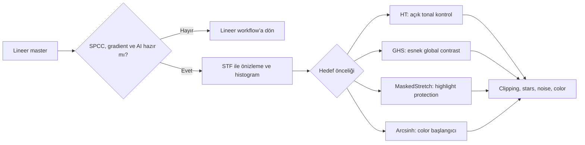

# Stretch ve Doğrusal Olmayan Dönüşüm

!!! info "Sayfa Bilgisi"
    **Kategori:** Stretch · **Düzey:** Intermediate · **Tahmini okuma:** 3 dk
    **Anahtar kelimeler:** `Stretch` · `nonlinear processing` · `histogram stretch`

## Amaç

Lineer astronomik veriyi insan görme sistemi ve ekranın sınırlı dinamik aralığı içinde okunabilir hale getirirken faint signal, highlights, star profiles, color ratios ve background ayrımını kontrollü biçimde korumaktır.

## Doğrusal ve doğrusal olmayan veri

Lineer görüntüde pixel değeri, calibration ve response zincirinin izin verdiği ölçüde kaydedilen sinyalle orantılıdır. Nonlinear stretch bu oranı bilinçli olarak değiştirir: düşük değerleri daha fazla, yüksek değerleri daha az genişleterek büyük dinamik aralığı ekrana sıkıştırır.

```text
Lineer master → ölçüm ve fiziksel oranlar öncelikli
              ↓ nonlinear transform
Nonlinear image → görünürlük ve tonal dağılım öncelikli
```

İnsan görmesi parlaklığa yaklaşık doğrusal tepki vermez; düşük kontrastlı faint structure lineer histogramın dar sol bölümünde görünmez kalabilir. Stretch yeni signal üretmez. Var olan signal ile noise’u birlikte görünür hale getirir.

## STF neden yalnız visualization aracıdır?

`ScreenTransferFunction` görüntü pixel değerlerini değiştirmeden ekrandaki gösterim transformunu yönetir. STF kaldırıldığında veri aynı lineer değerlerle kalır. `HistogramTransformation`, GHS, MaskedStretch veya ArcsinhStretch uygulandığında ise pixel değerleri gerçekten değişir.

!!! warning "STF kalıcı stretch değildir"
    STF görünümünü “son görüntü” sanıp kaydetmek veya sonraki process kararlarını yalnız bu görünüşe bağlamak tekrar üretilebilir bir nonlinear workflow değildir. STF parametreleri başlangıç önizlemesi olabilir; kalıcı dönüşüm ayrı process ile uygulanmalı ve histogram/clipping denetlenmelidir.

## Stretch fiziği ve görsel ödünleşimler

| Hedef | Kazanç | Bedel/risk |
|---|---|---|
| Dynamic range compression | Core ve faint halo aynı görüntüde görünür | Tonal oranlar nonlinear olur |
| Shadow expansion | Nebula/cirrus görünürlüğü artar | Noise da büyür |
| Highlight compression | Star/core clipping gecikir | Highlights düz veya yapay görünebilir |
| Contrast expansion | Yapı ayrımı güçlenir | Background separation azalabilir |
| Color preservation | Channel ratios daha az bozulur | Saturation yine display/transforma bağlı değişir |
| Local contrast | İnce yapı belirginleşir | Global stretch bunu tek başına çözmez |

Stretch sırasında saturation sabit kalmak zorunda değildir. Kanallar ayrı veya farklı clipping ile dönüştürülürse hue ve saturation değişebilir. RGB/K veya luminance tabanlı uygulama seçimi, color preservation hedefiyle birlikte test edilmelidir.

## Process karşılaştırması

| İşlem | Güçlü olduğu kontrol | Başlıca risk |
|---|---|---|
| [HistogramTransformation](histogram-transformation.md) | Açık black/midtones/white kontrolü | Shadow clipping ve sert star profiles |
| [GeneralizedHyperbolicStretch](generalized-hyperbolic-stretch.md) | Belirli tonal bölgede esnek global contrast | Parametre etkileşimini yanlış yorumlama |
| [MaskedStretch](masked-stretch.md) | Iterative highlight/star protection | Flat görünüm ve background-reference hassasiyeti |
| [ArcsinhStretch](arcsinh-stretch.md) | Color/star saturation koruma eğilimi | Zayıf tonal separation veya gray background |

## Pratik Karar Rehberi

| Durum | Önerilen İşlem | Gerekçe |
|---|---|---|
| Doğal galaxy core ve açık histogram kontrolü | HistogramTransformation | Black/midtones/highlights doğrudan izlenir |
| SHO/HOO starless yapı | GHS | Tonal bölgeye göre global contrast yönetilebilir |
| Bright-star wide field | MaskedStretch | Iterative masking highlights’ı korumayı hedefler |
| OSC star color önceliği | ArcsinhStretch + HT | Color-preserving başlangıç, HT ile black point kontrolü |
| Düşük SNR faint nebula | Küçük HT/GHS adımları | Noise ve faint signal her adımda karşılaştırılır |
| Starless/stars ayrı dallar | GHS/HT + ayrı star stretch | Farklı dinamik aralıklar bağımsız yönetilir |

## İş Akışı örnekleri



| Veri | Başlangıç | Neden |
|---|---|---|
| Broadband LRGB/galaxy | Iterative HT veya kontrollü GHS | Core–halo dinamik aralığı ölçülür |
| Reflection nebula | Küçük GHS/HT adımları | Yumuşak geçiş ve color korunur |
| Emission nebula | GHS veya HT, mask ile | Filament/background ayrımı izlenir |
| SHO/HOO | Starless GHS, stars ayrı HT | Palette ve stars farklı davranır |
| OSC | Arcsinh başlangıç + HT/GHS | Star color ile black point ayrı yönetilir |
| Heavy light pollution | Önce gradient; sonra konservatif stretch | Gradient/noise stretch ile büyür |
| Dark sky, high SNR | GHS/HT daha geniş kontrol | Signal headroom daha fazladır |
| Low SNR | Küçük iterative stretch | Noise görünürlüğü her adımda denetlenir |

## İşlem sırası ve ilişkiler

[SPCC](../05-color-calibration/spcc.md), [BackgroundNeutralization](../05-color-calibration/background-neutralization-process.md), [BlurXTerminator](../06-ai-eklentileri/blurxterminator.md) ve çoğu lineer NoiseXTerminator geçişi stretch öncesinde tamamlanır. Stretch sonrasında [CurvesTransformation](../13-final/curves-transformation.md), [SCNR](../13-final/scnr.md), [ColorMask](../11-maskeler/color-mask.md) ve [RangeMask](../11-maskeler/range-mask.md) ile lokal/renk kontrollü düzeltmeler yapılabilir. Starless/stars birleşimi için [PixelMath](../10-pixelmath/index.md) kullanıldığında layer matematiği kaydedilmelidir.

## Sorun Giderme özeti

| Belirti | Olası neden | Doğrulama | Düzeltici workflow |
|---|---|---|---|
| Black clipping | Black point fazla ileride | Histogram sol kuyruk ve Statistics | Önceki state’e dön; clipping olmadan tekrar |
| White clipping | Highlight compression yetersiz | Sağ histogram ve star cores | Daha küçük adım/korumalı transform |
| Gray background | Midtones fazla açık | Background Preview median | Black clipping yapmadan tonal denge |
| Color washout/pink stars | Kanal clip veya layer mismatch | RGB histograms ve stars layer | Linear calibrated clone’dan yeniden stretch |
| Flat image | Aşırı compression | Core–halo contrast ölçümü | Daha lokal hedefli GHS/Curves |
| Lost faint nebula | Black point veya denoise fazla | Lineer STF ve mask kıyası | Lineer aşamaya dön; shadow protection |
| Noisy background | Noise stretch ile görünür oldu | Linear noise estimate | NXT kararını gözden geçir; daha küçük stretch |
| Harsh stars/halo | Highlights aşırı contrast | Radial star profile | Star mask/separate stretch, miktarı azalt |

## En İyi Uygulamalar

- Her denemeyi aynı lineer clone’dan başlatın.
- Histogram yanında Preview Statistics, star cores ve faint target bölgelerini izleyin.
- Tek büyük stretch yerine geri dönüşü ve karşılaştırması kolay küçük adımlar kullanın.
- Global stretch ile local contrast problemini çözmeye çalışmayın.
- Process instance ve image history kaydedin.

## Kaynaklar

- [PixInsight: ScreenTransferFunction ve HistogramTransformation temelleri](../02-pixinsight-temelleri/stf.md)
- [GHS process reference](https://www.ghsastro.co.uk/doc/tools/GeneralizedHyperbolicStretch/GeneralizedHyperbolicStretch.html)
- [PixInsight Staff: MaskedStretch tool](https://pixinsight.com/forum/index.php?threads/new-maskedstretch-tool.6420/)

## Önceki Bölüm

[← StarXTerminator](../06-ai-eklentileri/starxterminator.md)

## Sonraki Bölüm

[HistogramTransformation →](histogram-transformation.md)
