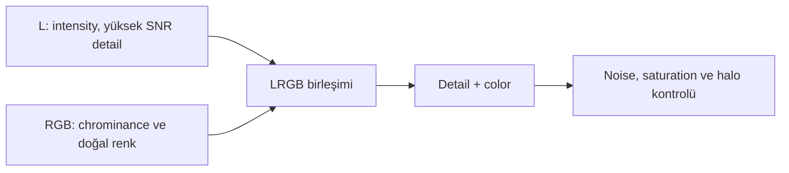

# LRGB Teorisi ve İş Akışı

## Amaç

Luminance içindeki yüksek SNR’li intensity/detail bilgisini RGB chrominance ile birleştirerek çözünürlük, contrast ve color fidelity arasında kontrollü bir denge kurmaktır.

## Kuramsal Arka Plan ve bilimsel arka plan

İnsan görsel sistemi ince spatial detail’e büyük ölçüde brightness değişimleri üzerinden, color detail’e ise daha düşük spatial çözünürlükle tepki verir. LRGB yaklaşımı bu algısal ayrımdan yararlanır: Luminance detail/contrast taşır; RGB hue ve saturation ilişkisini taşır. Bu, RGB’nin detail içermediği veya L’nin renklerden bağımsız olduğu anlamına gelmez.

LRGB vardır çünkü aynı toplam süre içinde unfiltered/broad luminance çoğu sistemde daha yüksek photon throughput ve SNR sağlayabilir. Ancak L passband’i RGB toplam response’uyla uyumsuzsa color fidelity, star halo ve contrast artefact’ları oluşabilir.

## Luminance, chrominance ve noise

| Özellik | Luminance | RGB/chrominance |
|---|---|---|
| Ana rol | Detail, brightness, contrast | Hue, saturation, color separation |
| SNR | Sıklıkla daha yüksek | Kanal ve exposure’a göre değişir |
| Noise aktarımı | Detail layer ile doğrudan görünür | Chroma noise renk lekesi oluşturur |
| Dynamic range | Core ve faint halo ilişkisini belirler | Channel clipping color’ı değiştirir |
| Hazırlık | Sharpen/noise/contrast kontrollü | SPCC, color noise ve saturation kontrollü |

## RGB-only ne zaman daha iyi olabilir?

- L passband’i güçlü light pollution, IR leakage veya halo taşıyorsa
- RGB toplam süresi ve SNR zaten yeterliyse
- Reflection nebula veya star color fidelity detail artışından daha önemliyse
- L ve RGB farklı seeing, sampling veya optical configuration ile çekildiyse
- L eklemek doğal color contrast’ı sürekli bozuyorsa

## Process karşılaştırması

| Yaklaşım | Avantaj | Sınır |
|---|---|---|
| [LRGBCombination](lrgb-combination.md) | Amaç odaklı, tekrar üretilebilir UI | Karmaşık lokal blend sınırlı |
| [PixelMath LRGB](pixelmath-lrgb.md) | Weight, mask ve formül kontrolü | Clipping/normalization hatasına açık |
| RGB-only | En basit color ilişkisi | L’nin yüksek SNR detail avantajı yok |
| Synthetic L | RGB’den geometrik olarak tutarlı | Bağımsız L kadar SNR kazancı sağlamaz |

## Pratik Karar Rehberi

| Durum | Öneri | Gerekçe |
|---|---|---|
| Broadband galaxy | LRGBCombination veya PixelMath | L detail, RGB color taşır |
| Reflection nebula | RGB-only veya düşük L weight | Color fidelity ve yumuşak yapı korunur |
| Emission nebula + L | LRGB A/B testi | L passband nebula contrast’ını değiştirebilir |
| HaRGB | PixelMath | Emission katkısı maskeli/kontrollü eklenir |
| SHO/HOO | ChannelCombination/PixelMath | Mapping, LRGB’den farklı bir color modelidir |
| Starless workflow | PixelMath | Stars ve target layer bağımsız yönetilir |

## Tam İş Akışı

| İş Akışı | Sıra | Neden |
|---|---|---|
| Broadband LRGB galaxy | L/R/G/B integrate → RGB combine → SPCC → L/RGB match → LRGB | Color önce kurulur, L sonra detail ekler |
| OSC | Debayer/integrate → SPCC → RGB-only veya synthetic L test | Gerçek ayrı L yoktur |
| Mono RGB | RGB combine → SPCC → stretch | Basit ve yüksek color fidelity |
| HaRGB | Broadband RGB calibration → continuum-aware Ha blend → diagnostics | Ha star/continuum’u domine etmemeli |
| SHO/HOO | Kanalları normalize et → mapping → stars strategy | Palette mapping fiziksel LRGB değildir |
| Starless | Stars ayır → target ve stars ayrı işle → PixelMath recombine | Halo/saturation bağımsız kontrol edilir |

## Giriş ve çıktı acceptance

L ve RGB aynı geometry, crop, registration ve image state’e sahip olmalıdır. Linear/nonlinear karışım ancak bilinçli normalization ile yapılır. Çıktıda detail artarken RGB hue, star color, faint halo ve background noise açıklanabilir kalmalıdır.

!!! warning "Luminance üstünlüğü otomatik değildir"
    Daha keskin veya yüksek SNR’li L, yanlış weight ile RGB color’ı yıkayabilir. Birleşim sonucu yalnız keskinlik üzerinden kabul edilmez.

## Sorun Giderme

| Belirti | Olası neden | Doğrulama | Düzeltme İş Akışı |
|---|---|---|---|
| Soluk color | L weight fazla | RGB ve LRGB saturation kıyası | L azalt; saturation protection |
| Harsh stars | L PSF daha kötü/farklı | FWHM ve radial profile | PSF match veya RGB-only |
| Color halo | Misregistration/PSF mismatch | Channel blink | Registration ve blur match |
| Noise arttı | L noise doğrudan aktarıldı | L background estimate | L denoise/weight revizyonu |
| Core unnatural | Dynamic range uyuşmazlığı | L/RGB core histogram | Stretch/normalization eşleştir |

## Ayrıca İnceleyin

- [ChannelCombination](channel-combination.md)
- [Luminance Hazırlama](luminance-hazirlama.md)
- [SPCC](../05-color-calibration/spcc.md)
- [Stretch](../07-stretch/index.md)
- [PixelMath](../10-pixelmath/index.md)

## Önceki Bölüm

[← ArcsinhStretch](../07-stretch/arcsinh-stretch.md)

## Sonraki Bölüm

[ChannelCombination →](channel-combination.md)
