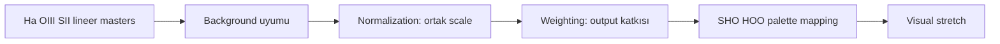

# Kanal Normalizasyonu ve Ağırlıklandırma

!!! info "Sayfa Bilgisi"
    **Kategori:** Narrowband · **Düzey:** Advanced · **Tahmini okuma:** 10 dk
    **Anahtar kelimeler:** `channel normalization` · `channel weighting` · `LinearFit` · `washed-out` · `white image`
    **Önerilen ön bilgiler:** [Lineer ve Nonlineer Görüntü](../02-pixinsight-temelleri/lineer-ve-nonlineer-goruntu.md) · [Histogram](../02-pixinsight-temelleri/histogram.md)

## Amaç

Kanal normalizasyonu ile kanal ağırlıklandırmasını birbirinden, ikisini de stretch ve color calibration işlemlerinden ayırmak.

## Dört farklı işlem

| İşlem | Amaç | Aynı şey değildir |
|---|---|---|
| Background matching | Arka plan offset/gradient ilişkisini düzenlemek | Target signal scale |
| Channel normalization | Seçilen reference/statistic'e göre sayısal scale ilişkisini eşlemek | Stretch |
| Channel weighting | Output içindeki katkı oranını seçmek | Physical flux calibration |
| Visual stretching | Tonları görünür display aralığına dağıtmak | Linear scaling |

## Reference-channel seçimi

Reference, otomatik olarak en parlak veya Ha kanal olmak zorunda değildir. Seçim amaca bağlıdır:

- yüksek SNR'lı kanalı reference yapmak zayıf kanalları büyütebilir ve noise'u görünür hale getirebilir;
- zayıf kanalı reference yapmak güçlü kanalları küçültebilir;
- morphology ve background dağılımı çok farklı kanallar arasında tek global fit temsilî olmayabilir;
- physical relative strength korunacaksa normalization hiç uygulanmayabilir.

## Mean, median ve histogram farkı

Mean parlak yıldızlar ve outlier'lardan daha fazla etkilenir. Median, dağılımın orta değerini temsil eder ancak nebula frame'in büyük bölümünü kaplıyorsa “background” sayılmaz. Aynı median'a sahip iki kanalın histogram şekli, noise'u ve target morphology'si farklı olabilir. Bu nedenle tek statistic eşleşmesi tam histogram eşleşmesi değildir.

## LinearFit kavramı

LinearFit, bir görüntünün değerlerini seçilmiş reference'a doğrusal modelle yaklaştırır. PixInsight process'inin ayrıntılı UI ve parametre davranışı foundations kapsamı değildir. Process sayfası mevcut değilse bu bağlantı **DOC-REQUIRED** olarak kalır; işlem uygulanırken PixInsight 1.9.3 process documentation/UI kanıtı kullanılmalıdır.

!!! warning
    LinearFit sonucu parlak veya washed-out görünüyorsa önce STF'nin linked/unlinked durumu ile gerçek pixel statistics ayrılır. Görünüm değişikliği tek başına data clipping kanıtı değildir; minimum, maximum, median ve histogram kontrol edilir.

## Normalizasyon neden beyaz görüntü üretebilir?

- Yanlış veya sıfıra yakın reference statistic büyük scale factor üretmiş olabilir.
- Background offset, target scale sanılmış olabilir.
- Zaten nonlinear veya clipped kanallara lineer ilişki varsayılmış olabilir.
- PixelMath division guard olmadan uygulanmış olabilir.
- Output rescale seçeneği veya display stretch sonucu yanıltıyor olabilir.
- Kanal isimleri yanlış olduğundan beklenmeyen görüntü kullanılmış olabilir.

## Equal weighting neden zorunlu değildir?

Eşit `1:1:1` weighting yalnız display katkılarını eşit tanımlar; exposure, SNR, filter transmission veya physical emission'u eşitlemez. Ağırlıklar şu hedeflerden birine göre seçilebilir:

- noise yönetimi,
- weak-channel preservation,
- structural separation,
- aesthetic palette,
- belgesel channel identity.

Hedef belirtilmeden “doğru weight” yoktur.

## Güvenli A/B testi

1. Geometry ve lineer state eşleşmesini doğrulayın.
2. Background gradient/offset'i target signal'dan ayırın.
3. Her kanalın statistics ve histogramını kaydedin.
4. Unnormalized baseline palette oluşturun.
5. Bir reference ve gerekçe seçerek normalized clone üretin.
6. Aynı display koşulunda morphology, noise, clipping ve star profile karşılaştırın.
7. Weighting kararını normalization'dan sonra ayrı kaydedin.

## Görsel planı

!!! example "Gerçek veri görseli — normalization ve weighting"
    **Eğitim amacı:** Scale matching ile output contribution farkını göstermek.
    **Kaynak/kanallar:** Proje Ha/OIII/SII masters.
    **Durum:** Lineer, aynı geometry; ortak STF.
    **Varyantlar:** Raw statistics, normalized channels, equal weights, documented weights.
    **İşaretleme:** Median/mean, histogram wings, noise floor ve clipped pixels.
    **Beklenen ders:** Normalization stretch değildir; weighting normalization değildir.
    **Proje verisi gerekli:** Evet.

## İlgili sayfalar

- [ImageIntegration](../03-kalibrasyon/image-integration.md)
- [PixelMath Kanal Karışımları](../10-pixelmath/kanal-karisimlari.md)
- [SHO](sho.md) · [HOO](hoo.md)
- [Narrowband Sorun Giderme](troubleshooting.md)

## Önceki Bölüm

[← Narrowband Renk Dengesi](natural-sho.md)

## Sonraki Bölüm

[Sentetik Parlaklık →](synthetic-luminance.md)
