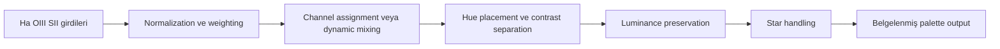

# Alternative Paletler ve Foraxx

!!! info "Sayfa Bilgisi"
    **Kategori:** Narrowband · **Düzey:** Advanced · **Tahmini okuma:** 10 dk
    **Anahtar kelimeler:** `Foraxx` · `alternative palette` · `Modified SHO` · `Dynamic SHO` · `HSO` · `HOS` · `OHS` · `synthetic green`
    **Önerilen ön bilgiler:** [SHO](sho.md) · [HOO](hoo.md) · [PixelMath Temelleri](../10-pixelmath/temeller.md)

## Amaç

Foraxx, Modified SHO, Dynamic SHO, HSO/HOS/OHS, bicolor ve custom weighted palette yaklaşımlarının ortak mimarisini açıklamak. Bu URL Foraxx sayfası olarak korunmuştur; canonical rolü, yöntem başına ayrı ve tekrarlı tarif sayfaları üretmek yerine alternative palette architecture'ı sahiplenmektir.

## Ortak mimari

Bir alternative palette beş kararı açıkça tanımlamalıdır:

1. Hangi physical channel hangi display kanalına katkı veriyor?
2. Katkılar sabit mi, sinyale veya maskeye göre dinamik mi?
3. Channel normalization veya weighting varsayılıyor mu?
4. Luminance/structure hangi kaynaktan korunuyor?
5. Star layer aynı palete mi dahil, ayrı mı yönetiliyor?

## Palette aileleri

| Aile | Ayırt edici karar | Temel risk |
|---|---|---|
| HSO/HOS/OHS | Physical kanalların RGB sırası değişir | Harf sırasını fiziksel renk sanmak |
| Modified SHO | SHO katkıları ağırlıklı karıştırılır | Formülü universal kabul etmek |
| Dynamic SHO | Katkı yerel sinyale/maskeye göre değişir | Noise'un renk kararına dönüşmesi |
| Bicolor/synthetic green | İki physical kanaldan üç display kanalı üretilir | Sentetik kanalı bağımsız ölçüm sanmak |
| Custom weighted palette | Estetik veya structural hedefe özel matrix | Clipping ve açıklanamaz hue kayması |
| Foraxx ailesi | Ha/OIII/SII katkılarını nonlineer veya koşullu karışımlarla ayırabilir | Tek bir resmi formül varmış gibi sunmak |

Foraxx adı toplulukta birden fazla uygulama ve varyasyonla kullanılabilir. Burada tek “doğru Foraxx” ifadesi yayınlanmaz. Kullanılan expression, kaynak, image state ve coefficient'ler proje kaydında belirtilmelidir.

## Formula sınıflandırması

| Formula türü | Foundations sayfasındaki yeri |
|---|---|
| Conceptual illustration | Mimariyi açıklamak için kısa ve değişkensiz örnek olabilir |
| Reusable building block | [PixelMath Kanal Karışımları](../10-pixelmath/kanal-karisimlari.md) sayfasında tutulur |
| Process recipe | PixelMath/process referansına aittir |
| Workflow-specific recipe | İlgili workflow veya uygulamalı proje sayfasına aittir |

Her expression; input kanal adlarını, output amacını, image state'i, normalizasyon varsayımını, dynamic-range davranışını ve clipping riskini açıklamadıkça yayınlanmamalıdır.

## Ne zaman alternative palette düşünülür?

- SHO'da üst üste binen morfolojileri daha ayrışmış hue bölgelerine taşımak istendiğinde.
- Zayıf OIII veya SII'nin doğrulanmış yapısı standart mapping'de görünmüyorsa.
- Belgesel kanal kimliği yerine açıkça estetik bir sunum hedefleniyorsa.
- Luminance ve color contribution ayrı yönetilebiliyorsa.

## Ne zaman kullanılmamalıdır?

- Source channel noise'u sinyalden ayrılmamışsa.
- Sonucun bilimsel abundance veya literal color iddiası taşıması bekleniyorsa.
- Formula image identifiers, state ve scale varsayımları bilinmeden kopyalanıyorsa.
- Basit SHO/HOO mapping henüz diagnostic baseline olarak üretilmemişse.

## Decision matrix

| Hedef | Daha uygun başlangıç | Gerekçe |
|---|---|---|
| Kanal kimliğini açık tutmak | SHO/HOO | Mapping kolay açıklanır |
| Renk bölgelerini ayırmak | Modified veya dynamic yaklaşım | Overlap kontrollü yeniden dağıtılır |
| İki kanal verisi | Bicolor | Olmayan üçüncü physical channel uydurulmaz |
| Natural-looking stars | Ayrı broadband star layer | Palette yıldız continuum'unu kalibre etmez |
| Deneysel sanatsal çıktı | Belgelenmiş custom weights | Niyet ve varsayım görünür kalır |

## Görsel planı

!!! example "Gerçek veri görseli — palette architecture karşılaştırması"
    **Eğitim amacı:** Aynı physical channels'ın farklı display mappings ile nasıl değiştiğini göstermek.
    **Kaynak/kanallar:** Tek projeye ait SII/Ha/OIII.
    **Durum:** Aynı lineer input ve eşleştirilmiş final stretch.
    **Varyantlar:** SHO, HSO, bicolor, belgelenmiş Foraxx varyantı.
    **İşaretleme:** Hue değişirken korunan/kaybolan morphology ve clipped bölgeler.
    **Beklenen ders:** Palette, yeni physical signal üretmez.
    **Proje verisi gerekli:** Evet.

## İlgili sayfalar

- [Narrowband Renk Dengesi](natural-sho.md)
- [Kanal Normalizasyonu ve Ağırlıklandırma](channel-normalization-and-weighting.md)
- [Sentetik Parlaklık](synthetic-luminance.md)
- [PixelMath Hata Ayıklama](../10-pixelmath/hata-ayiklama.md)
- [SHO/HOO İş Akışı](../15-workflows/sho-hoo.md)

## Önceki Bölüm

[← SHO](sho.md)

## Sonraki Bölüm

[Narrowband Renk Dengesi →](natural-sho.md)
