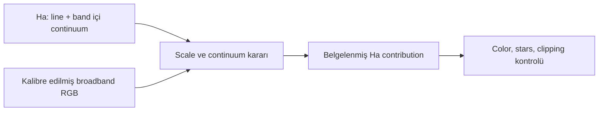

# HaRGB Mimarisi

!!! info "Sayfa Bilgisi"
    **Kategori:** Narrowband · **Düzey:** Advanced · **Tahmini okuma:** 10 dk
    **Anahtar kelimeler:** `HaRGB` · `H-alpha RGB` · `continuum subtraction` · `galaxy Ha` · `star color`
    **Önerilen ön bilgiler:** [Dar Bant Temelleri](index.md) · [Renk Kalibrasyonu](../05-color-calibration/index.md)

## Amaç

H-alpha emisyonunu broadband RGB görüntüye eklerken physical line signal, broadband continuum, color calibration ve display blend arasındaki sınırları açıklamak.

## HaRGB nedir?

HaRGB, ayrı H-alpha verisini broadband RGB'nin çoğunlukla red/intensity yapısıyla birleştiren bir yöntem ailesidir. Tek bir formula değildir. Emisyon nebulalarında Ha yapısını güçlendirmek veya galakside H II bölgelerini görünür kılmak için kullanılabilir; ancak broadband continuum ve yıldız rengi korunacaksa katkı kontrollü olmalıdır.

## Continuum neden önemlidir?

Ha filtresi yalnız nebula çizgisini değil, dar bandın içine düşen yıldız/galaksi continuum'unu da kaydeder. Ha'yı red kanala doğrudan eklemek yıldızları, galaksi bulge'unu veya halo yapısını da kırmızılaştırabilir. Documentary amaçta continuum subtraction gerekebilir; bunun scale katsayısı filter bandpass ve sistem yanıtına bağlıdır ve tahmin edilmemelidir.

PixInsight'ın [M31 H-alpha örneği](https://www.pixinsight.com/examples/M31-Ha/), galaksi renginin belgesel değerini korumak için continuum contribution'ın neden ayrılması gerektiğini gösterir. Bu örnekteki expression başka sisteme sabit katsayı olarak kopyalanmaz.

## Başlıca mimari seçenekler

| Yaklaşım | Amaç | Risk |
|---|---|---|
| Red-channel blend | Ha yapısını R içinde güçlendirmek | Salmon/magenta stars, clipped red |
| Luminance contribution | Ha structure'ı intensity'ye taşımak | Color separation ve noise dengesi bozulabilir |
| Continuum-aware blend | Line emission'u daha seçici ayırmak | Yanlış scale dark residual/halo üretir |
| Starless Ha blend | Nebula ile stars'ı ayrı yönetmek | Separation residuals ve recombination halos |

## Ön koşullar

- Ha ve RGB aynı registration/crop geometry'sinde olmalı.
- Gradient ve background mismatch ayrı düzeltilmiş olmalı.
- RGB color calibration, Ha palette/blend kararından ayrılmalı.
- Input image state'leri bilinmeli; lineer ve nonlinear veriler rastgele karıştırılmamalı.
- Ha signal ve continuum amacı önceden tanımlanmalı.

## Ne zaman kullanılmaz?

- Ha master'da hedef yapısı noise'dan ayrılmıyorsa.
- Reflection nebula veya broadband dust, Ha ile temsil edilmeye çalışılıyorsa.
- Image identifiers, geometry veya state eşleşmiyorsa.
- Documentary color hedefinde continuum etkisi ölçülmeden direct addition yapılıyorsa.

## Görsel planı

!!! example "Gerçek veri görseli — HaRGB contribution"
    **Eğitim amacı:** Direct Ha blend ile continuum-aware yaklaşımın yıldız ve galaksi rengine etkisini göstermek.
    **Kaynak/kanallar:** Proje RGB ve Ha masters.
    **Durum:** Registered lineer data; eşdeğer final stretch.
    **Varyantlar:** RGB, direct blend, continuum-aware blend, starless blend.
    **İşaretleme:** H II regions, stellar halos, bulge color ve red clipping.
    **Beklenen ders:** Ha katkısı yalnız nebula sinyalini değiştirmeyebilir.
    **Proje verisi gerekli:** Evet.

## İlgili sayfalar

- [PixelMath Kanal Karışımları](../10-pixelmath/kanal-karisimlari.md)
- [LRGB + Ha Galaksi İş Akışı](../15-workflows/lrgb-ha-galaxy.md)
- [Yıldızsız İşleme](starless-processing.md)
- [Kanal Normalizasyonu](channel-normalization-and-weighting.md)
- [Narrowband Sorun Giderme](troubleshooting.md)

## Önceki Bölüm

[← Dar Bant Temelleri](index.md)

## Sonraki Bölüm

[HOO →](hoo.md)
