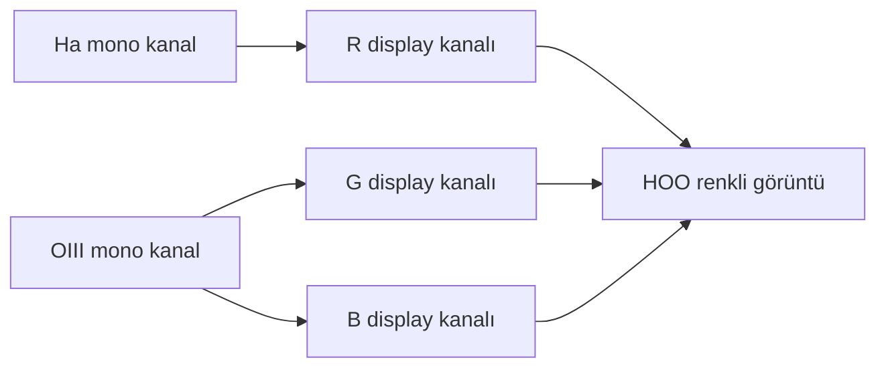
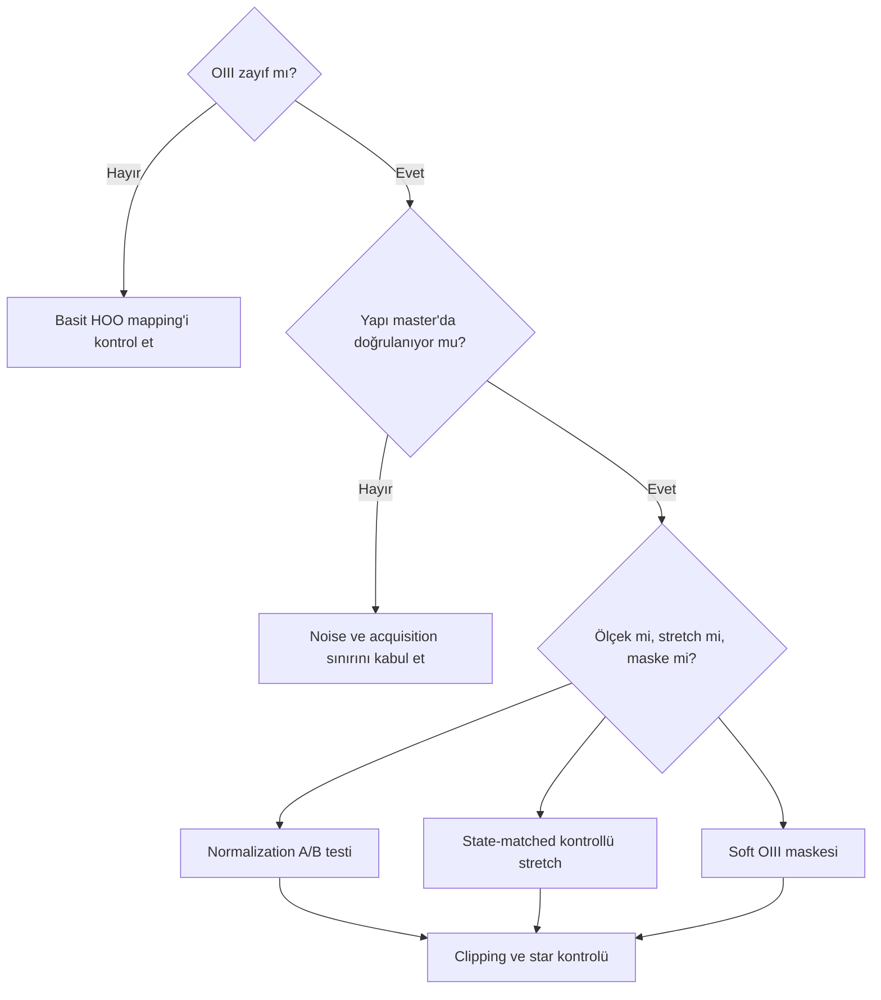

# HOO ve Bicolor Palette Mimarisi

!!! info "Sayfa Bilgisi"
    **Kategori:** Narrowband · **Düzey:** Advanced · **Tahmini okuma:** 10 dk
    **Anahtar kelimeler:** `HOO` · `bicolor` · `Ha OIII` · `cyan OIII` · `red HOO` · `weak OIII`
    **Önerilen ön bilgiler:** [Dar Bant Temelleri](index.md) · [Kanal Normalizasyonu](channel-normalization-and-weighting.md)

## Amaç

HOO'yu tek bir formüle indirgemeden Ha ve OIII sinyalinin üç display kanalına nasıl dağıtıldığını ve kararların hangi riskleri taşıdığını açıklamak.

## Temel mimari

OIII'nin hem G hem B kanalına katkısı, OIII bölgelerinin cyan görünmesine yol açar. Bu bir display eşlemesidir; OIII'nin “gerçek renginin cyan olduğu” iddiası değildir.

## Neden sonuç kırmızı ağırlıklı olabilir?

Ha sinyali daha güçlü, daha geniş veya daha yüksek SNR'lıysa kırmızı kanal görüntünün büyük bölümünü taşır. OIII zayıfsa, gürültülü ise veya contrast/noise-reduction aşamalarında bastırılmışsa cyan bölgeler küçülür. Red dominance şu nedenlerden ayrılmalıdır:

- hedefteki gerçek Ha/OIII morphology farkı,
- farklı integration süreleri ve filter/sensor response,
- background veya gradient mismatch,
- kanal normalizasyonu ve weighting,
- bağımsız stretch farkı,
- OIII maskesinin yanlış polarity'si.

## OIII preservation

Zayıf OIII'yi görünür kılmak, bütün OIII kanalını sınırsız büyütmek değildir. Önce filamentin birden fazla subframe/integration'da tutarlı olup olmadığı ve noise'dan ayrılıp ayrılmadığı kontrol edilir. Ardından local contrast, saturation ve weighting yalnız uygun maske ve dynamic-range kontrolüyle değerlendirilir.

!!! warning
    Cyan suppression, cyan noise'u azaltırken gerçek OIII yapısını da silebilir. “Cyan fazlalığı” değerlendirmesi, OIII master ve combination contribution ile karşılaştırılmadan yapılmamalıdır.

## Ha contamination ifadesinin sınırı

OIII görüntüsündeki Ha-benzeri yapı; filter spectral leakage, continuum, halo, background mismatch veya iki çizginin gerçekten aynı bölgede bulunması gibi farklı nedenlerden kaynaklanabilir. Görsel benzerlik tek başına Ha contamination kanıtı değildir. Filter transmission verisi ve yıldız/nebula morphology karşılaştırması gerekir.

## Channel balancing seçenekleri

| Yaklaşım | Ne zaman düşünülebilir? | Risk |
|---|---|---|
| Fiziksel kayıt ölçeğini korumak | Belgesel karşılaştırmada | OIII display'de zor seçilebilir |
| Reference normalization | Ortak sayısal ölçek gerekiyorsa | OIII noise'u büyüyebilir |
| Weighted HOO | Estetik veya structural separation hedefinde | Fiziksel oran yorumu kaybolur |
| Ayrı nonlinear stretch | Kanalların dynamic range'i çok farklıysa | Tutarsız stretch state ve recombination seams |
| Masked OIII enhancement | Doğrulanmış zayıf yapı için | Maske noise'u ve cyan artefaktı taşıyabilir |

Formüller illustrative olabilir ancak universal değildir. G ve B'nin aynı OIII kaynağından gelmesi bile iki display kanalının zorunlu olarak eşit işlenmesini gerektirmez; her sapma belgelenmelidir.

## Yıldız rengi

İki dar bandın yıldız continuum'unu sınırlı örneklemesi doğal broadband yıldız rengi üretmez. HOO'nun “natural-color impression” vermesi, broadband color doğruluğu anlamına gelmez. Doğal görünümlü yıldız hedefleniyorsa registered broadband stars veya ayrı star workflow değerlendirilir.

## Karar rehberi

## Görsel planı

!!! example "Gerçek veri görseli — raw ve dengelenmiş HOO"
    **Eğitim amacı:** Red dominance, cyan OIII ve noise amplification ayrımını göstermek.
    **Kaynak/kanallar:** Aynı hedefe ait Ha ve OIII master'ları.
    **Durum:** Lineer masters ve aynı nonlinear state.
    **Varyantlar:** Raw HOO, normalized HOO, masked OIII preservation, aşırı cyan örneği.
    **İşaretleme:** Gerçek OIII filamentleri, cyan noise, star halos ve clipped bölgeler.
    **Beklenen ders:** OIII preservation salt saturation artışı değildir.
    **Proje verisi gerekli:** Evet.

## İlgili sayfalar

- [SHO](sho.md)
- [Kanal Normalizasyonu ve Ağırlıklandırma](channel-normalization-and-weighting.md)
- [Narrowband Maske Stratejisi](mask-strategy.md)
- [OIII Kaybolması](../14-hata-kutuphanesi/oiii-kaybolmasi.md)
- [PixelMath Kanal Karışımları](../10-pixelmath/kanal-karisimlari.md)
- [SHO/HOO İş Akışı](../15-workflows/sho-hoo.md)

## Önceki Bölüm

[← HaRGB](hargb.md)

## Sonraki Bölüm

[SHO →](sho.md)
