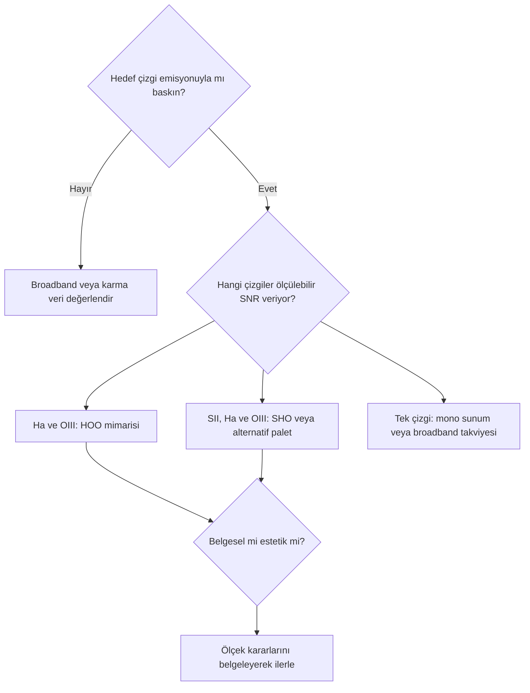
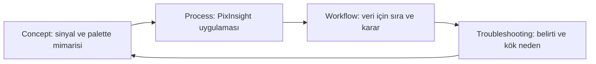

# Dar Bant Görüntüleme Temelleri

!!! info "Sayfa Bilgisi"
    **Kategori:** Narrowband · **Düzey:** Advanced · **Tahmini okuma:** 15 dk
    **Anahtar kelimeler:** `narrowband` · `dar bant` · `Ha` · `H-alpha` · `OIII` · `SII` · `emission line` · `dual-band`
    **Önerilen ön bilgiler:** [Filtreler](../01-temeller/filtreler.md) · [Sinyal ve Gürültü](../02-pixinsight-temelleri/sinyal-ve-gurultu.md)

## Amaç

Dar bant görüntülemenin hangi ışığı kaydettiğini, hangi hedeflerde anlamlı olduğunu ve fiziksel emisyon ile ekranda gösterilen renk arasındaki dönüşüm zincirini açıklamak. Bu sayfa genel filtre teorisini tekrar etmez; bandpass, transmission ve sensör ilişkisi için canonical [Filtreler](../01-temeller/filtreler.md) sayfasını kullanır.

## Dar bant görüntüleme nedir?

Dar bant görüntüleme (narrowband imaging), spektrumun belirli emisyon çizgileri çevresindeki sınırlı bölümünü kaydeder. Bir interference filter için sonuç yalnız etiketindeki çizgi adına bağlı değildir. Merkezi dalga boyu, bant genişliği, transmission eğrisi, bant dışı blocking, optik sistemdeki geliş açısı ve sensörün kuantum verimi birlikte kaydedilen sinyali belirler.

Bu zincirin her aşaması farklıdır. Gösterilen sarı, cyan veya mavi renk doğrudan gazın gözle görülen rengi değildir; fiziksel çizginin seçilmiş bir display kanalına eşlenmesidir.

## Dar bandın sağladığı ayrım

- **Signal isolation:** Hedef çizgi çevresindeki sinyal, geniş spektrumlu arka planın önemli bölümünden ayrılır.
- **Light-pollution resistance:** Bandın dışında kalan yapay ışığın bir kısmı bastırılır; fakat hedef çizgisine yakın emisyon, geniş spektrumlu LED bileşenleri ve uzamsal gradient tamamen yok olmaz.
- **Morphology:** Farklı iyonların uzamsal dağılımları ayrı kanallarda incelenebilir.
- **Contrast:** Emisyon bölgeleri, broadband kayda göre daha yüksek arka plan ayrımı gösterebilir.

!!! warning "Sınır"
    Narrowband filtre “ışık kirliliğine bağışıklık” sağlamaz. Ay ışığı yansıyan güneş ışığıdır; atmosferik saçılma, filter leakage, halo ve gradient üretmeye devam edebilir. OIII gibi daha kısa dalga boylu bantlarda pratik etki hedef, Ay açısı, atmosfer ve filtreye bağlıdır.

## Bandpass, merkezi dalga boyu ve blocking

| Özellik | Ne anlatır? | Neden tek başına yeterli değildir? |
|---|---|---|
| Central wavelength | Geçiş bandının merkezini | Hızlı optikte açıya bağlı kayma olabilir |
| Bandpass/FWHM | Geçiş aralığının yaklaşık genişliğini | Gerçek eğri ve çizginin band içindeki konumu gerekir |
| Peak transmission | Tepe geçirgenliğini | Sensör QE ve toplam eğri sonucu değiştirir |
| Out-of-band blocking | İstenmeyen dalga boylarının bastırılmasını | Sistem yansımaları ve uzak spectral leakage ayrıca değerlendirilir |

Hızlı optik sistemlerde ışınların filtreye geliş açıları genişler ve interference filter bandı daha kısa dalga boylarına kayabilir. Üreticinin ölçülmüş f-ratio verisi yoksa “3 nm her sistemde aynı çalışır” varsayımı yapılmaz.

## Emisyon, continuum ve hedef uygunluğu

**Emission signal**, atom veya iyonların belirli geçişlerinden gelen çizgi ışığıdır. **Continuum signal** ise yıldızlar, galaksi yıldız popülasyonları, yansıma nebulaları ve saçılmış ışık gibi daha geniş spektral bileşenleri kapsar. Dar bant veri continuum'u tamamen sıfırlamaz; filter bandı içine düşen yıldız ışığı ve diğer continuum bileşenleri kaydedilir.

| Hedef | Dar bant uygunluğu | Temel sınırlama |
|---|---|---|
| H II/emisyon nebulası | Genellikle güçlü aday | Çizgi oranları ve morfoloji hedefe göre değişir |
| Gezegenimsi nebula | Ha ve OIII yapıları anlamlı olabilir | Küçük parlak çekirdeklerde dynamic range ve saturation |
| Süpernova kalıntısı | Filamentlerde Ha/OIII/SII ayrımı yararlı olabilir | Kanal SNR'ları büyük ölçüde farklı olabilir |
| Yansıma nebulası | Tek başına uygun olmayabilir | Ana sinyal çizgi değil, saçılmış continuum'dur |
| Galaksi | Seçici Ha takviyesi yararlı olabilir | Broadband yıldız ve continuum yapısının yerini tutmaz |
| Yıldız kümesi | Genellikle broadband önceliklidir | Doğal yıldız rengi dar bantlarla örneklenmez |

## Ha, OIII ve SII neyi temsil eder?

Yaklaşık dalga boyları filtre seçimi ve kanal kimliği için verilir; astrofiziksel nicelik çıkarmak için kalibre edilmiş spektroskopi yerine geçmez.

| Kanal | Yaklaşık çizgi | Fiziksel köken | Görüntüde dikkat edilmesi gereken |
|---|---:|---|---|
| H-alpha (`Ha`) | 656.3 nm | Hidrojenin Balmer-alpha geçişi; iyonize gaz bölgelerinde güçlü olabilir | Birçok H II hedefinde geniş ve baskın morfoloji oluşturabilir |
| OIII | 495.9 ve 500.7 nm çevresi | Çift iyonize oksijenin forbidden çizgileri | Daha yüksek iyonlaşma bölgeleri ve kabuklar farklı dağılım gösterebilir |
| SII | 671.6 ve 673.1 nm çevresi | Tek iyonize sülfürün forbidden çift çizgisi | Bazı hedeflerde daha zayıf veya ince bölgelerde yoğunlaşmış olabilir |

`OIII her zaman zayıftır` veya `SII yalnız şokları gösterir` gibi mutlak kurallar doğru değildir. Çizgi gücü hedefin fiziksel koşullarına, görüş hattına ve kullanılan sistemin spektral yanıtına bağlıdır. Kanal parlaklığı ayrıca toplam exposure, bandpass, transmission, QE, atmosfer, kalibrasyon ve processing ölçeğinden etkilenir.

!!! note "Yoğunluk karşılaştırmasının sınırı"
    Ekranda daha parlak görünen kanal otomatik olarak daha fazla element veya daha yüksek fiziksel bolluk anlamına gelmez. Physical emission, captured signal, calibrated intensity, stretch ve palette mapping ayrı katmanlardır.

## Mono, OSC, dual-band ve multi-band

Mono kamerada ayrı Ha/OIII/SII filtreleri her kanalı doğrudan ayrı bir integration olarak üretir. OSC ile dual-band veya multi-band filtre, birden fazla emisyon bölgesini aynı exposure'da Bayer kanallarına dağıtır. Debayer matrisi, sensörün kanal yanıtı ve filtre bandları birbirine karıştığı için OSC çıktısı, üç bağımsız mono master ile eşdeğer kabul edilmez.

Dual-band veride Ha ve OIII ayrımı yapılabilirlik derecesi filtrenin bandlarına, sensör yanıtına ve işlem yöntemine bağlıdır. Tek exposure'dan bağımsız SII elde edildiği varsayılmaz.

## Kanal morfolojisini okuma

1. Kanalları aynı geometry ve lineer durumda karşılaştırın.
2. STF görünümünü fiziksel ölçek sanmayın; bağımsız Auto STF, zayıf kanalı güçlü kanal kadar parlak gösterebilir.
3. Gradient, halo, star profile ve background farkını nebula morfolojisinden ayırın.
4. Normalizasyonun fiziksel çizgi oranlarını değiştirebileceğini kaydedin.
5. Palet öncesinde her kanalın SNR ve clipping durumunu ayrı inceleyin.

## Palet, kalibrasyon değildir

- **Physical signal calibration:** bias/dark/flat, registration ve integration ile ölçüm zincirini düzeltir.
- **Channel normalization:** kanalların sayısal ölçeğini seçilmiş bir referansa yaklaştırır.
- **Palette mapping:** mono kanalları RGB display kanallarına atar.
- **Hue remapping/saturation:** oluşan renklerin görünümünü değiştirir.
- **Star-color restoration:** broadband veya ayrı star verisini nebula paletinden bağımsız yönetir.

Broadband [SPCC](../05-color-calibration/spcc.md) mantığı, SHO veya HOO paletine tek bir “doğru renk” atamaz. Kapsam ayrımı için [SPCC Narrowband](../05-color-calibration/spcc-narrowband.md) ve [Narrowband Renk Dengesi](natural-sho.md) sayfalarına bakın.

## Seçim rehberi

## Görsel planı

!!! example "Gerçek veri görseli — Ha/OIII/SII karşılaştırması"
    **Eğitim amacı:** Aynı hedefte fiziksel çizgi, kayıtlı kanal ve display stretch farkını göstermek.
    **Kaynak veri:** Projeye ait, aynı geometry'de Ha/OIII/SII master'ları.
    **Durum:** Lineer masters; ortak STF ve bağımsız STF varyantları.
    **Varyantlar:** Ham lineer görünüm, ortak display stretch, eşitlenmiş presentation.
    **İşaretleme:** Ortak filamentler, yalnız bir kanalda görülen yapılar, halo ve noise bölgeleri.
    **Beklenen ders:** Kanal parlaklığı ile morfoloji ve palette rengi aynı kavram değildir.
    **Proje verisi gerekli:** Evet.

## İlgili kavramlar ve sonraki adımlar

- [SHO Paleti](sho.md)
- [HOO Paleti](hoo.md)
- [Kanal Normalizasyonu ve Ağırlıklandırma](channel-normalization-and-weighting.md)
- [Sentetik Parlaklık](synthetic-luminance.md)
- [Yıldızsız İşleme ve Yeniden Birleştirme](starless-processing.md)
- [Narrowband Maske Stratejisi](mask-strategy.md)
- [Narrowband Sorun Giderme](troubleshooting.md)
- [SHO ve HOO İş Akışı](../15-workflows/sho-hoo.md)
- [PixelMath Kanal Karışımları](../10-pixelmath/kanal-karisimlari.md)

## Kaynaklar

- [ESA — A perfect storm of turbulent gases](https://www.esa.int/Science_Exploration/Space_Science/Space_sensations/A_perfect_storm_of_turbulent_gases): SII/Ha/OIII mapped-color örneği.
- [ESA — Painting with oxygen and hydrogen](https://www.esa.int/About_Us/Corporate_news/Painting_with_oxygen_and_hydrogen): narrowband çizgiler ve enhanced-color ayrımı.
- [Chroma — Astronomy and Astrophotography Filters](https://www.chroma.com/applications/astronomy-and-astrophotography/): emission-line isolation ve filter kapsamı.
- [Chroma — Narrowband Filter f-number Data](https://www.chroma.com/resources/technical-library/narrowband-astronomy-filter-f-number-data/): f-ratio ile ölçülmüş spectral response değişimi.
- [NASA — Moonlight](https://science.nasa.gov/moon/moonlight/): Ay ışığının yansıyan güneş ışığı olması.

## Önceki Bölüm

[← PixelMath ile LRGB](../08-lrgb/pixelmath-lrgb.md)

## Sonraki Bölüm

[HaRGB →](hargb.md)
