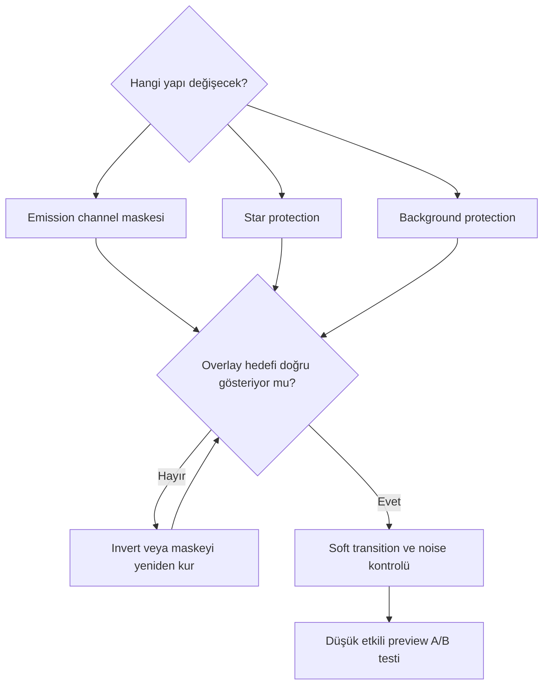

# Narrowband Maske Stratejisi

!!! info "Sayfa Bilgisi"
    **Kategori:** Narrowband · **Düzey:** Advanced · **Tahmini okuma:** 10 dk
    **Anahtar kelimeler:** `Ha mask` · `OIII mask` · `SII mask` · `emission mask` · `weak OIII` · `mask polarity`
    **Önerilen ön bilgiler:** [Maske Mantığı](../11-maskeler/maske-mantigi.md)

## Amaç

RangeSelection, StarMask veya ColorMask process talimatlarını tekrar etmeden dar bant kanallarına özgü seçici işleme stratejisini açıklamak.

## Maske türleri ve amaçları

| Maske | Temel amaç | Başlıca risk |
|---|---|---|
| Ha mask | Ha morphology'sini seçmek veya korumak | Bütün nebula Ha-dominant ise aşırı geniş seçim |
| OIII mask | Doğrulanmış zayıf OIII'yi korumak/geliştirmek | OIII noise ve halo'nun seçilmesi |
| SII mask | Lokal SII yapısını ayırmak | Zayıf SII yerine background noise seçmek |
| Combined emission mask | Nebula bütününü background'dan ayırmak | Faint outer signal'ın dışarıda kalması |
| Star protection | Palette/detail işlemlerinden stars'ı korumak | Halo'nun maskeden taşması |
| Highlight protection | Bright cores ve star cores'u sınırlamak | Yapısal kontrastın fazla bastırılması |
| Background protection | Chromatic noise ve gradient'i korumak | Zayıf nebula'nın background sanılması |

## Polarity ve soft transition

Genel [Maske Mantığı](../11-maskeler/maske-mantigi.md) uyarınca beyaz alan güçlü etki, siyah alan güçlü koruma olarak okunur; inversion bu ilişkiyi değiştirir. Dar bantta maskenin histogramı kadar morphology'si de incelenir. Almost-all-white maske bütün görüntüyü etkiler; almost-all-black maske işlemi görünmez kılar.

## Weak OIII enhancement

OIII maskesi üretmeden önce structure'ın OIII master'da tutarlı olduğu doğrulanır. Aggressive stretch noise'u maske içine taşırsa LHE, saturation veya local contrast yalnız noise'u cyan hale getirebilir. Maskeyi yumuşatmak gerçek structure sınırını silmemeli; sertleştirmek de filament çevresinde seam üretmemelidir.

## Color-region isolation

Palette sonrası ColorMask belirli hue bölgelerini seçebilir; fakat hue, physical channel ile bire bir eşleşmeyebilir. SHO remapping sonrası “cyan mask = OIII” veya “green mask = Ha” varsayımı contribution analizi olmadan yapılmaz. Physical-channel mask daha doğrudan morphology taşır; color mask display sonucunu seçer.

## Maskenin nebulayı silmesi

- Polarity ters olabilir.
- Mask source yanlış kanal veya yanlış image identifier olabilir.
- Black point clipping faint emission'u maskeden çıkarmış olabilir.
- Star mask subtraction nebula knots'ını da çıkarmış olabilir.
- Combined mask formülü `[0,1]` dışına taşmış olabilir.

## Görsel planları

!!! example "Gerçek veri görseli — mask polarity hatası"
    **Eğitim amacı:** Doğru/ters polarity'nin OIII enhancement üzerindeki etkisini göstermek.
    **Kaynak/kanallar:** Project-owned HOO, OIII mask ve star mask.
    **Durum:** Nonlinear target; mask source history belgeli.
    **Varyantlar:** Mask image, overlay, normal, inverted.
    **İşaretleme:** Protected background, OIII filament ve halo.
    **Beklenen ders:** Overlay kontrolü uygulamadan önce zorunludur.
    **Proje verisi gerekli:** Evet.

!!! example "Gerçek veri görseli — LHE maskeli/maskesiz"
    **Eğitim amacı:** Uygun maskenin weak OIII ve noise üzerindeki etkisini göstermek.
    **Kaynak:** Project-owned OIII-bearing nebula.
    **Durum:** Aynı nonlinear state.
    **Varyantlar:** LHE yok, maskesiz LHE, soft OIII maskeli LHE.
    **İşaretleme:** Filament continuity, background noise, halos.
    **Beklenen ders:** Mask, olmayan sinyali yaratmaz; etki alanını sınırlar.
    **Proje verisi gerekli:** Evet.

## İlgili process ve kavramlar

- [RangeSelection](../11-maskeler/range-mask.md)
- [StarMask](../11-maskeler/star-mask.md)
- [ColorMask](../11-maskeler/color-mask.md)
- [Luminance Mask](../11-maskeler/luminance-mask.md)
- [LocalHistogramEqualization](../12-detay-ve-kontrast/local-histogram-equalization.md)
- [OIII Kaybolması](../14-hata-kutuphanesi/oiii-kaybolmasi.md)

## Önceki Bölüm

[← Yıldızsız İşleme](starless-processing.md)

## Sonraki Bölüm

[Narrowband Sorun Giderme →](troubleshooting.md)
