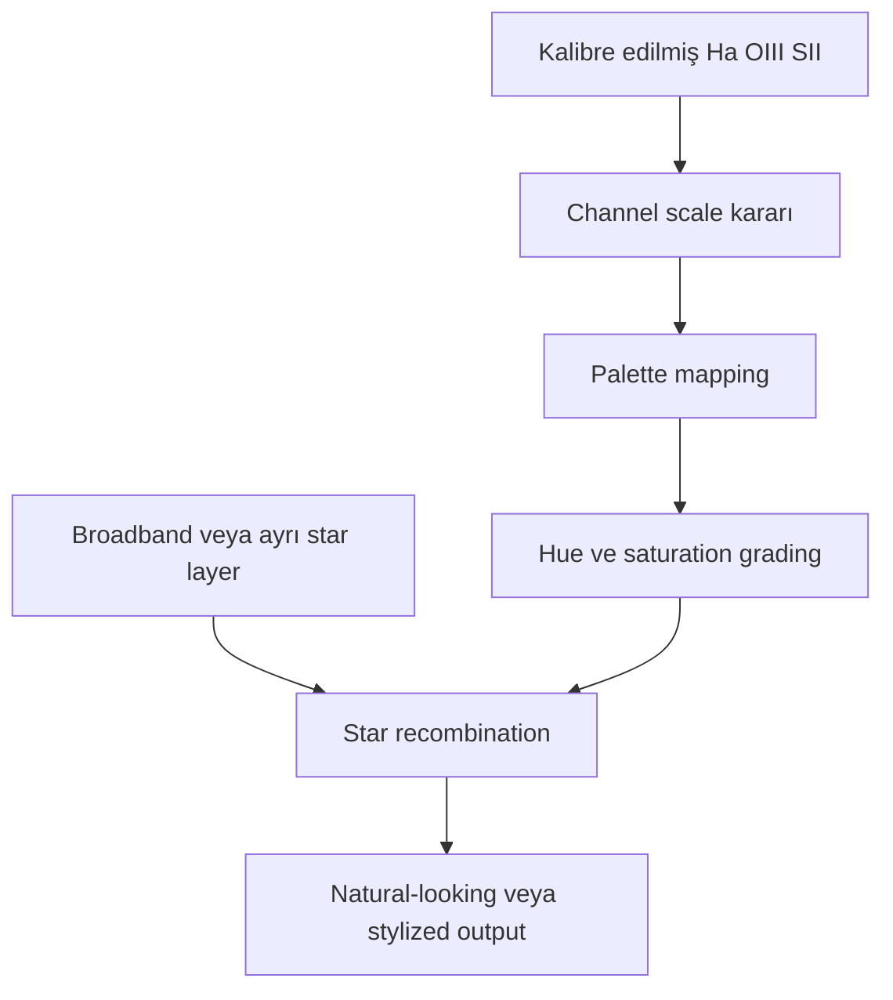

# Narrowband Renk Dengesi ve Natural-Looking SHO

!!! info "Sayfa Bilgisi"
    **Kategori:** Narrowband · **Düzey:** Advanced · **Tahmini okuma:** 10 dk
    **Anahtar kelimeler:** `narrowband color calibration` · `natural SHO` · `natural-looking stars` · `white balance` · `hue remapping`
    **Önerilen ön bilgiler:** [Renk ve Kanallar](../02-pixinsight-temelleri/renk-ve-kanallar.md) · [SHO](sho.md)

## Amaç

“Natural SHO” ifadesinin fiziksel natural color garantisi olmadığını açıklamak; broadband color calibration, channel normalization, palette mapping, hue remapping ve star-color restoration işlemlerini birbirinden ayırmak.

## Beş ayrı renk problemi

| Problem | Sorduğu soru | Canonical araç/kavram |
|---|---|---|
| Broadband color calibration | Sistem yanıtı ve stellar reference nasıl dengelenir? | [SPCC](../05-color-calibration/spcc.md) |
| Channel normalization | Mono kanallar hangi sayısal scale'de karşılaştırılır? | [Normalization ve Weighting](channel-normalization-and-weighting.md) |
| Palette mapping | Ha/OIII/SII hangi RGB display kanallarına gider? | [SHO](sho.md), [HOO](hoo.md) |
| Hue/saturation grading | Mapped colors nasıl sunulur? | CurvesTransformation/ColorMask süreçleri |
| Star-color restoration | Nebula paletinden bağımsız yıldız rengi nasıl korunur? | [Starless Strategy](starless-processing.md) |

## Physical calibration ve aesthetic construction

Physical signal calibration, sensör ve acquisition zincirindeki düzeltmeleri içerir. Palette construction ise physical channels'ı görünür RGB renklerine eşler. SHO ve HOO'da beyaz nokta seçimi, broadband white balance ile aynı fiziksel referansı taşımayabilir.

SPCC/PCC, ordinary broadband stellar color bağlamında değerlidir; mapped SHO/HOO nebula için tek ve evrensel “correct palette” üretmez. [SPCC Narrowband Kapsamı](../05-color-calibration/spcc-narrowband.md) bu sınırı process düzeyinde açıklar.

## Natural-looking ne demektir?

Bu terim en az üç farklı niyet için kullanılabilir:

- yeşil dominance'ı azaltıp daha dengeli bir palette oluşturmak,
- broadband görüntülere benzeyen hue dağılımı üretmek,
- broadband star layer ile doğal görünümlü yıldızlar korumak.

Bu hedeflerin hiçbiri narrowband nebula rengini literal görünür renge dönüştürmez. Sayfada “doğal” kullanıldığında hangi niyetin kastedildiği açıkça belirtilmelidir.

## Güvenli renk dengesi ilkeleri

- Channel contribution değişikliklerinden önce basit mapping'i referans olarak saklayın.
- Histogram ve clipping'i her RGB kanalında ayrı kontrol edin.
- Green suppression sırasında meşru Ha morphology'sini silmeyin.
- Cyan reduction sırasında OIII filamentlerini noise ile birlikte bastırmayın.
- Saturation artışını signal recovery sanmayın.
- Broadband yıldızları nebula ile geometry, PSF ve stretch state açısından eşleştirin.

## Maske stratejisi

Ha/OIII/SII veya combined emission maskeleri color-region isolation için kullanılabilir; fakat maskeyi üretmek palette rengini kalibre etmez. Soft transitions, background protection ve star protection için [Narrowband Maske Stratejisi](mask-strategy.md) kullanılmalıdır.

## Görsel planı

!!! example "Gerçek veri görseli — natural-looking ve stylized ayrımı"
    **Eğitim amacı:** Physical channel mapping, hue grading ve star restoration katmanlarını ayırmak.
    **Kaynak:** Proje SHO masters ve registered broadband RGB stars.
    **Durum:** Nebula ve stars için belgelenmiş eşdeğer nonlinear state.
    **Varyantlar:** Raw SHO, subtle palette, aggressive palette, broadband-star recombination.
    **İşaretleme:** Korunan OIII/SII bölgeleri, star halos ve clipped chroma.
    **Beklenen ders:** Natural-looking sonuç bir presentation hedefidir.
    **Proje verisi gerekli:** Evet.

## İlgili sayfalar

- [Alternative Palettes ve Foraxx](foraxx.md)
- [Yıldızsız İşleme](starless-processing.md)
- [Narrowband Sorun Giderme](troubleshooting.md)
- [ColorMask](../11-maskeler/color-mask.md)
- [CurvesTransformation](../13-final/curves-transformation.md)

## Önceki Bölüm

[← Alternative Palettes ve Foraxx](foraxx.md)

## Sonraki Bölüm

[Kanal Normalizasyonu ve Ağırlıklandırma →](channel-normalization-and-weighting.md)
