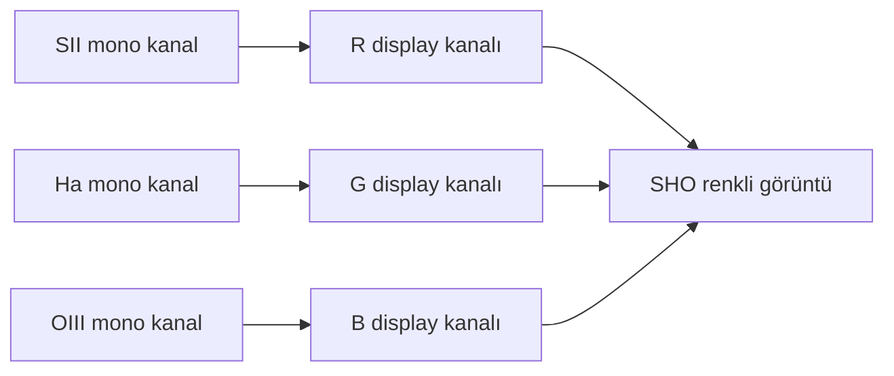

# SHO ve Hubble Palette Mimarisi

!!! info "Sayfa Bilgisi"
    **Kategori:** Narrowband · **Düzey:** Advanced · **Tahmini okuma:** 10 dk
    **Anahtar kelimeler:** `SHO` · `Hubble Palette` · `green SHO` · `SII Ha OIII` · `channel mapping`
    **Önerilen ön bilgiler:** [Dar Bant Temelleri](index.md) · [Kanal Normalizasyonu](channel-normalization-and-weighting.md)

## Amaç

SHO'yu sabit bir PixelMath tarifi değil, fiziksel kanallardan display rengine giden bir eşleme mimarisi olarak açıklamak.

## Temel eşleme

Bu `SII → R`, `Ha → G`, `OIII → B` ataması, NASA/ESA Hubble görüntülerinde kullanılan tanınmış mapped-color yaklaşımı nedeniyle **Hubble Palette** olarak anılır. Atama fiziksel çizgileri ayırt edilebilir renklerle sunar; insan gözünün nebulayı uzayda bu renklerde göreceği anlamına gelmez.

## Raw SHO neden yeşil olabilir?

Ha birçok emisyon hedefinde daha yüksek SNR, daha geniş morfoloji veya daha güçlü kaydedilmiş yoğunluk üretebilir. Ha yeşil display kanalına atandığı için doğrudan kombinasyon yeşil ağırlıklı görünebilir. Bunun kaynağı yalnız fiziksel çizgi gücü değildir: exposure süresi, filter transmission, sensor QE, background, normalization ve stretch de sonucu değiştirir.

Yeşili azaltmak bir “kalibrasyon düzeltmesi” olmak zorunda değildir; çoğu zaman presentation kararıdır. SCNR, hue remapping veya channel weighting uygulanmadan önce gerçek Ha/OIII/SII yapıların kaybolup kaybolmadığı kontrol edilir.

## Renk dengesi ile fiziksel güç ayrımı

| Karar | Koruduğu şey | Değiştirebileceği şey |
|---|---|---|
| Fiziksel ölçeği korumak | Kaydedilmiş relatif kanal ilişkisi | Görsel renk ayrımı zayıf kalabilir |
| Channel normalization | Seçilmiş istatistikte ortak ölçek | Relatif fiziksel yoğunluk ilişkisi |
| Weighted mapping | Yapısal veya estetik vurgu | Hue ve kanal dominance |
| Hue remapping | Bölgelerin display rengi | Fiziksel çizgi rengi yorumu |
| Saturation | Renk ayrımının görünürlüğü | Noise ve clipping görünümü |

## Sunum amacına göre karar

| Amaç | Öncelik | Kaçınılacak varsayım |
|---|---|---|
| Documentary/scientific emphasis | Kanal kimliğini, stretch ve ölçek kararını belgelemek | Display rengini element bolluğu saymak |
| Yüksek structural separation | Benzer morfolojileri farklı hue bölgelerine ayırmak | Zayıf kanalı noise ile birlikte zorlamak |
| Güçlü color contrast | Kontrollü weighting ve hue remapping | Tek paleti evrensel doğru saymak |
| Natural-looking stars | Broadband star layer veya ayrı star strategy | Narrowband yıldızlardan tam broadband renk beklemek |
| Subtle rendering | Küçük hue/saturation değişiklikleri | Kanal farklarını tamamen eşitlemek |
| Aggressive artistic rendering | Açıkça belgelenmiş estetik hedef | Bilimsel renk veya flux iddiası taşımak |

## Yıldız rengi ve halo sorunu

SII, Ha ve OIII filtreleri yıldız continuum'unun farklı dar bölümlerini örnekler. Star profile, focus, seeing ve halo farkları birleşimde magenta, yeşil veya cyan yıldızlar üretebilir. Bu durum yalnız hue problemi değildir; channel geometry ve profile mismatch de incelenir. [Yıldızsız İşleme](starless-processing.md), star layer'ı ayrı yönetebilir fakat fiziksel sahneyi kusursuz ayırdığı varsayılmaz.

## Güvenli değerlendirme sırası

1. Üç master'ın geometry, lineer durum ve clipping durumunu doğrulayın.
2. Her kanalın gerçek SNR ve morfolojisini bağımsız inceleyin.
3. [Normalizasyon](channel-normalization-and-weighting.md) gerekip gerekmediğini sunum amacına göre belirleyin.
4. Basit SHO eşlemesini kontrol görüntüsü olarak üretin.
5. Hue remapping veya green suppression öncesi channel contribution kayıtlarını tutun.
6. Nebula ve yıldız kabul ölçütlerini ayrı değerlendirin.

!!! warning
    Fixed coefficient veya tek SCNR miktarı bu sayfanın konusu değildir. Uygulanabilir ifadeler [PixelMath Kanal Karışımları](../10-pixelmath/kanal-karisimlari.md), işlem sırası ise [SHO/HOO İş Akışı](../15-workflows/sho-hoo.md) tarafından sahiplenilir.

## Görsel planı

!!! example "Gerçek veri görseli — raw ve dengelenmiş SHO"
    **Eğitim amacı:** Ha dominance, channel normalization ve hue remapping etkilerini ayırmak.
    **Kaynak/kanallar:** Aynı hedefe ait proje SII, Ha ve OIII master'ları.
    **Durum:** Lineer mapping ve kontrollü nonlinear sunum ayrı gösterilecek.
    **Varyantlar:** Raw SHO, normalized SHO, hafif hue remap, agresif sanatsal sürüm.
    **İşaretleme:** Ha-dominant bölgeler, zayıf OIII, star halos ve clipping.
    **Beklenen ders:** Renk dengesi fiziksel line strength ile özdeş değildir.
    **Proje verisi gerekli:** Evet.

## İlgili sayfalar

- [HOO](hoo.md)
- [Alternative Palettes ve Foraxx](foraxx.md)
- [Narrowband Renk Dengesi](natural-sho.md)
- [Narrowband Maske Stratejisi](mask-strategy.md)
- [OIII Kaybolması](../14-hata-kutuphanesi/oiii-kaybolmasi.md)

## Kaynaklar

- [ESA — A perfect storm of turbulent gases](https://www.esa.int/Science_Exploration/Space_Science/Space_sensations/A_perfect_storm_of_turbulent_gases)
- [ESA — Painting with oxygen and hydrogen](https://www.esa.int/About_Us/Corporate_news/Painting_with_oxygen_and_hydrogen)

## Önceki Bölüm

[← HOO](hoo.md)

## Sonraki Bölüm

[Alternative Palettes ve Foraxx →](foraxx.md)
