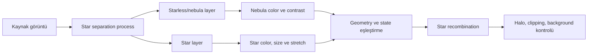

# Yıldızsız İşleme ve Yıldız Yeniden Birleştirme

!!! info "Sayfa Bilgisi"
    **Kategori:** Narrowband · **Düzey:** Advanced · **Tahmini okuma:** 10 dk
    **Anahtar kelimeler:** `starless` · `star recombination` · `star layer` · `magenta stars` · `black halos`
    **Önerilen ön bilgiler:** [Maske Mantığı](../11-maskeler/maske-mantigi.md) · [StarXTerminator](../06-ai-eklentileri/starxterminator.md)

## Amaç

Yıldızsız işlemeyi bir workflow stratejisi olarak açıklamak; star separation output'unu fiziksel nebula/yıldız ayrımı sanmadan recombination risklerini yönetmek.

!!! warning "Kavramsal sınır"
    Starless image ve star image, sahnenin fiziksel olarak kusursuz iki bileşeni değildir. Model tabanlı ayrım residual, halo, clipped core veya yanlış sınıflandırılmış compact structure bırakabilir.

## Ayrım ve recombination zinciri

## Neden kullanılır?

- Nebula palette ve local contrast işlemlerinin yıldız renk/size'ını bozmasını azaltmak.
- Narrowband stars yerine registered broadband star layer kullanmak.
- Weak OIII veya SII enhancement sırasında yıldız halolarını korumak.
- Star reduction ve nebula detail kararlarını ayırmak.

## Temel riskler

| Belirti | Olası neden | Diagnostic check |
|---|---|---|
| Black halos | Starless residual veya yanlış additive/subtractive recombination | Starless ve stars toplamını source ile fark görüntüsünde karşılaştır |
| Magenta stars | Narrowband channel profile/color mismatch | Star layer RGB kanallarını ve saturation'ı ayrı incele |
| Sert yıldız kenarı | Stars ve nebula farklı stretch/PSF state | Aynı zoom'da halo transition kontrolü |
| Clipped cores | Star layer veya recombination output range aşımı | Max value ve clipped pixel kontrolü |
| Background seams | Layer background offset mismatch | Stars-only background histogramı |
| Nebula kaybı | Separation modelinin compact structure'ı star sayması | Residual/difference image incelemesi |

## Lineer ve nonlinear star handling

Lineer separation, düşük görünürlükte doğru STF ile değerlendirilir; nonlinear separation ise stretch ile değişmiş profile ve clipping taşır. Recombination öncesi iki layer'ın yalnız “ikisi de açık görünüyor” olması yeterli değildir. Geometry, background, dynamic range ve stretch history uyumlu olmalıdır.

## Recombination order

Tek evrensel sıra yoktur. Nebula önce işlenip stars sonra eklenebilir; stars ayrı color-calibrated broadband kaynaktan gelebilir; bazı yöntemler lineer bazıları nonlinear recombination kullanabilir. Seçilen yöntemin state gereksinimi [PixelMath Kanal Karışımları](../10-pixelmath/kanal-karisimlari.md) veya ilgili workflow'da açıkça belgelenmelidir.

## Görsel planları

!!! example "Gerçek veri görseli — separation ve layer denetimi"
    **Eğitim amacı:** Starless output'un fiziksel ayrım olmadığını residual üzerinden göstermek.
    **Kaynak:** Project-owned SHO/HOO color image.
    **Durum:** Aynı lineer veya aynı nonlinear state.
    **Varyantlar:** Source, starless, stars, difference image.
    **İşaretleme:** Halos, compact nebula knots, clipped cores.
    **Beklenen ders:** Her iki layer recombination öncesi denetlenmelidir.
    **Proje verisi gerekli:** Evet.

!!! example "Gerçek veri görseli — recombination failure"
    **Eğitim amacı:** Black halo ve mismatched stretch nedenini göstermek.
    **Kaynak:** Aynı verinin doğru ve hatalı layer state'leri.
    **Durum:** Nonlinear; history kayıtlı.
    **Varyantlar:** Hatalı recombination, fark görüntüsü, düzeltilmiş sonuç.
    **İşaretleme:** Halo boundaries, background seam ve clipped stars.
    **Beklenen ders:** Formula kadar layer state de sonucu belirler.
    **Proje verisi gerekli:** Evet.

## İlgili sayfalar

- [StarXTerminator](../06-ai-eklentileri/starxterminator.md)
- [Narrowband Renk Dengesi](natural-sho.md)
- [Narrowband Maske Stratejisi](mask-strategy.md)
- [Narrowband Sorun Giderme](troubleshooting.md)
- [SHO/HOO İş Akışı](../15-workflows/sho-hoo.md)

## Önceki Bölüm

[← Sentetik Parlaklık](synthetic-luminance.md)

## Sonraki Bölüm

[Narrowband Maske Stratejisi →](mask-strategy.md)
