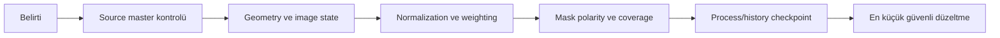

# Narrowband Sorun Giderme

!!! info "Sayfa Bilgisi"
    **Kategori:** Narrowband · **Düzey:** Advanced · **Tahmini okuma:** 15 dk
    **Anahtar kelimeler:** `green SHO` · `red HOO` · `weak OIII` · `magenta stars` · `black halos` · `LinearFit washed-out` · `PixelMath error`
    **Önerilen ön bilgiler:** [Dar Bant Temelleri](index.md) · [PixelMath Hata Ayıklama](../10-pixelmath/hata-ayiklama.md)

## Amaç

Yaygın narrowband failures'ı symptom, likely cause, diagnostic check ve güvenli corrective action düzeninde sınıflandırmak. Sabit parameter veya coefficient önerilmez.

## Tanı sırası

## Failure cards

| Belirti | Olası neden | Diagnostic check | Güvenli düzeltme | Kavram | Process | Workflow |
|---|---|---|---|---|---|---|
| Görüntü neredeyse tamamen kırmızı | Ha dominance, zayıf OIII, mapping/scale hatası | Ha/OIII masters ve channel contributions | Baseline HOO'ya dön; scale ile stretch'i ayrı A/B test et | [HOO](hoo.md) | [PixelMath](../10-pixelmath/kanal-karisimlari.md) | [SHO/HOO](../15-workflows/sho-hoo.md) |
| OIII contrast sonrası kayboluyor | Mask dışı bırakma, aggressive NR/LHE, cyan suppression | History checkpoint ve OIII reference blink | İlk kayıp adımına dön; soft OIII mask ile düşük etki | [Mask Strategy](mask-strategy.md) | [LHE](../12-detay-ve-kontrast/local-histogram-equalization.md) | [OIII Kaybolması](../14-hata-kutuphanesi/oiii-kaybolmasi.md) |
| SHO aşırı yeşil | Ha'nın G kanalında dominance'ı | Raw SHO ve source histograms | Fiziksel/estetik hedefi seç; channel contribution'ı kontrollü değiştir | [SHO](sho.md) | [SCNR](../13-final/scnr.md) | [SHO/HOO](../15-workflows/sho-hoo.md) |
| Normalizasyon sonrası görüntü beyaz | Aşırı scale, yanlış statistic, display STF | Pixel min/max/median ve clipped count | Original clone'a dön; reference ve denominator'ı doğrula | [Normalization](channel-normalization-and-weighting.md) | [PixelMath](../10-pixelmath/hata-ayiklama.md) | [SHO/HOO](../15-workflows/sho-hoo.md) |
| LinearFit washed-out | Yanlış reference/state veya STF yanılsaması | Linked STF kapat; gerçek histogramı ölç | State-matched clones ile yeniden değerlendir | [Normalization](channel-normalization-and-weighting.md) | LinearFit **DOC-REQUIRED** | [SHO/HOO](../15-workflows/sho-hoo.md) |
| Maske nebulayı siliyor | Ters polarity veya clipped mask | Overlay ve mask histogramı | Invert/test; black point'i geri al | [Mask Strategy](mask-strategy.md) | [RangeSelection](../11-maskeler/range-mask.md) | [SHO/HOO](../15-workflows/sho-hoo.md) |
| Maske tümüyle beyaz/siyah | Threshold/state yanlış | Mask min/max ve overlay | Kaynak state'i doğrula; threshold'u veriyle yeniden kur | [Maske Mantığı](../11-maskeler/maske-mantigi.md) | [RangeSelection](../11-maskeler/range-mask.md) | [Maske Hatası](../14-hata-kutuphanesi/maske-tum-goruntuyu-kapliyor.md) |
| LHE weak OIII'yi yok ediyor | Uygunsuz scale, mask veya clipping | OIII master ile before/after blink | Daha düşük etki; uygun scale ve soft mask | [Dynamic Range](../02-pixinsight-temelleri/dinamik-aralik-ve-yerel-kontrast.md) | [LHE](../12-detay-ve-kontrast/local-histogram-equalization.md) | [OIII Kaybolması](../14-hata-kutuphanesi/oiii-kaybolmasi.md) |
| OIII noisy ve aşırı cyan | Noise channel olarak büyütülmüş | OIII SNR ve background crop | Signal maskesi; weight/saturation'ı azalt; acquisition limitini kabul et | [HOO](hoo.md) | [NoiseXTerminator](../06-ai-eklentileri/noisexterminator.md) | [SHO/HOO](../15-workflows/sho-hoo.md) |
| SII kayboluyor | Zayıf SNR, weighting veya Ha overlap | SII master ve contribution map | SII structure doğrulanırsa controlled weighting/mask | [SHO](sho.md) | [PixelMath](../10-pixelmath/kanal-karisimlari.md) | [SHO/HOO](../15-workflows/sho-hoo.md) |
| Stars magenta | Narrowband star profiles/color mismatch | Star layer RGB channels ve halos | Stars'ı ayrı işle; gerekirse registered broadband stars | [Starless](starless-processing.md) | [StarXTerminator](../06-ai-eklentileri/starxterminator.md) | [SHO/HOO](../15-workflows/sho-hoo.md) |
| Recombination sonrası black halos | Residual veya incompatible layer states | Source − recombined difference | Layer background/state'i eşleştir; recombination yöntemini yeniden doğrula | [Starless](starless-processing.md) | [PixelMath](../10-pixelmath/hata-ayiklama.md) | [SHO/HOO](../15-workflows/sho-hoo.md) |
| Background chromatically uneven | Channel gradient/offset mismatch | Channels ve background samples | Palette'den önce channel-specific gradient tanısı | [Gradient Theory](../04-gradient/gradient-theory.md) | [DBE](../04-gradient/dbe.md) | [SHO/HOO](../15-workflows/sho-hoo.md) |
| PixelMath clipping | Expression output `[0,1]` dışına taşıyor | New image statistics ve clipped pixels | Expression/weights'i guard ve range analiziyle düzelt | [Normalization](channel-normalization-and-weighting.md) | [PixelMath Debug](../10-pixelmath/hata-ayiklama.md) | [SHO/HOO](../15-workflows/sho-hoo.md) |
| Channel identifier invalid | View ID yanlış veya kapanmış | Workspace View ID listesini kontrol et | Güvenli View ID kullan; expression'ı küçük testte doğrula | [PixelMath Temelleri](../10-pixelmath/temeller.md) | [PixelMath Debug](../10-pixelmath/hata-ayiklama.md) | [SHO/HOO](../15-workflows/sho-hoo.md) |
| Yanlış image identifier kullanılıyor | Benzer isimli clone/master | Expression editor ve active views | Açıklayıcı View ID; source checksum/history kaydı | [PixelMath Temelleri](../10-pixelmath/temeller.md) | [PixelMath Debug](../10-pixelmath/hata-ayiklama.md) | [SHO/HOO](../15-workflows/sho-hoo.md) |
| Uyumsuz stretch state sonrası scaling | Lineer/nonlinear kanallar karışmış | Histogram shape ve processing history | Aynı checkpoint'ten matched-state inputs üret | [Lineer/Nonlineer](../02-pixinsight-temelleri/lineer-ve-nonlineer-goruntu.md) | [HistogramTransformation](../07-stretch/histogram-transformation.md) | [SHO/HOO](../15-workflows/sho-hoo.md) |

## En küçük güvenli düzeltme ilkesi

1. Belirtinin ilk ortaya çıktığı history adımını bulun.
2. Source masters, geometry ve state'i doğrulayın.
3. Palette'i basit SHO/HOO baseline'a döndürün.
4. Tek seferde yalnız normalization, weighting, mask veya process değişkenlerinden birini değiştirin.
5. Sonucu stars, background, weak signal ve clipping açısından ayrı kabul edin.

## Görsel planı

!!! example "Gerçek veri görseli — failure atlas"
    **Eğitim amacı:** Red HOO, green SHO, weak OIII loss, magenta stars ve black halos'u aynı diagnostic diliyle göstermek.
    **Kaynak:** Project-owned processing history ve masters.
    **Kanallar/durum:** Ha/OIII/SII, starless/star layers; lineer ve nonlinear checkpoint'ler ayrı.
    **Varyantlar:** Symptom, diagnostic overlay/difference, corrected output.
    **İşaretleme:** İlk bozulma bölgesi, histogram/clipping ve layer boundaries.
    **Beklenen ders:** Belirti tek başına kök nedeni belirlemez.
    **Proje verisi gerekli:** Evet.

## İlgili sayfalar

- [OIII Kaybolması](../14-hata-kutuphanesi/oiii-kaybolmasi.md)
- [Maske Tüm Görüntüyü Kaplıyor](../14-hata-kutuphanesi/maske-tum-goruntuyu-kapliyor.md)
- [PixelMath Hata Ayıklama](../10-pixelmath/hata-ayiklama.md)
- [Gradient Tanısı](../04-gradient/gradient-diagnostics.md)

## Önceki Bölüm

[← Narrowband Maske Stratejisi](mask-strategy.md)

## Sonraki Bölüm

[PixelMath'e Giriş →](../10-pixelmath/index.md)
