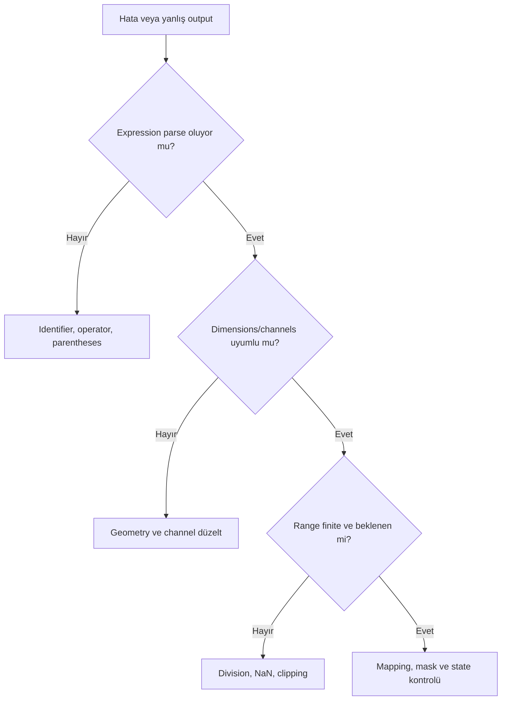

# PixelMath Hata Ayıklama

## Amaç

Parser, identifier, geometry, channel, range ve numerical safety sorunlarını belirtilerden kök nedene sistematik biçimde ayırmaktır.

## Debugging strateji

## Hata matrisi

| Hata | Belirtiler | Olası nedenler | Doğrulama | Düzeltme İş Akışı |
|---|---|---|---|---|
| Identifier not found | İşlem başlamaz | Typo/renamed window | Window identifier list | Identifier’ı yeniden seç |
| Dimension mismatch | Geometry error | Farklı crop/registration | Dimensions property | Register/crop eşleştir |
| Channel mismatch | Mono/RGB error | Yanlış channel expression | Channel count | Separate expressions/output düzelt |
| Invalid expression | Parser error | Operator/function/parentheses | İfadeyi küçült | Minimal expression’dan kur |
| Unexpected clipping | 0/1 yığılması | Coefficient/range overflow | Statistics/histogram | Weight/normalization düzelt |
| Black output | Zero branch, invalid scale | Koşul/identifier/range | Ara expressions | Branch’leri ayrı üret |
| White output | Saturation/Inf | Division veya büyük coefficient | Max/finite test | Denominator guard |
| Unexpected colors | Mapping ters | R/G/B expressions | Channels ayrı görüntüle | Mapping’i düzelt |
| NaN propagation | Invalid domain | Division by zero/log invalid | Ara output finite check | Guard condition ve epsilon |
| Division by zero | Denominator zero | Background/mask zero | Denominator image | Safe normalization veya farklı yöntem |

## Pratik Karar Rehberi

| Durum | Öneri | Gerekçe |
|---|---|---|
| Parser error | Minimal expression | Hatalı token izole edilir |
| Wrong color | Channel-by-channel output | Mapping doğrudan görülür |
| Black/white image | Rescale kapalı Statistics | Gerçek numeric range görünür |
| Complex recipe | Intermediate images | Evaluation chain ayrılır |
| Replace target risk | New image | Geri dönüş ve karşılaştırma kolaydır |

## Debug iş akışı

1. Orijinal images ve process icon’u saklayın.
2. Expression’ı en küçük çalışan alt ifadeye indirin.
3. Her input identifier/dimensions/channels kontrol edin.
4. Mask/weight/denominator’ı ayrı image olarak üretin.
5. Min/max/mean, NaN/Inf ve channel histogramlarını inceleyin.
6. Rescale/clamp seçeneklerinin problemi gizlemediğini doğrulayın.
7. Son adımda replace target kullanın.

## Yaygın Hatalar ve En İyi Uygulamalar

Error mesajının ilk satırını atlamak, birden fazla değişkeni aynı anda değiştirmek, output’u STF ile normal sanmak, `0/0` riskini görmezden gelmek ve wrong mapping’i color grading ile düzeltmek başlıca hatalardır.

!!! tip "İkili Arama"
    Uzun expression’ın yarısını geçici sabitle değiştirerek hangi alt bölümün hatalı olduğunu hızlıca izole edin.

## Performans ve sınırlamalar

Karmaşık expression, çok sayıda full-resolution image ve temporary output bellek/swap kullanımını artırır. Debug Preview kullanın; finali full frame’de yeniden doğrulayın. Syntax success semantic correctness değildir.

## İlgili Süreçler

- [PixelMath ana sayfa](index.md)
- [Temeller](temeller.md)
- [Koşullar ve Fonksiyonlar](kosullar-ve-fonksiyonlar.md)
- [Kanal Karışımları](kanal-karisimlari.md)

## İlgili İş Akışları

- [LRGB + Ha Galaksi](../15-workflows/lrgb-ha-galaxy.md)
- [SHO ve HOO Narrowband](../15-workflows/sho-hoo.md)
- [M31 LRGB + Ha](../20-uygulamalar/m31-lrgb-ha/index.md)
- [NGC 6888 SHO](../20-uygulamalar/ngc6888-sho/index.md)

## Önceki Bölüm

[← Kanal Karışımları](kanal-karisimlari.md)

## Sonraki Bölüm

[Maskeler →](../11-maskeler/index.md)
