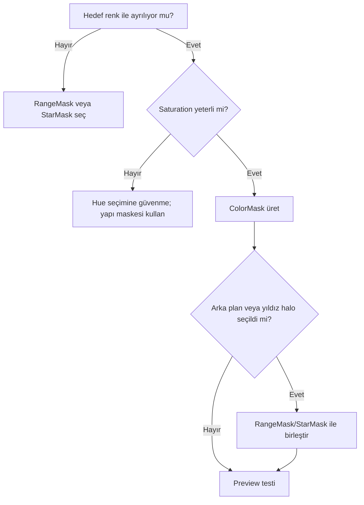

# ColorMask

!!! info "Sayfa Bilgisi"
    **Kategori:** Maskeler · **Düzey:** Intermediate · **Tahmini okuma:** 3 dk
    **Anahtar kelimeler:** `ColorMask` · `Color Mask` · `mask` · `maske` · `selective processing`
    **Önerilen ön bilgiler:** [HistogramTransformation](../07-stretch/histogram-transformation.md) · [PixelMath Temelleri](../10-pixelmath/temeller.md)

## Amaç

ColorMask, belirli bir hue aralığını saturation ve intensity koşullarıyla seçerek renk temelli grayscale maske üretir. Amaç yalnız “kırmızıyı seçmek” değil; hedef rengin komşu hue'larla geçişini ve düşük saturation bölgelerindeki belirsizliği yönetmektir.

## Araç durumu

ColorMask, PixInsight ekosisteminde yaygın kullanılan bir script iş akışıdır; core process olduğu varsayılmamalıdır. Kurulum kaynağı ve arayüzü dağıtıma göre değişebilir.

!!! warning "Kanıt Düzeyi — Community Consensus"
    ColorMask script'inin bulunabilirliği ve tam UI kontrolleri PixInsight 1.9.3 kurulumunda doğrulanmalıdır. Bu sayfa sürüme bağlı menü konumu veya varsayılan değer iddiasında bulunmaz.

## Teori

Hue, renk ailesini; saturation, rengin nötr eksenden uzaklığını temsil eder. Düşük saturation alanında hue kararsız veya görsel olarak anlamsız olabilir. Bu nedenle yalnız hue aralığına dayalı maske arka plan gürültüsü, yıldız halo rengi veya chromatic artefaktları da seçebilir.

Hue daireseldir: kırmızı aralığı skalanın iki ucuna taşabilir. Seçim aracının wrap-around davranışı UI ve çıktı üzerinden doğrulanmalıdır.

## Ne zaman kullanılır?

- Emission nebula içindeki belirli renk ailesinin saturation'ını düzenlerken.
- Galaksi kollarındaki mavi bölgeleri lokal Curves işlemine ayırırken.
- Renkli yıldız halolarını tanısal olarak seçerken.
- SCNR etkisini yalnız problemli bölgelere sınırlarken.

## Ne zaman kullanılmaz?

- Renk kalibrasyonu hatasını maske ile gizlemek için.
- Düşük saturation arka planda güvenilir fiziksel sınıflandırma amacıyla.
- Kanal clipping'i veya hatalı white balance'ı onarmak için.
- Yapı yoğunluk veya morfolojiyle daha güvenilir ayrılıyorsa.

## Parametre yaklaşımı

| Parametre ailesi | Amacı | Genişletme sonucu | Daraltma sonucu | Risk |
|---|---|---|---|---|
| Hue range | Hedef renk ailesi | Komşu renkler dahil olur | Hedefin ton varyasyonu eksilir | Renk sınırı/contamination |
| Hue transition | Aralık kenarını yumuşatma | Doğal geçiş | Keskin seçim | Halo veya sert renk sınırı |
| Saturation limit | Nötr alanları dışlama | Daha temiz renk seçimi | Zayıf renkler dahil olur | Zayıf sinyal kaybı veya chroma noise |
| Intensity control | Çok karanlık/parlak bölgeleri sınırlama | Gürültü/çekirdek dışlanabilir | Daha geniş seçim | Highlight veya background contamination |
| Mask blur/smooth | Küçük renk beneklerini yumuşatma | Daha bütün seçim | Daha yerel seçim | Detay kaybı veya benekli etki |

## Adım adım kullanım

1. Görüntünün renk kalibrasyonunu ve gradient durumunu doğrulayın.
2. Hedef hue aralığını ölçüm/preview ile belirleyin.
3. Düşük saturation arka planın maskeye girip girmediğini inceleyin.
4. Hue kenarlarını sert çizgi oluşturmayacak şekilde geçişli tutun.
5. Yıldız halo ve chroma noise yanlış pozitiflerini kontrol edin.
6. Gerekirse ColorMask'i RangeMask veya StarMask ile kesiştirin.
7. Hedefe bağlayıp Curves/SCNR işlemini düşük miktarla test edin.

## Gerçek kullanım senaryoları

### Emission nebula saturation

Hedef kırmızı/magenta yapılar hue ile seçilir; zayıf arka plan düşük saturation filtresiyle bastırılır. Yıldız çekirdekleri StarMask ile çıkarıldıktan sonra Curves saturation küçük iterasyonlarla uygulanır. Amaç kanal clipping'i değil, renk ayrımını kontrollü güçlendirmektir.

### SCNR sınırlama

SCNR global uygulandığında bilimsel veya estetik olarak korunmak istenen yeşil/cyan yapılar etkilenebilir. ColorMask, yalnız sorunlu baskının görüldüğü hue ve intensity bölgesini sınırlar; önce nötr örnekler ve kanal dağılımı kontrol edilir.

## ColorMask ve PixelMath

| Yaklaşım | Avantaj | Risk |
|---|---|---|
| ColorMask script | Etkileşimli hue/saturation seçimi | Script sürümü ve UI değişkenliği |
| PixelMath kanal/hue ifadesi | Tekrarlanabilir ve birleştirilebilir | Renk uzayı ve wrap-around mantığı doğru kurulmalı |
| RangeMask + kanal maskesi | Basit yoğunluk/kanal kesişimi | Hue seçimi kadar sezgisel olmayabilir |

## Pratik Karar Rehberi

## Sık yapılan hatalar ve sorun giderme

| Belirti | Olası neden | Çözüm |
|---|---|---|
| Renk sınırı oluşuyor | Hue transition sert | Geçiş aralığını yumuşatın |
| Arka plan benekli seçiliyor | Saturation eşiği düşük | Nötr/gürültülü alanları dışlayın |
| Yıldız haloları etkileniyor | Halo hue aralığında | StarMask çıkarımı yapın |
| Hedef rengin bir kısmı yok | Hue aralığı dar veya wrap-around | Hue dağılımını yeniden inceleyin |
| Saturation clipping oluşuyor | İşlem miktarı yüksek | Daha küçük iterasyon ve kanal kontrolü kullanın |
| Sonuç renk kalibrasyonunu bozuyor | İşlem çok erken/genel | Önce kalibrasyonu tamamlayın, seçimi daraltın |

## Hızlı Referans

- Önce renk kalibrasyonunu doğrula.
- Hue yanında saturation ve intensity'yi değerlendir.
- Düşük saturation bölgede hue'ya güvenme.
- Hue sınırlarını yumuşat.
- Yıldız ve arka plan contamination'ını kontrol et.
- Curves/SCNR etkisini küçük iterasyonlarla uygula.

## Teknik Doğrulama Notları

Renk temelli maskeleme teorisi geneldir. ColorMask script'inin kaynağı, sürümü, menü konumu, kontrol adları ve hue wrap davranışı PixInsight 1.9.3 kurulumunda doğrulanmalıdır.

## Teknik Doğrulama Durumu

| Alan | Durum |
| --- | --- |
| Hedeflenen PixInsight Sürümü | 1.9.3 |
| Teknik İnceleme Durumu | Sürüm Bağımlı |
| Resmî Kaynak Kontrolü | Kısmi |
| İş Akışı Tutarlılığı | Doğrulandı |
| Kanıt Düzeyi İncelemesi | Güncellendi |
| Son Teknik İnceleme | Phase 6.4 |

Canlı PixInsight uygulama testi yapılmadı. UI ekran kanıtı, statik ifade/iş akışı incelemesi ve yayımlanmış birincil kaynak kontrolü birbirinin yerine kullanılmamıştır.

## Ayrıca İnceleyin

[Maske Mantığı](maske-mantigi.md) · [RangeMask](range-mask.md) · [StarMask](star-mask.md) · [CurvesTransformation](../13-final/curves-transformation.md) · [SCNR](../13-final/scnr.md)

## Referanslar

- [PixInsight Forum — ColorMask script version discussion](https://pixinsight.com/forum/index.php?threads/pi-version-1-8-modefied-color-mask-script.21707/)

## İlgili Süreçler

- [RangeMask](range-mask.md)
- [StarMask](star-mask.md)
- [Luminance Mask](luminance-mask.md)
- [Maske Mantığı](maske-mantigi.md)

## İlgili İş Akışları

- [LRGB Galaksi](../15-workflows/lrgb-galaxy.md)
- [Emisyon Nebulası](../15-workflows/emission-nebula.md)
- [Gezegenimsi Nebula](../15-workflows/planetary-nebula.md)
- [NGC 6888 SHO](../20-uygulamalar/ngc6888-sho/index.md)

## İlgili Sorun Giderme Başlıkları

- [Maske Tüm Görüntüyü Kaplıyor](../14-hata-kutuphanesi/maske-tum-goruntuyu-kapliyor.md)

## Önceki Bölüm

[← Luminance Mask](luminance-mask.md)

## Sonraki Bölüm

[Maske Mantığı →](maske-mantigi.md)
