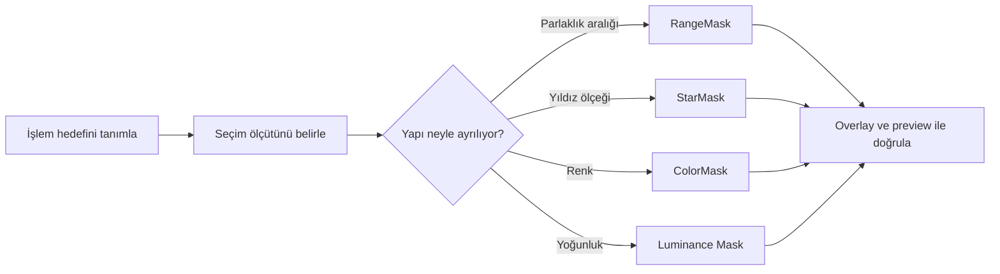

# Maskeler ve Seçici İşleme

!!! info "Sayfa Bilgisi"
    **Kategori:** Maskeler · **Düzey:** Intermediate · **Tahmini okuma:** 3 dk
    **Anahtar kelimeler:** `Maskeler` · `mask` · `maske` · `selective processing`

## Amaç

Maskeler, bir process'in etkisini görüntünün tamamına eşit uygulamak yerine yapısal, parlaklık veya renk temelli bölgelere dağıtır. Amaç yalnızca bir alanı “seçmek” değil; sinyal, gürültü ve geçiş bölgeleri arasında kontrollü bir etki haritası kurmaktır.

!!! info "Kanıt Düzeyi — Official Documentation"
    PixInsight'ta herhangi bir uygun görüntü maske olarak kullanılabilir. Maske, hedef görüntüde korunacak ve işlenecek bölgeleri tanımlar; kırmızı overlay yalnızca bu dağılımın ekran gösterimidir.

## Bu bölümde ne var?

| Sayfa | Temel seçim ölçütü | Tipik kullanım |
|---|---|---|
| [Maske Mantığı](maske-mantigi.md) | Maske geometrisi ve ağırlığı | Inversion, birleşim, lineer/nonlineer ayrımı |
| [RangeMask](range-mask.md) | Parlaklık aralığı | Nebula, galaksi, arka plan veya parlak çekirdek ayrımı |
| [StarMask](star-mask.md) | Çok ölçekli yıldız yapıları | Yıldız koruma, yıldızlara özel renk ve profil işlemleri |
| [ColorMask](color-mask.md) | Hue ve saturation | Belirli bir renk ailesine seçici müdahale |
| [Luminance Mask](luminance-mask.md) | Yoğunluk yapısı | Kontrast, gürültü azaltma ve detay koruma |

## Seçici işleme felsefesi

İyi bir maske şu üç soruyu birlikte cevaplar:

1. Hangi yapı işlenecek?
2. Etki sınırda ne kadar yumuşak değişecek?
3. Maske, hedefteki gürültü veya artefaktı da yanlışlıkla seçiyor mu?

Maske üretmek tek başına hedef değildir. Asıl kalite ölçütü, maskeyi açıp kapattığınızda işlem geçişlerinin görünmemesi ve korunması gereken sinyalin gerçekten korunmasıdır.

## İş Akışı içindeki yeri

Maskeler hem lineer hem de nonlinear aşamada kullanılabilir; ancak maske kaynağının dağılımı aşamaya göre değişir. Lineer veri çoğu zaman görüntülenebilir ve ayrıştırılabilir hale getirilmeden doğrudan iyi maske üretmez. Nonlinear veri ise clipping ve aşırı kontrast nedeniyle sert geçişler üretebilir.

Yaygın eşleşmeler:

- [NoiseXTerminator](../06-ai-eklentileri/noisexterminator.md): düşük SNR bölgelerine daha güçlü, yüksek ayrıntıya daha kontrollü etki.
- [BlurXTerminator](../06-ai-eklentileri/blurxterminator.md): yıldız ve nonstellar yapıların ayrı korunması.
- [CurvesTransformation](../13-final/curves-transformation.md): renk, saturation ve lokal kontrast işlemleri.
- [SCNR](../13-final/scnr.md): yalnız istenmeyen renk baskısına maruz kalan bölgeler.
- [PixelMath](../10-pixelmath/index.md): maske birleştirme, kesişim ve çıkarma.
- [LocalHistogramEqualization](../12-detay-ve-kontrast/local-histogram-equalization.md), [HDRMultiscaleTransform](../12-detay-ve-kontrast/hdr-multiscale-transform.md), [MultiscaleMedianTransform](../12-detay-ve-kontrast/multiscale-median-transform.md) ve [DarkStructureEnhance](../12-detay-ve-kontrast/dark-structure-enhance.md): ölçek ve bölge kontrollü detay işlemleri.

## Pratik Karar Rehberi

| İhtiyaç | Başlangıç tercihi | Doğrulama |
|---|---|---|
| Belirli parlaklık bandını ayırmak | RangeMask | Hedef yapının tamamı gri tonla temsil ediliyor mu? |
| Yıldızları korumak veya işlemek | StarMask | Zayıf yıldızlar ve parlak halo ayrı ayrı kapsanıyor mu? |
| Belirli renk ailesini seçmek | ColorMask | Hue komşuları ve düşük saturation alanları taşma yapıyor mu? |
| Sinyal gücüne göre etki dağıtmak | Luminance Mask | Gürültü maskeye basılmış mı? |
| Karmaşık seçim kurmak | PixelMath ile maskeleri birleştir | Son maske normalleştirilmiş ve yumuşak mı? |

## Sık yapılan hatalar

- Maskeyi binary seçim gibi aşırı sertleştirmek.
- Kırmızı overlay'i maske verisinin kendisi sanmak.
- Maskeyi ters çevirip çevirmediğini kontrol etmeden process uygulamak.
- Maske üzerindeki gürültüyü hedef yapıyla birlikte seçmek.
- Bir maske tarifini farklı veri setlerine sabit değerlerle taşımak.
- Process önizlemesini maskesiz sonuçla karıştırmak.

## Hızlı Referans

- Maskeyi hedef görüntüyle aynı geometriye getir.
- Maskeyi tek başına incele; clipping, delik ve halo ara.
- Overlay ile korunan/işlenen yönü doğrula.
- Düşük etkili bir preview denemesi yap.
- Sert sınırları gerekli ölçüde yumuşat.
- Sonucu maskeyi devre dışı bırakarak karşılaştır.

## Teknik doğrulama durumu

Bu bölüm maskelerin temel kullanım modelini açıklar. Process arayüzündeki kontrol adları ve sürüme bağlı davranışlar ilgili process sayfalarında ayrıca sınıflandırılmıştır.

## Referanslar

- [PixInsight — Introduction to PixInsight](https://pixinsight.com/astrophotocl/outreach/pixinsight_eccai_2006.pdf)
- [PixInsight — M31 Ha processing example](https://www.pixinsight.com/examples/M31-Ha/)

## Önceki Bölüm

[← Hata Ayıklama](../10-pixelmath/hata-ayiklama.md)

## Sonraki Bölüm

[RangeMask →](range-mask.md)
