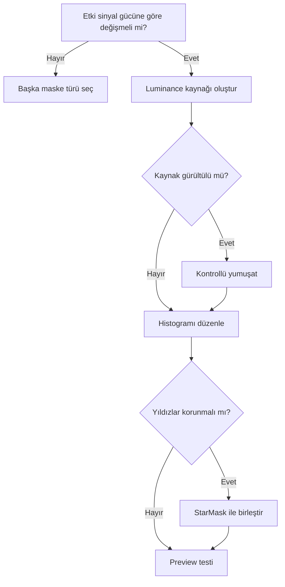

# Luminance Mask

## Amaç

Luminance Mask, görüntünün yoğunluk yapısını process ağırlığına dönüştürür. Parlak, yüksek SNR yapıları korumak; zayıf alanlarda daha güçlü noise reduction veya parlak yapılarda daha kontrollü kontrast uygulamak için kullanılır.

## Teori

RGB görüntüden türetilen luminance, kanalların eşit ortalaması olmak zorunda değildir. Çalışma uzayındaki luminance tanımı ve kanal ilişkileri sonucu etkiler. Mono veride görüntünün kendisi başlangıç maskesi olabilir; ancak gürültü, yıldız ve gradient de maskeye taşınır.

!!! note
    Luminance Mask bir intensity map'tir; nesnenin fiziksel olarak “gerçek luminance” ölçümünü garanti etmez. Maske amacı için yapıların göreli ağırlığı önemlidir.

## Ne zaman kullanılır?

- Noise reduction'ı SNR'a göre dağıtırken.
- Curves ile parlak yapıların kontrastını seçici değiştirirken.
- LHE, HDRMT veya MMT öncesi yıldızları ve düşük SNR alanları korurken.
- Renk işleminde luminance yapısını korumak için.

## Ne zaman kullanılmaz?

- Yalnız dar bir parlaklık bandı gerektiğinde RangeMask daha uygundur.
- Yalnız belirli hue ailesi hedefleniyorsa ColorMask kullanın.
- Yıldız ölçeği seçimin ana ölçütüyse StarMask tercih edin.
- Kaynak görüntü ağır gradient veya clipping içeriyorsa önce bunları değerlendirin.

## Oluşturma yöntemleri

| Kaynak | Avantaj | Risk |
|---|---|---|
| RGB'den luminance extraction | Hedef yapıyla kayıtlı ve hızlı | Renk gürültüsü/gradient taşınabilir |
| Ayrı L master | Yüksek SNR ve detay | RGB ile registration/geometri eşleşmeli |
| Mono hedef kopyası | Doğrudan yoğunluk ilişkisi | Gürültü ve yıldız profilleri aynen taşınır |
| Sentetik luminance | Kanal ağırlıkları kontrol edilebilir | Ağırlık gerekçesi doğrulanmalıdır |

## HistogramTransformation ile ilişki

Maskenin histogramını düzenlemek, seçimin ağırlık dağılımını değiştirir. Siyah noktayı ileri taşımak zayıf alanları korumaya, midtone düzenlemesi ara tonların etkisini değiştirmeye yarayabilir. Clipping, maskede geri getirilemeyen binary bölgeler oluşturur.

## Adım adım kullanım

1. Hedefle aynı geometride luminance kaynağı oluşturun.
2. Maskeyi görünür kılmak için kontrollü stretch uygulayın.
3. Gürültü ve küçük ölçekli benekleri inceleyin; gerekiyorsa hafif yumuşatın.
4. Histogramı clipping oluşturmadan istenen koruma dağılımına getirin.
5. Yıldızların işleme dahil olup olmayacağına karar verin.
6. Maskeyi hedefe bağlayın ve inversion yönünü kontrol edin.
7. Preview üzerinde process miktarını ayarlayın.

!!! tip "Evidence Level — Verified Workflow"
    Noise reduction öncesinde maskeyi 1:1 zoom'da incelemek, maskenin gürültü desenini process ağırlığına taşıyıp taşımadığını gösterir.

## Gerçek kullanım senaryoları

### NoiseXTerminator

Parlak nebula filamentlerini koyu/orta tonla koruyan, düşük SNR arka planı daha açık bırakan invert edilmiş luminance mantığı kullanılabilir. Güç ve detail değerleri maskeden bağımsız olarak preview sonucuna göre belirlenir.

### LocalHistogramEqualization

Luminance Mask, düşük SNR arka planı koruyup orta-parlak yapıdaki kontrast etkisini kademeli dağıtır. Yıldızlar maskede çok parlaksa ayrıca StarMask çıkarımı değerlendirilir.

## Practical Decision Guide

## Sık yapılan hatalar ve sorun giderme

| Belirti | Olası neden | Çözüm |
|---|---|---|
| Benekli process etkisi | Maske gürültülü | Maskeyi kontrollü yumuşatın |
| Yıldızlar aşırı etkileniyor | Parlak yıldızlar seçili | StarMask ile koruma ekleyin |
| Zayıf yapılar kayboluyor | Siyah nokta clipping'i | Maskeyi daha yumuşak stretch edin |
| Renkli halo oluşuyor | RGB ve maskenin geometrisi/PSF'si farklı | Registration ve yıldız profillerini kontrol edin |
| Etki ters bölgede | Inversion yanlış | Overlay ile polarity'yi doğrulayın |
| Gradient seçimi bozuyor | Kaynak luminance kirli | Gradient düzeltmesini önce değerlendirin |

## Quick Reference

- Geometri eşleşmesini doğrula.
- Maskeyi clipping yapmadan stretch et.
- Gürültüyü ağırlık haritasına taşımamaya çalış.
- Yıldızları ayrıca değerlendir.
- Inversion ve overlay kontrolü yap.
- Preview'da geçiş artefaktı ara.

## Teknik doğrulama durumu

Luminance Mask ayrı bir zorunlu process adı değil, farklı araçlarla üretilebilen iş akışı varlığıdır. Extraction ve renk uzayı ayrıntıları kullanılan process'in PixInsight 1.9.3 arayüzüyle doğrulanmalıdır.

## İlgili bölümler

[Maske Mantığı](maske-mantigi.md) · [RangeMask](range-mask.md) · [StarMask](star-mask.md) · [LocalHistogramEqualization](../12-detay-ve-kontrast/local-histogram-equalization.md)
