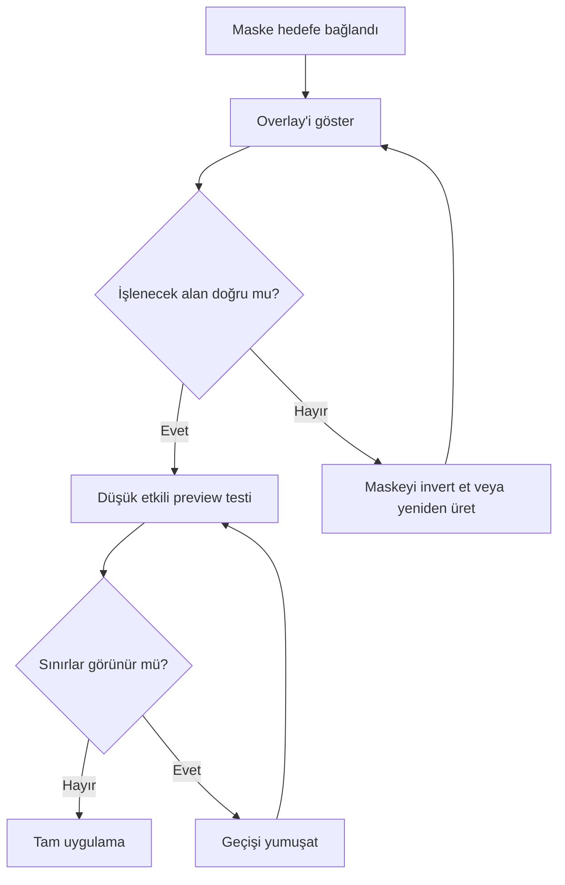
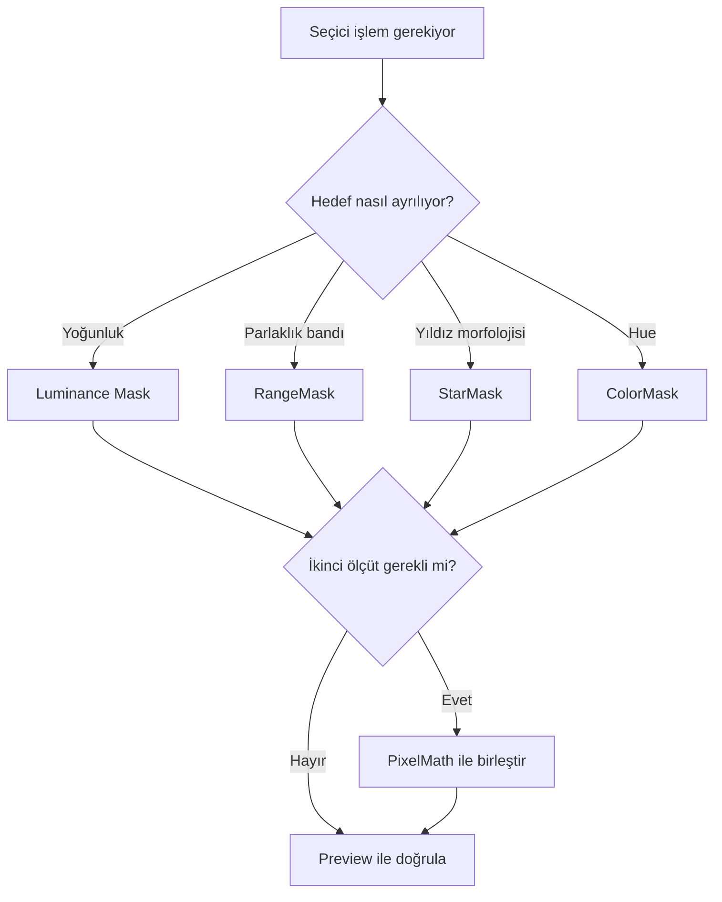

# Maske Mantığı

!!! info "Sayfa Bilgisi"
    **Kategori:** Maskeler · **Düzey:** Intermediate · **Tahmini okuma:** 3 dk
    **Anahtar kelimeler:** `Maske Mantığı` · `mask` · `maske` · `selective processing`
    **Önerilen ön bilgiler:** [HistogramTransformation](../07-stretch/histogram-transformation.md) · [PixelMath Temelleri](../10-pixelmath/temeller.md)

## Amaç

Bu sayfa, maskeyi bir siyah-beyaz şablondan ziyade sürekli bir ağırlık alanı olarak okumayı öğretir. İyi maske; hedefi ayırır, kenarlarda yumuşak geçiş kurar ve process etkisini veri kalitesine göre dağıtır.

## Teori

Bir maske pikseli normalize edilmiş olarak `m ∈ [0,1]` aralığında düşünülebilir. İşlem sonucu `P`, özgün görüntü `I` ise kavramsal birleşim:

`O = (1 - m) × I + m × P`

şeklinde okunabilir. Bu ifade maske ağırlığının sonucunu anlamak içindir; her process'in iç algoritmasını tarif etmez. Maskenin polarity'si veya inversion durumu değiştiğinde işlenen ve korunan taraf yer değiştirir.

| Maske tonu | Kavramsal anlam | Risk |
|---|---|---|
| Siyah | Güçlü koruma | İstenen yapı yanlışlıkla korunabilir |
| Gri | Kısmi etki | Gürültülü gri dağılım benekli sonuç üretebilir |
| Beyaz | Güçlü etki | Clipping varsa geçiş sertleşir |

!!! note
    PixInsight'ın kırmızı maske overlay'i bir görselleştirmedir. Kırmızı rengin yoğunluğu maske görüntüsünün gerçek piksel değerleriyle karıştırılmamalıdır.

## Binary ve grayscale maske

Binary maske sert bir seçim sınırı üretir. Bu yaklaşım yalnız geometrik sınır gerçekten keskin olduğunda uygundur. Astrofotoğrafta yıldız haloları, nebula geçişleri ve galaksi dış bölgeleri süreklidir; bu nedenle grayscale maskeler çoğunlukla daha doğal sonuç verir.

Opacity, grayscale ağırlığın process etkisine yansımasıdır. Maskeyi yalnız HistogramTransformation ile sertleştirmek yerine, hedef yapının iç tonlarını korumak ve gerekirse az miktarda yumuşatma uygulamak daha güvenlidir.

## Inversion ve görünürlük

Maskeyi invert etmek maske dosyasını zorunlu olarak değiştirmez; hedef üzerindeki koruma/etki yönünü tersine çevirir. Maskeyi görünmez yapmak ise maskeyi devre dışı bırakmaz. Uygulamadan önce status bar ve overlay ile maskenin bağlı ve doğru yönde olduğunu kontrol edin.

## Maskeleri birleştirme

PixelMath ile iki maskenin birleşimi kavramsal olarak şu mantıklarla kurulabilir:

| Amaç | Örnek ifade | Yorum |
|---|---|---|
| Birleşim | `max(A,B)` | A veya B'nin seçtiği alanı kapsar |
| Kesişim | `min(A,B)` | Yalnız iki maskenin ortak alanını tutar |
| A'dan B'yi çıkarma | `A*(1-B)` | A içindeki B yapılarını korur |
| Ağırlıklı karışım | `0.7*A + 0.3*B` | Sonucu `[0,1]` aralığında denetlemek gerekir |

Nested mask yaklaşımı, tek maskeyi sürekli düzenlemek yerine yapı maskesiyle yoğunluk maskesini birleştirir. Örneğin bir nebula RangeMask'i ile yıldız StarMask'inin çıkarılması, nebula üzerinde çalışırken yıldız profillerini koruyabilir.

!!! warning
    PixelMath birleşimlerinde değerlerin geçerli aralığın dışına taşması veya clipping oluşması maske ağırlığını bozar. Son maskenin minimum, maksimum ve histogram dağılımını kontrol edin.

## Doğrusal ve doğrusal olmayan aşama

| Aşama | Avantaj | Risk | Yaklaşım |
|---|---|---|---|
| Lineer | Fiziksel sinyal oranları henüz stretch ile değişmemiştir | Zayıf yapılar görünür değildir | Maske kopyasını kontrollü stretch ile görünür kıl |
| Nonlinear | Yapılar görsel olarak kolay ayrılır | Clipping ve aşırı kontrast sert seçim üretir | Siyah/beyaz noktaları kesmeden düzenle |

Bir lineer görüntüden maske üretirken STF görünümünü doğrudan veri değişikliği sanmayın. Maske kaynağı için gereken kalıcı ton dönüşümünü kontrollü biçimde yapın.

## seçici işleme örnekleri

- NoiseXTerminator: luminance veya range mask ile zayıf arka planda daha güçlü etki.
- BlurXTerminator: StarMask ile parlak yıldız çekirdeklerini veya sorunlu haloları koruma.
- CurvesTransformation: ColorMask ile yalnız belirli hue bandının saturation'ını düzenleme.
- SCNR: nötr alanları koruyup yeşil baskının görüldüğü yapıları hedefleme.
- LHE/HDRMT/MMT: scale-aware bir maske ile büyük yapı ve küçük detay etkisini ayırma.
- DSE: koyu yapıların gelişmesini yıldız ve gürültüden izole etme.

!!! example "Doğrulanmış İş Akışı"
    Maskeyi hedefe bağlayın, preview üzerinde düşük miktarlı bir işlem uygulayın, overlay'i kapatıp geçişleri inceleyin ve yalnız sonra tüm görüntüye uygulayın. Bu kontrol sırası process'ten bağımsız, tekrarlanabilir bir iş akışıdır.

## Pratik Karar Rehberi

## Sık yapılan hatalar ve sorun giderme

| Belirti | Olası neden | Düzeltme |
|---|---|---|
| İşlem ters bölgeyi etkiliyor | Inversion yanlış | Overlay ile polarity kontrolü yapın |
| Kenar çizgisi oluşuyor | Binary veya sert maske | Grayscale geçişi genişletin |
| Gürültü benek benek değişiyor | Maske gürültüyü taşıyor | Maske kaynağını kontrollü yumuşatın |
| Yıldız çevresinde halka var | Halo maske dışında kalmış | StarMask ölçeğini/haloyu yeniden değerlendirin |
| Etki görünmüyor | Maske bağlı değil ya da alan siyah | Bağlantı ve histogramı kontrol edin |
| Tüm görüntü etkileniyor | Maske beyaza yakın | Kontrastı azaltıp seçim aralığını daraltın |

## En İyi Uygulamalar

- Maskeyi daima ayrı bir görüntü olarak inceleyin.
- Hedefle aynı boyut ve geometride çalışın.
- Maskeye uygulanan stretch'te clipping'den kaçının.
- Önce küçük miktar, sonra iteratif artış kullanın.
- Maskeli ve maskesiz sonucu aynı zoom düzeyinde karşılaştırın.

## Teknik doğrulama durumu

Matematiksel model kavramsal ve process'ten bağımsızdır. PixInsight 1.9.3'te maske bağlama, görünürlük ve inversion kontrollerinin tam UI konumu kurulu platforma göre ekran kanıtıyla doğrulanmalıdır.

## Ayrıca İnceleyin

- [RangeMask](range-mask.md)
- [StarMask](star-mask.md)
- [ColorMask](color-mask.md)
- [Luminance Mask](luminance-mask.md)
- [PixelMath](../10-pixelmath/index.md)

## Referanslar

- [PixInsight — Introduction to PixInsight](https://pixinsight.com/astrophotocl/outreach/pixinsight_eccai_2006.pdf)
- [PixInsight — M31 Ha processing example](https://www.pixinsight.com/examples/M31-Ha/)

## İlgili Süreçler

- [RangeMask](range-mask.md)
- [StarMask](star-mask.md)
- [Luminance Mask](luminance-mask.md)
- [ColorMask](color-mask.md)

## İlgili İş Akışları

- [LRGB Galaksi](../15-workflows/lrgb-galaxy.md)
- [Emisyon Nebulası](../15-workflows/emission-nebula.md)
- [Gezegenimsi Nebula](../15-workflows/planetary-nebula.md)
- [NGC 6888 SHO](../20-uygulamalar/ngc6888-sho/index.md)

## İlgili Sorun Giderme Başlıkları

- [Maske Tüm Görüntüyü Kaplıyor](../14-hata-kutuphanesi/maske-tum-goruntuyu-kapliyor.md)

## Önceki Bölüm

[← ColorMask](color-mask.md)

## Sonraki Bölüm

[Detay ve Kontrast →](../12-detay-ve-kontrast/index.md)
