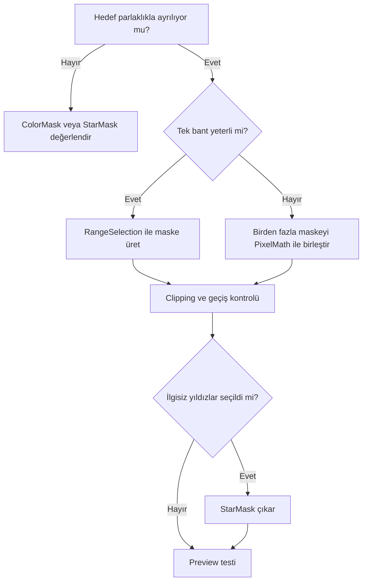

# RangeSelection (RangeMask)

!!! info "Sayfa Bilgisi"
    **Kategori:** Maskeler · **Düzey:** Intermediate · **Tahmini okuma:** 3 dk
    **Anahtar kelimeler:** `RangeMask` · `RangeSelection` · `Range Mask` · `mask` · `maske` · `selective processing`
    **Önerilen ön bilgiler:** [HistogramTransformation](../07-stretch/histogram-transformation.md) · [PixelMath Temelleri](../10-pixelmath/temeller.md)

## Amaç

RangeSelection, görüntüdeki belirli bir parlaklık aralığını grayscale ağırlık haritasına dönüştürür. Üretilen görüntü pratikte “range mask” olarak adlandırılır. Nebula, galaksi gövdesi, parlak çekirdek veya arka plan gibi yoğunlukla ayrılabilen yapıları seçmek için kullanılır.

## Teori

Process, alt ve üst yoğunluk sınırları arasındaki pikselleri seçer; yumuşatma kontrolleri seçimin kenar geçişini düzenler. Sonuç salt nesne segmentasyonu değildir: aynı parlaklığa sahip yıldız, gradient veya gürültü de seçilebilir.

!!! info "Kanıt Düzeyi — Practical Recommendation"
    Eşikler veri setine bağlıdır. Sabit sayılar yerine maskenin histogramını ve hedef üzerindeki overlay'i değerlendirin.

## Ne zaman kullanılır?

- Nebula veya galaksi sinyalini arka plandan ayırırken.
- Parlak çekirdeği HDR veya Curves işleminden korurken.
- Zayıf arka planda noise reduction etkisini artırırken.
- Yıldız maskesiyle birleştirilecek geniş yapı maskesi üretirken.

## Ne zaman kullanılmaz?

- Hedef ile arka plan aynı yoğunluk aralığındaysa.
- Seçim yalnız hue veya yıldız morfolojisine dayanıyorsa.
- Flat-field kaynaklı multiplicative hatayı düzeltmek amacıyla.
- Maske, gradient'i hedef sinyal sanıyorsa.

## Menü yolu

Process adı: `RangeSelection`

!!! warning "Doğrulama Durumu — UI Kanıtı Gerekli"
    Menü grubu ve kontrol adlarının PixInsight 1.9.3 kurulumunda ekran kanıtıyla doğrulanması gerekir; doğrulanmamış kategori yolu burada kesin bilgi olarak verilmemiştir.

## Parametreler

| Kontrol | Amacı | Artırıldığında | Azaltıldığında | Yanlış kullanım sonucu |
|---|---|---|---|---|
| Lower limit | Seçimin alt yoğunluk sınırı | Daha karanlık pikseller dışlanır | Arka plan seçime girer | Zayıf sinyal kaybı veya gürültü seçimi |
| Upper limit | Seçimin üst yoğunluk sınırı | Daha parlak yapılar dahil olur | Parlak çekirdek/yıldızlar dışlanır | Halo veya clipping |
| Smoothness | Ton geçişini yumuşatır | Daha geniş, doğal geçiş | Daha kesin sınır | Aşırı değerlerde seçim taşması ya da sert kenar |
| Screening | Seçimin düşük ağırlıklı bölgelerini düzenler | Zayıf katkı bastırılabilir | Daha fazla düşük seviye yapı kalır | İnce sinyalin silinmesi |

Kontrol isimleri sürüm arayüzünde doğrulanmalıdır; davranış değerlendirmesi maskenin çıktısı üzerinden yapılmalıdır.

## Adım adım kullanım

1. Hedef yapının histogramdaki yaklaşık konumunu inceleyin.
2. `Lower limit` ile arka planı, `Upper limit` ile istenmeyen parlak yapıları sınırlandırın.
3. Maskeyi üretin ve tek başına inceleyin.
4. Siyah/beyaz clipping, yıldız haloları ve gradient sızıntısı arayın.
5. Gerekirse maskeyi kontrollü yumuşatın veya StarMask ile birleştirin.
6. Hedefe bağlayın; polarity'yi overlay ile kontrol edin.
7. Preview üzerinde düşük etkili bir process denemesi yapın.

## Gerçek kullanım senaryoları

### Emission nebula üzerinde noise reduction

Zayıf arka planı beyaza, parlak nebula dokusunu gri/siyaha yaklaştıran bir RangeMask hazırlanır. NoiseXTerminator daha çok düşük SNR alanda çalışırken parlak filamentler kısmen korunur. Karar, tek bir threshold yerine sonuçtaki doku sürekliliğine göre alınır.

### Galaksi çekirdeğini koruyarak kontrast

Çekirdeği ve parlak iç kolları seçen maske invert edilerek LHE veya Curves etkisinden korunur. StarMask çıkarımı, yıldız çevresindeki sahte kontrastı azaltabilir.

## RangeSelection ile Üretilen Maske ve Luminance Mask

| Ölçüt | RangeSelection sonucu | Luminance Mask |
|---|---|---|
| Seçim | Belirli yoğunluk bandı | Tüm yoğunluk yapısının sürekli kopyası |
| Güçlü yön | Alt/üst aralık izolasyonu | Sinyal ağırlıklı kademeli koruma |
| Risk | Aynı parlaklıktaki ilgisiz yapılar | Gürültü ve gradient'i taşıma |

## Pratik Karar Rehberi

## Sık yapılan hatalar ve sorun giderme

| Belirti | Neden | Çözüm |
|---|---|---|
| Nebula eksik seçiliyor | Lower limit fazla yüksek | Eşiği düşürüp geçişi inceleyin |
| Arka plan tamamen beyaz | Lower limit düşük | Arka planı dışlayacak şekilde artırın |
| Yıldız haloları seçiliyor | Aynı yoğunluk bandı | StarMask çıkarın veya üst sınırı değerlendirin |
| İşlem sınırı görünüyor | Sert maske | Smoothness/yumuşatma kullanın |
| Gradient maskeye giriyor | Yoğunluk temelli ayrım yetersiz | Önce gradient düzeltmesini değerlendirin |
| Maske ters çalışıyor | Polarity yanlış | Overlay ile inversion kontrolü yapın |

## Hızlı Referans

- Eşik değerlerini veri setinden türet.
- Alt sınır: arka plan ayrımı.
- Üst sınır: parlak yapı kontrolü.
- Maskeyi tek başına ve overlay ile incele.
- Yıldızları gerekirse ayrı maske ile çıkar.
- Preview sonucunda kenar ve halo ara.

## Teknik Doğrulama Notları

Yoğunluk aralığına dayalı maskeleme temel kavramdır. Menü yolu, parametre adları ve özellikle `Screening` davranışı PixInsight 1.9.3 UI kanıtıyla doğrulanmalıdır.

## Teknik Doğrulama Durumu

| Alan | Durum |
| --- | --- |
| Hedeflenen PixInsight Sürümü | 1.9.3 |
| Teknik İnceleme Durumu | UI Kanıtı Gerekli |
| Resmî Kaynak Kontrolü | Kısmi |
| İş Akışı Tutarlılığı | Doğrulandı |
| Kanıt Düzeyi İncelemesi | Güncellendi |
| Son Teknik İnceleme | Phase 6.4 |

Canlı PixInsight uygulama testi yapılmadı. UI ekran kanıtı, statik ifade/iş akışı incelemesi ve yayımlanmış birincil kaynak kontrolü birbirinin yerine kullanılmamıştır.

## Ayrıca İnceleyin

[Maske Mantığı](maske-mantigi.md) · [StarMask](star-mask.md) · [Luminance Mask](luminance-mask.md) · [PixelMath](../10-pixelmath/index.md)

## İlgili Süreçler

- [StarMask](star-mask.md)
- [Luminance Mask](luminance-mask.md)
- [ColorMask](color-mask.md)
- [Maske Mantığı](maske-mantigi.md)

## İlgili İş Akışları

- [LRGB Galaksi](../15-workflows/lrgb-galaxy.md)
- [Emisyon Nebulası](../15-workflows/emission-nebula.md)
- [Gezegenimsi Nebula](../15-workflows/planetary-nebula.md)
- [NGC 6888 SHO](../20-uygulamalar/ngc6888-sho/index.md)

## İlgili Sorun Giderme Başlıkları

- [Maske Tüm Görüntüyü Kaplıyor](../14-hata-kutuphanesi/maske-tum-goruntuyu-kapliyor.md)

## Önceki Bölüm

[← Maskeler](index.md)

## Sonraki Bölüm

[StarMask →](star-mask.md)
