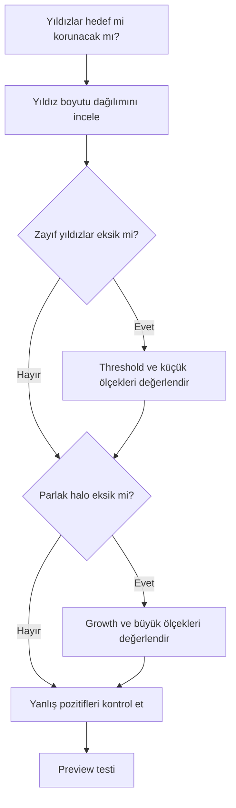

# StarMask

## Amaç

StarMask, yıldız benzeri yapıları ölçek ve yoğunluk ölçütleriyle ayırarak yıldız koruma veya yıldızlara özel işlem için ağırlık haritası üretir. Başarı yalnız yıldız çekirdeklerini bulmakla değil, zayıf yıldızlar ile parlak haloları kontrollü kapsamakla ölçülür.

## Teori

Yıldız alanı tek ölçekli değildir. Küçük yıldızlar birkaç pikselde temsil edilirken parlak yıldızların çekirdeği, profil kanatları ve optik halo yapıları farklı ölçeklere yayılır. StarMask'in multiscale ayrıştırması bu nedenle tek threshold seçiminden daha esnektir; yine de kompakt nebula düğümleri veya galaksi çekirdeği yanlış pozitif olabilir.

## Ne zaman kullanılır?

- Star reduction öncesinde yıldızları seçerken.
- BlurXTerminator, LHE, HDRMT veya sharpening sırasında yıldızları korurken.
- Curves ile yıldız rengi/saturation işlemi yaparken.
- Nebula maskesinden yıldızları çıkarmak için.

## Ne zaman kullanılmaz?

- Yıldız kaldırılmış görüntü zaten güvenilir bir yıldız katmanı sağlıyorsa.
- Hedef yalnız parlaklık veya hue ile daha doğru ayrılıyorsa.
- Ağır clipping nedeniyle yıldız profilleri bozulmuşsa, maskenin bunu düzelteceği varsayılmamalıdır.

## Menü yolu

`Process > MaskGeneration > StarMask`

!!! warning "Evidence Level — UI verification"
    Menü grubu, kontrol adları ve varsayılan değerler PixInsight 1.9.3 ekran kanıtıyla doğrulanmalıdır. Bu sayfa sabit varsayılan değer önermemektedir.

## Parametre yaklaşımı

| Parametre ailesi | Amaç | Artırma gerekçesi | Azaltma gerekçesi | Risk |
|---|---|---|---|---|
| Scale / layers | Yakalanan yıldız boyutu aralığı | Büyük yıldız/halo eksikse | Nebula yapıları seçiliyorsa | Yapı kaybı veya yanlış pozitif |
| Noise threshold | Gürültü ile zayıf yıldızı ayırma | Gürültü seçiliyorsa | Zayıf yıldızlar eksikse | Zayıf yıldız kaybı veya benekli maske |
| Growth | Yıldız seçim alanını genişletme | Profil kanatları dışarıda kalıyorsa | Maskeler birleşiyorsa | Şişmiş yıldız maskesi |
| Smoothness | Maske kenarını yumuşatma | Halka/sınır görünüyorsa | Komşu yapılar birleşiyorsa | Aşırı halo veya sert kenar |
| Midtones / stretch | Maske ağırlık dağılımı | Zayıf yıldızları görünür yapmak için | Arka planı bastırmak için | Clipping ve binary seçim |

## Adım adım kullanım

1. Hedefin lineer/nonlinear durumunu ve yıldız boyutu dağılımını belirleyin.
2. Gürültüyü yıldız sanmayacak başlangıç threshold'u kurun.
3. Küçük ve orta yıldızları kapsayacak scale aralığını değerlendirin.
4. Parlak yıldız profil kanatları için growth ve smoothness'i kontrollü ayarlayın.
5. Maskeyi 1:1 ve uzak görünümde inceleyin.
6. Nebula düğümleri, galaksi çekirdeği ve hot pixel yanlış pozitiflerini kontrol edin.
7. Hedefte overlay ile polarity kontrolü yapıp preview testi uygulayın.

## Dense ve sparse star field

| Alan | Öncelik | Tipik risk |
|---|---|---|
| Dense Milky Way alanı | Yıldızların birleşmesini önlemek | Maske geniş bir beyaz yüzeye dönüşür |
| Sparse yüksek galaktik enlem | Zayıf yıldızları kaçırmamak | Gürültü yanlış pozitifleri artar |
| Parlak yıldızlı alan | Halo ve profil kanatlarını kapsamak | Nebula/galaksi yapısı seçilir |

## StarMask ve StarXTerminator yıldız katmanı

| Özellik | StarMask | StarXTerminator yıldız katmanı |
|---|---|---|
| Temel | Çok ölçekli yapı seçimi | Model tabanlı yıldız ayırma çıktısı |
| Çıktı | Process ağırlık maskesi | Görüntü katmanı; maskeye dönüştürülebilir |
| Güçlü yön | Parametrik ölçek/growth kontrolü | Karmaşık yıldız alanını ayırabilme |
| Risk | Nebula düğümlerini seçme | Residual, halo veya model hatasını maskeye taşıma |

## Gerçek kullanım senaryoları

### Nebula üzerinde LHE

StarMask, LHE'nin yıldız profillerinde keskin halo oluşturmasını engellemek üzere nebula maskesinden çıkarılır. Çok geniş growth nebula ayrıntısını da koruyacağı için sonuç 1:1 zoom'da denetlenir.

### Yıldız rengi koruma

Nonlinear stretch veya Curves öncesinde parlak yıldız çekirdekleri maskelenir. Clipping olmuş çekirdeklerde maske kayıp rengi geri getiremez; yalnız sonraki değişimi sınırlar.

!!! example "Evidence Level — Official Documentation"
    PixInsight'ın M31 Ha örneği, PixelMath işlemini bir star mask üzerinden uygulayarak yıldızların ve çevresindeki noise/halo etkilerinin ayrıca değerlendirilmesi gerektiğini gösterir.

## Practical Decision Guide

## Sık yapılan hatalar ve sorun giderme

| Belirti | Olası neden | Çözüm |
|---|---|---|
| Zayıf yıldızlar yok | Threshold yüksek veya ölçek yetersiz | İteratif olarak ayarlayın |
| Gürültü yıldız gibi seçiliyor | Threshold düşük | Noise eşiğini artırıp maskeyi inceleyin |
| Parlak yıldızda halka | Profil kanatları eksik | Growth/smoothness'i değerlendirin |
| Nebula düğümleri beyaz | Ölçek ayrımı yetersiz | RangeMask ile kesişim/çıkarma kurun |
| Yıldızlar birleşiyor | Growth fazla | Büyümeyi azaltın |
| Star reduction sert görünüyor | Binary maske veya aşırı miktar | Grayscale geçiş ve daha düşük iterasyon kullanın |

## Performance considerations

Büyük görüntülerde çok sayıda scale ve geniş kernel kullanımı süre ve bellek tüketimini artırabilir. Parametre aramasını representative preview veya downsample edilmiş tanı görüntüsünde yapmak mümkündür; nihai maskeyi tam çözünürlükte üretin.

## Quick Reference

- Küçük yıldız, parlak halo ve yanlış pozitifleri ayrı kontrol et.
- Threshold'u gürültü tabanına göre ayarla.
- Growth'u yalnız profil kanadı için artır.
- Maskeyi 1:1 zoom'da incele.
- Nebula seçimini PixelMath ile çıkar.
- Star reduction'ı küçük iterasyonlarla uygula.

## Teknik doğrulama durumu

Multiscale yıldız seçimi ve maske kullanım ilkeleri sürümden bağımsızdır. Tam kontrol adları, ölçek numaralandırması ve process menü yolu PixInsight 1.9.3 UI kanıtıyla doğrulanmalıdır.

## İlgili bölümler

[Maske Mantığı](maske-mantigi.md) · [RangeMask](range-mask.md) · [StarXTerminator](../06-ai-eklentileri/starxterminator.md) · [BlurXTerminator](../06-ai-eklentileri/blurxterminator.md)

## Referanslar

- [PixInsight — M31 Ha processing example](https://www.pixinsight.com/examples/M31-Ha/)
