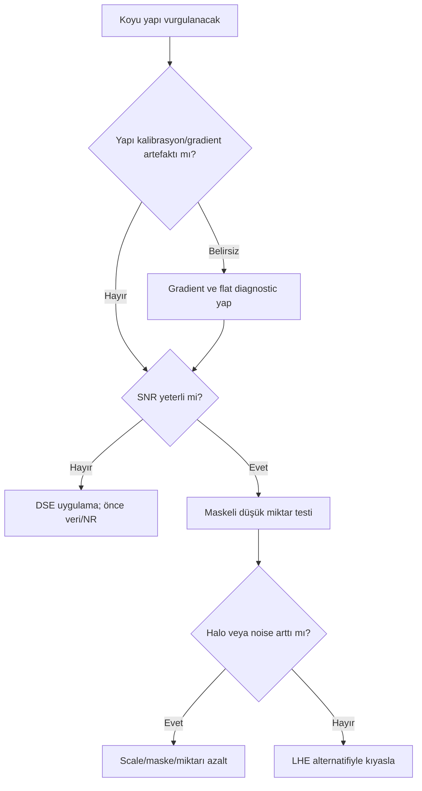

# DarkStructureEnhance

!!! info "Sayfa Bilgisi"
    **Kategori:** Detay ve Kontrast · **Düzey:** Advanced · **Tahmini okuma:** 3 dk
    **Anahtar kelimeler:** `DarkStructureEnhance` · `DSE` · `detail enhancement` · `contrast` · `detay`
    **Önerilen ön bilgiler:** [Stretch](../07-stretch/index.md) · [Maske Mantığı](../11-maskeler/maske-mantigi.md)

## Amaç

DarkStructureEnhance (DSE), çevresine göre koyu kalan yapıları vurgulayarak galaxy dust lane'leri, molecular cloud sınırları ve nebula içindeki karanlık kanalları daha okunur hale getiren seçici bir script iş akışıdır.

## Kuramsal Arka Plan ve bilimsel arka plan

DSE “karanlık veri üretmez”. Lokal koyu yapı ile çevresi arasındaki kontrast ilişkisini değiştirir. Gerçek dust lane, background gradient, calibration kusuru ve dark halo benzer tonlarda olabilir; bu nedenle seçim maskesi ve veri doğruluğu process miktarından daha önemlidir.

!!! warning "Kanıt Düzeyi — Topluluk Uzlaşısı"
    DSE bir script olarak dağıtılır; kurulum kaynağı, sürümü, menü konumu ve kontrol adları PixInsight 1.9.3 ortamında doğrulanmalıdır. Core process davranışı varsayılmamalıdır.

## Ne zaman kullanılır?

- Galaxy dust lane yapısı mevcut fakat lokal kontrastı zayıfsa.
- Dark nebula/molecular cloud sınırı güvenilir sinyal içinde ayrılıyorsa.
- Emission nebula içindeki koyu kanallar maskeyle izole edilebiliyorsa.
- Global Curves hedef dışı alanları fazla etkiliyorsa.

## Ne zaman kullanılmaz?

- Gradient, flat hatası, walking noise veya calibration kusurunu saklamak için.
- Düşük SNR arka planda koyu benekleri “dust” sanarak.
- Yıldız çevresindeki dark halo'yu güçlendirecek maskesiz kullanımda.
- Clipped siyah noktalarda kayıp ayrıntıyı geri getirmek amacıyla.

## Giriş Gereksinimleri ve iş akışı position

Girdi gradient-corrected, renk/ton dengesi kurulmuş ve çoğunlukla nonlinear olmalıdır. DSE genellikle LHE/HDRMT gibi büyük yapısal işlemlerden sonra, final Curves öncesinde değerlendirilir. [RangeMask](../11-maskeler/range-mask.md), [Luminance Mask](../11-maskeler/luminance-mask.md) ve [StarMask](../11-maskeler/star-mask.md) birleşimi hedef dışı koyu bölgeleri koruyabilir.

## Parametre yaklaşımı

| Kontrol ailesi | Amacı | Artırma gerekçesi | Azaltma gerekçesi | Risk |
|---|---|---|---|---|
| Layers/scale | Koyu yapının karakteristik boyutu | Geniş dust lane hedefleniyorsa | İnce kanal hedefleniyorsa | Halo veya ilgisiz arka plan seçimi |
| Iterations | Enhancement tekrar sayısı | Tek hafif geçiş yetersizse | Yapay görünüm başlıyorsa | Over-enhancement |
| Amount/strength | Sonuç yoğunluğu | Maskeli preview yetersizse | Noise/halo büyüyorsa | Siyah ezilmesi ve sert sınır |
| Mask/selection controls | Koyu yapı seçimi | Hedef eksikse | Background/halo seçiliyorsa | Yanlış yapının güçlenmesi |

## Adım adım kullanım

1. Gradient, flat residual ve siyah nokta clipping'i olmadığını doğrulayın.
2. Hedef koyu yapının piksel ölçeğini ve çevresindeki SNR'ı inceleyin.
3. Hedefi arka plan ve yıldız halolarından ayıran yumuşak maske oluşturun.
4. En küçük yeterli scale/layer ve tek hafif uygulamayla başlayın.
5. Dust lane sürekliliği yanında yıldız çevresi ve boş arka planı kontrol edin.
6. Sonucu düşük amount LHE veya Curves alternatifiyle kıyaslayın.
7. Gerekirse özgün görüntüyle [PixelMath](../10-pixelmath/index.md) üzerinden karıştırın.

## Hedefe göre yaklaşım

| Hedef | Karar | Neden |
|---|---|---|
| Spiral galaxy/LRGB | Dust lane maskesiyle düşük miktar | Kolların parlak dokusunu ezmeden koyu sınırı ayırır |
| Dark nebula/mono | Geniş yapı maskesi, çok muhafazakâr etki | Koyu sinyal background ile kolay karışır |
| Emission nebula/SHO-HOO | Luminance odaklı seçim | Color contrast'ı koyu yapı sanmamak için |
| Reflection nebula/OSC | Genellikle LHE ile karşılaştır | Yumuşak toz geçişinde DSE sert halo üretebilir |
| Heavy light pollution | Önce gradient diagnostic | Residual gradient yanlış koyu yapı olarak seçilebilir |

## DSE ve LHE

| Ölçüt | DSE | LHE |
|---|---|---|
| Hedef | Koyu yapılar | Açık/koyu lokal yapıların genel kontrastı |
| Seçim | Dark structure odaklı | Kernel komşuluğu |
| Güçlü yön | Dust lane vurgusu | Nebula/galaxy genel orta ölçek kontrastı |
| Risk | Dark halo ve black crush | Bright/dark halo ve crunchy texture |

## Pratik Karar Rehberi

| Durum | Önerilen İşlem | Gerekçe |
|---|---|---|
| Güvenilir galaxy dust lane | DSE | Koyu yapıyı seçici vurgular |
| Genel nebula lokal kontrastı | LHE | Yalnız karanlık yapıya bağlı değildir |
| Parlak galaxy core | HDRMT | Sorun dinamik aralıktır |
| Noise benzeri koyu lekeler | Önce NR/diagnostic | DSE artefaktı büyütebilir |

## Sorun giderme

| Belirti | Olası neden | Doğrulama | Düzeltme |
|---|---|---|---|
| Dark halo | Yıldız/kenar yanlış seçilmiş | StarMask overlay'ini inceleyin | Yıldız koruması ve yumuşak geçiş ekleyin |
| Black crush | Strength/iteration yüksek | Histogramda sıfıra yığılma kontrolü | Miktarı azaltın, önceki aşamaya dönün |
| Noise amplification | Düşük SNR koyu benekler seçilmiş | Background preview kıyası | Önce NR, daha güçlü maske |
| Yapay dust texture | Scale hedefle uyuşmuyor | Farklı scale denemeleri | En küçük yeterli ölçeği seçin |
| Parlak halo | Lokal ton dengesi bozulmuş | Yapı çevresini radial inceleyin | Amount azaltın veya LHE kullanın |
| Faint detail kaybı | Koyu yapı fazla bastırılmış | Orijinalle blink kıyası | PixelMath blend ve daha düşük miktar |

## Performans ve En İyi Uygulamalar

Script'in ölçek/iteration maliyeti görüntü boyutuyla artar. Preview ile ayar arayın, tam görüntüde kenar ve büyük yapı davranışını yeniden doğrulayın. DSE'yi “son dokunuş” olarak bile maskesiz otomatik reçeteye dönüştürmeyin.

!!! tip "Kanıt Düzeyi — Pratik Öneri"
    Sonucu yalnız daha dramatik görünüp görünmediğine göre değil, koyu yapının özgün görüntüde süreklilik gösterip göstermediğine göre değerlendirin.

## Teknik doğrulama durumu

Koyu lokal yapı enhancement yaklaşımı genel iş akışıdır. DSE script sürümü, repository kaynağı, parametre adları ve sayısal davranışı PixInsight 1.9.3 kurulumunda ayrıca doğrulanmalıdır.

## Ayrıca İnceleyin

[LHE](local-histogram-equalization.md) · [HDRMT](hdr-multiscale-transform.md) · [MMT](multiscale-median-transform.md) · [Maskeler](../11-maskeler/index.md) · [CurvesTransformation](../13-final/curves-transformation.md)

## İlgili Süreçler

- [HDRMultiscaleTransform](hdr-multiscale-transform.md)
- [LocalHistogramEqualization](local-histogram-equalization.md)
- [MultiscaleMedianTransform](multiscale-median-transform.md)

## İlgili İş Akışları

- [LRGB Galaksi](../15-workflows/lrgb-galaxy.md)
- [Broadband Nebula](../15-workflows/broadband-nebula.md)
- [Gezegenimsi Nebula](../15-workflows/planetary-nebula.md)

## Önceki Bölüm

[← MultiscaleMedianTransform](multiscale-median-transform.md)

## Sonraki Bölüm

[Son İşlemler →](../13-final/index.md)
