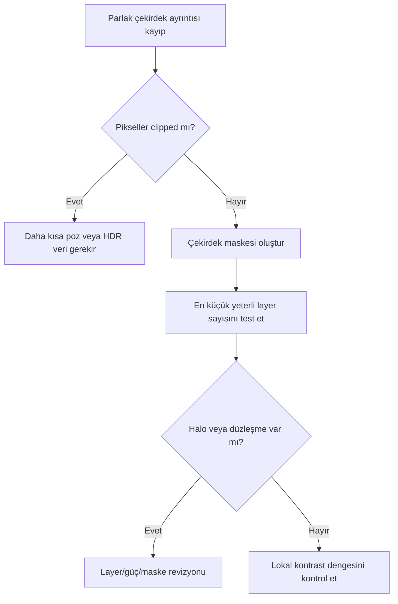

# HDRMultiscaleTransform

!!! info "Sayfa Bilgisi"
    **Kategori:** Detay ve Kontrast · **Düzey:** Advanced · **Tahmini okuma:** 3 dk
    **Anahtar kelimeler:** `HDRMultiscaleTransform` · `HDRMT` · `detail enhancement` · `contrast` · `detay`
    **Önerilen ön bilgiler:** [Stretch](../07-stretch/index.md) · [Maske Mantığı](../11-maskeler/maske-mantigi.md)

## Amaç

HDRMultiscaleTransform (HDRMT), parlak yapılardaki dinamik aralığı multiscale ayrıştırmayla sıkıştırır. Galaxy çekirdeği, planetary nebula merkezi veya parlak emission bölgesi gibi alanlarda büyük ölçekli parlaklık altında kalan lokal yapıyı görünür kılmayı amaçlar.

## Kuramsal Arka Plan ve bilimsel arka plan

HDRMT, à trous wavelet ve multiscale median transform temelli bir yaklaşımla yapıları karakteristik ölçeklerine ayırır. Bir ölçekteki lokal kontrastı, daha büyük ölçekli parlaklık yapısından görece bağımsız yönetir. Bu nedenle global histogram sıkıştırmasından farklıdır.

!!! info "Kanıt Düzeyi — Official Documentation"
    PixInsight workshop materyali HDRMT'yi dinamik aralık kontrolü için multiscale bir algoritma olarak tanımlar; layer'ların yapı ölçeklerini ayırdığını belirtir.

## Layers ve residual layer

Layer sayısı işleme dahil edilen en büyük karakteristik ölçeği belirleyen ana kontroldür. Az layer daha küçük yapılara, fazla layer daha büyük parlaklık yapısına ulaşır. Residual layer, ayrıştırmada ele alınan layer'lardan sonra kalan geniş ölçekli bileşendir; “arka plan” ile eş anlamlı değildir.

Sabit bir layer sayısı her görüntüye taşınamaz. Hedef çekirdeğin piksel boyutu, crop/drizzle oranı ve örnekleme ölçüt olmalıdır.

## Ne zaman kullanılır?

- Galaxy çekirdeği dış kolları bastırıyorsa.
- Planetary nebula iç kabukları parlak merkezde kayboluyorsa.
- Emission nebula çekirdeği lokal ton ayrımını gizliyorsa.
- Nonlinear görüntüde global stretch korunarak lokal dinamik aralık azaltılacaksa.

## Ne zaman kullanılmaz?

- Düşük SNR ayrıntıyı “ortaya çıkarmak” için.
- Saturated/clipped çekirdekte kayıp veriyi geri getirmek için.
- Gradient veya renk kalibrasyonu sorununu düzeltmek için.
- Tüm görüntüde daha güçlü mikro-kontrast amacıyla.

## Giriş, iş akışı ve maske etkileşimi

Girdi çoğunlukla kontrollü nonlinear olmalı; çekirdekte veri clipping olmamalıdır. [RangeMask](../11-maskeler/range-mask.md) veya luminance tabanlı maske, HDRMT etkisini parlak hedefe sınırlar. Yıldızları ayrıca korumak, koyu halo ve yıldız profil bozulması riskini azaltır.

## Parametre yaklaşımı

| Kontrol | Amacı | Artırma gerekçesi | Azaltma gerekçesi | Risk |
|---|---|---|---|---|
| Number of layers | En büyük işlenen yapı ölçeği | Çekirdeğin geniş parlaklık yapısı hâlâ baskınsa | Küçük hedefte çevre etkileniyorsa | Düz/soyut çekirdek veya yetersiz etki |
| Number of iterations | Dönüşüm tekrarını artırır | Tek geçiş kontrollü ama yetersizse | Yapı yapaylaşıyorsa | Aşırı sıkıştırma |
| Overdrive | Etki gücünü değiştirir | Yalnız dikkatli preview kıyasında | Halo/noise oluşuyorsa | Sert, yapay lokal kontrast |
| To lightness | Renkli görüntüde lightness odaklı işlem | Chrominance korunacaksa | Kanal bazlı gereksinim varsa | Renk davranışı UI ile doğrulanmalı |
| Lightness mask | İçsel parlaklık koruması | Parlak yapıyı hedeflemek için | Etki dağılımı yanlışsa | Çekirdek/çevre dengesizliği |

## Adım adım kullanım

1. Çekirdekte clipping olmadığını histogram ve pixel readout ile kontrol edin.
2. Hedef çekirdeğin yaklaşık piksel boyutunu belirleyin.
3. Hedefi çevreden ayıran yumuşak Range/Luminance Mask oluşturun.
4. Farklı layer sayılarıyla preview üretin; en küçük yeterli ölçeği seçin.
5. Tek iterasyon ve muhafazakâr güçle başlayın.
6. Yıldız profilleri, bright/dark halo ve flattened contrast kontrolü yapın.
7. Gerekirse HDRMT sonucunu özgün görüntüyle [PixelMath](../10-pixelmath/index.md) üzerinden kontrollü karıştırın.

## Gerçek iş akışları

| Hedef | Karar | Neden |
|---|---|---|
| Galaxy/LRGB | Çekirdek maskesi → HDRMT → hafif LHE | Önce dinamik aralık, sonra kol kontrastı |
| Planetary nebula/OSC | Kabuk ölçeğine uygun layers → yıldız koruma | Küçük hedefte çevre yıldızlar kolay bozulur |
| Emission nebula/SHO | Yalnız parlak merkezde maskeli HDRMT | Renk ve zayıf filamentlerin global sıkışmasını önler |
| Düşük SNR | HDRMT'yi sınırlı tut veya ertele | Sıkıştırma noise/artefakt görünürlüğünü artırabilir |

## HDRMT ve LHE

| Ölçüt | HDRMT | LHE |
|---|---|---|
| Ana amaç | Dinamik aralık sıkıştırma | Lokal kontrast amplification |
| Tipik hedef | Parlak çekirdek | Orta ölçekli yapı |
| Ana kontrol | Layer sayısı | Kernel radius/contrast limit |
| Başlıca risk | Flattened core, halo | Crunchy texture, noise |

## Pratik Karar Rehberi

| Durum | Önerilen İşlem | Gerekçe |
|---|---|---|
| Galaxy core | HDRMT | Büyük parlaklık yapısından bağımsız lokal ayrım sağlar |
| Faint nebula | LHE | Orta ölçekli kontrastı hedefler |
| Global ton dengesizliği | Histogram/Curves | Multiscale sıkıştırma asıl sorun değildir |
| Clipped core | Yeniden entegrasyon/short exposure | HDRMT kayıp veriyi geri getiremez |

## Hata Tanısı

| Belirti | Olası neden | Doğrulama | Düzeltme |
|---|---|---|---|
| Flattened core | Fazla layer/iteration | Daha hafif sonuçla kıyaslayın | Etkiyi azaltın, maskeyi daraltın |
| Dark halo | Sert maske veya ölçek uyumsuzluğu | Overlay sınırını inceleyin | Maskeyi yumuşatın, layer'ı değiştirin |
| Bright halo | Çevre ton ilişkisi bozulmuş | Radial profili kıyaslayın | Daha düşük miktar/PixelMath blend |
| Yapay texture | Küçük ölçekler fazla vurgulanmış | 1:1 görünüm | Daha büyük ölçek veya daha az iterasyon |
| Faint detail kaybı | Global uygulama | Maskeli/maskesiz fark | Hedef maskesini daraltın |
| Renk bozulması | Kanal/lightness etkileşimi | Kanalları ayrı inceleyin | Lightness odaklı workflow'u doğrulayın |

## Performans ve En İyi Uygulamalar

Layer ve iteration arttıkça süre/bellek maliyeti yükselir. Representative preview ile seçim yapın; nihai sonucu tam görüntüde kontrol edin. Tek agresif geçiş yerine gerektiğinde farklı ölçeklerde iki hafif geçiş kullanın.

## Teknik Doğrulama Notları

Multiscale dynamic range yaklaşımı resmi PixInsight kaynağıyla desteklenir. Tam parametre adları, sınırları ve `To lightness`/mask seçeneklerinin PixInsight 1.9.3 davranışı UI kanıtıyla doğrulanmalıdır.

## Referanslar

- [PixInsight Workshop — HDRMultiscaleTransform](https://pixinsight.com/workshops/atlanta-201603/VPeris_Astrophoto.pdf)
- [PixInsight Workshop — Delinearization and HDR](https://pixinsight.com/workshops/cfa-2014/03/index.html)

## Teknik Doğrulama Durumu

| Alan | Durum |
| --- | --- |
| Hedeflenen PixInsight Sürümü | 1.9.3 |
| Teknik İnceleme Durumu | Kısmen Doğrulandı |
| Resmî Kaynak Kontrolü | Kısmi |
| İş Akışı Tutarlılığı | Doğrulandı |
| Kanıt Düzeyi İncelemesi | Güncellendi |
| Son Teknik İnceleme | Phase 6.4 |

Canlı PixInsight uygulama testi yapılmadı. UI ekran kanıtı, statik ifade/iş akışı incelemesi ve yayımlanmış birincil kaynak kontrolü birbirinin yerine kullanılmamıştır.

## İlgili Süreçler

- [LocalHistogramEqualization](local-histogram-equalization.md)
- [MultiscaleMedianTransform](multiscale-median-transform.md)
- [DarkStructureEnhance](dark-structure-enhance.md)

## İlgili İş Akışları

- [LRGB Galaksi](../15-workflows/lrgb-galaxy.md)
- [Broadband Nebula](../15-workflows/broadband-nebula.md)
- [Gezegenimsi Nebula](../15-workflows/planetary-nebula.md)

## Önceki Bölüm

[← Detay ve Kontrast](index.md)

## Sonraki Bölüm

[LocalHistogramEqualization →](local-histogram-equalization.md)
