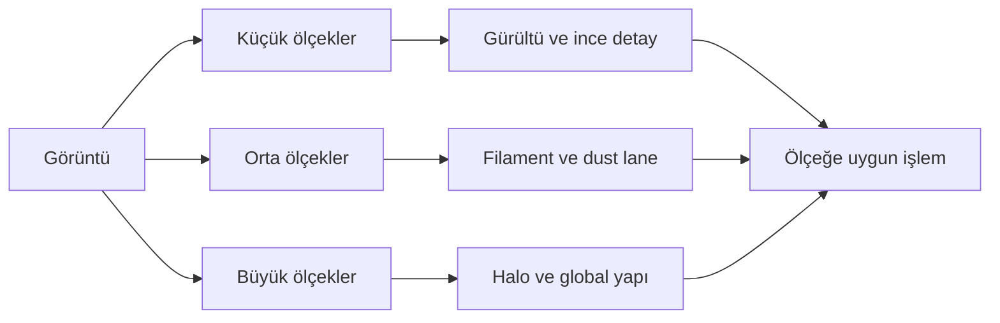
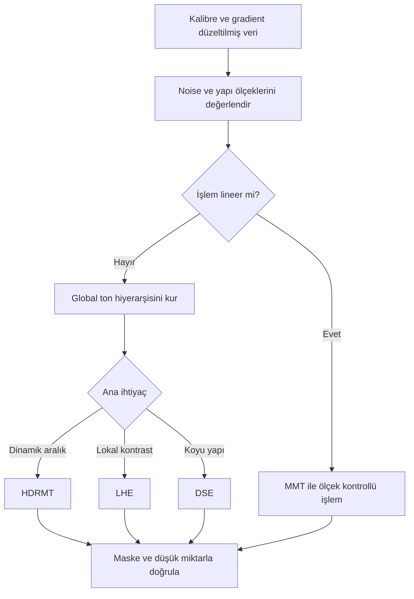

# Detay ve Kontrast

## Amaç

Bu bölüm, görüntüdeki yapıları uzamsal ölçeklerine göre ayırıp kontrollü biçimde güçlendirmeyi anlatır. Hedef “daha keskin” bir görünüm değil; gerçek sinyali korurken lokal kontrastı, dinamik aralığı ve algılanabilir yapıyı yönetmektir.

## Multiscale felsefesi

Bir görüntü, farklı uzamsal frekansların toplamı gibi düşünülebilir:

- **Yüksek uzamsal frekans:** küçük yıldız çekirdekleri, ince filamentler ve gürültü.
- **Orta frekans:** galaksi kolları, dust lane sınırları ve nebula kıvrımları.
- **Düşük frekans:** geniş halo, büyük nebula gövdesi ve arka plan gradient'i.

“İnce”, “orta” ve “büyük” mutlak sınıflar değildir; görüntünün örnekleme ölçeği, çözünürlüğü ve hedefin açısal boyutuyla değişir. Aynı layer, iki farklı veri setinde farklı fiziksel yapıları temsil edebilir.

Wavelet ve benzeri multiscale ayrıştırmalar, görüntüyü karakteristik boyutlarına göre katmanlara ayırmayı sağlar. Bu bölüm algoritmik uygulama ayrıntısı uydurmaz; layer'ları “belirli piksel boyutundaki yapıların çalışma alanı” olarak kullanır.

## Global ve lokal kontrast

| Özellik | Global kontrast | Lokal kontrast |
|---|---|---|
| Kapsam | Görüntünün genel ton dağılımı | Komşuluk içindeki ton farkı |
| Araç örneği | HistogramTransformation, CurvesTransformation | LHE, HDRMT, DSE |
| Güçlü yön | Genel tonal hiyerarşi | Yapıların algılanabilirliği |
| Risk | Zayıf yapının arka planda kaybolması | Halo, gürültü ve “crunchy” görünüm |

## Process seçimi

| İhtiyaç | İlk değerlendirilecek araç | Neden |
|---|---|---|
| Parlak çekirdekte dinamik aralık | [HDRMultiscaleTransform](hdr-multiscale-transform.md) | Büyük yapıdan bağımsız lokal kontrast kurar |
| Orta/büyük yapı kontrastı | [LocalHistogramEqualization](local-histogram-equalization.md) | Kernel çevresindeki kontrastı sınırlar |
| Layer bazlı noise/detail kontrolü | [MultiscaleMedianTransform](multiscale-median-transform.md) | Ölçeklerin ayrı ağırlıklandırılmasına izin verir |
| Dust lane ve koyu yapı vurgusu | [DarkStructureEnhance](dark-structure-enhance.md) | Koyu lokal yapıları hedefler |

!!! warning
    Detail enhancement yeni sinyal üretmez. Düşük SNR veride gürültüyü yapıya benzetebilir; maske ve kontrollü miktar, güçlü parametreden daha değerlidir.

## İş Akışı konumu

Gradient ve renk kalibrasyonu tamamlanmadan lokal kontrast uygulamak artefaktları büyütür. Genellikle önce [noise reduction](../06-ai-eklentileri/noisexterminator.md), sonra stretch, ardından hedefe göre lokal kontrast değerlendirilir. MMT lineer aşamada da kullanılabilir; LHE, HDRMT ve DSE çoğunlukla görünür yapının değerlendirilebildiği nonlinear aşamada kullanılır.

## Veri türüne göre strateji

| Veri/hedef | Öncelik | Muhafazakâr yaklaşım |
|---|---|---|
| Galaxy/LRGB | Çekirdek, kollar, dust lane | HDRMT → maskeli LHE → gerekirse DSE |
| Emission nebula/SHO/HOO | Filament ve renk ayrımı | Luminance maskeli LHE; chroma noise kontrolü |
| Reflection nebula/OSC | Yumuşak halo ve toz | Büyük kernel, düşük amount; sert mikro-kontrasttan kaçın |
| Planetary nebula | Parlak çekirdek ve kabuk | HDRMT, ardından küçük/orta ölçek kontrolü |
| Dark nebula | Koyu yapı ve zayıf arka plan | DSE yerine/yanında kontrollü LHE; halo denetimi |
| Düşük SNR/ışık kirliliği | Gürültü ve gradient güvenliği | Önce düzeltme ve maskeli NR; enhancement'ı sınırlı tut |
| Yüksek SNR/karanlık gökyüzü | İnce yapı sürekliliği | Birden fazla hafif, ölçek odaklı geçiş |

## Pratik Karar Rehberi

1. Hedef yapının ölçeğini 1:1 görüntüde belirleyin.
2. Gürültünün aynı ölçekte olup olmadığını kontrol edin.
3. Dinamik aralık sorunu varsa HDRMT; lokal kontrast sorunu varsa LHE değerlendirin.
4. Layer bazlı ayrım gerekiyorsa MMT kullanın.
5. Yalnız koyu yapı hedefleniyorsa DSE'yi maskeli ve düşük miktarda test edin.
6. Maskeli/maskesiz sonucu aynı zoom ve aynı screen stretch ile karşılaştırın.

## Ayrıca İnceleyin

[HistogramTransformation](../02-pixinsight-temelleri/histogram.md) · [Generalized Hyperbolic Stretch](../07-stretch/generalized-hyperbolic-stretch.md) · [CurvesTransformation](../13-final/curves-transformation.md) · [Maskeler](../11-maskeler/index.md) · [PixelMath](../10-pixelmath/index.md)

## Referanslar

- [PixInsight Workshop — HDRMultiscaleTransform and multiscale processing](https://pixinsight.com/workshops/atlanta-201603/VPeris_Astrophoto.pdf)
- [PixInsight Forum — HDRMT and LHE workflow example](https://pixinsight.com/forum/index.php?threads/m101-hdr-processing-startools-vs-pixinsight.4286/)

## Önceki Bölüm

[← Maske Mantığı](../11-maskeler/maske-mantigi.md)

## Sonraki Bölüm

[HDRMultiscaleTransform →](hdr-multiscale-transform.md)
