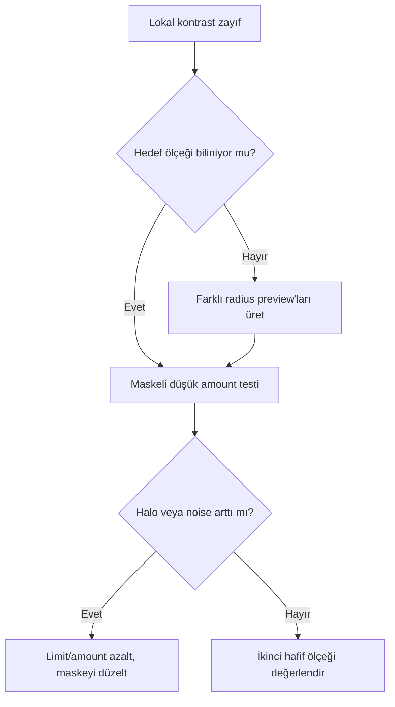

# LocalHistogramEqualization

## Purpose

LocalHistogramEqualization (LHE), komşuluk içindeki ton ayrımını artırarak orta ve büyük ölçekli yapıların algılanabilirliğini güçlendirir. Global histogramı yeniden kurmak yerine her bölgenin çevresine göre lokal kontrast üretir.

## Theory ve bilimsel arka plan

LHE, contrast-limited adaptive histogram equalization yaklaşımını kullanır. Kernel radius incelenen komşuluğun karakteristik boyutunu; contrast limit ise lokal histogramın ne ölçüde güçlendirilebileceğini belirler. Küçük kernel daha ince yapıları ve gürültüyü, büyük kernel daha geniş yapıları hedefleme eğilimindedir.

!!! info "Evidence Level — Official Documentation"
    PixInsight'ın teknik iş akışı örneği, LHE'yi CLAHE uygulaması olarak tanımlar ve düşük SNR alanlarda noise intensification riskini azaltmak için maskeli kullanır.

## Ne zaman kullanılır?

- Galaxy kolları ve dust lane çevresindeki orta ölçekli kontrast zayıfsa.
- Emission nebula filamentleri global Curves ile ayrışmıyorsa.
- Reflection nebula/toz yapısında yumuşak lokal ayrım gerekiyorsa.
- SHO/HOO görüntüde luminance yapısı renk ayrımından bağımsız güçlendirilecekse.

## Ne zaman kullanılmaz?

- Gradient veya flat hatasını düzeltmek için.
- Çok düşük SNR veride maske olmadan.
- Global ton dağılımı henüz dengeli değilse.
- Parlak çekirdek dinamik aralığı asıl sorunsa HDRMT daha doğrudan olabilir.

## Workflow position ve input requirements

Girdi geometrik ve fotometrik sorunlardan arındırılmış, çoğunlukla nonlinear ve clipping içermeyen bir master olmalıdır. Noise reduction ile enhancement sırası veri setine bağlıdır; LHE'nin mevcut noise'u büyütme ihtimali nedeniyle düşük SNR veride önce kontrollü noise reduction genellikle daha güvenlidir.

## Parametreler

| Parametre | Amacı | Artırma gerekçesi | Azaltma gerekçesi | Yanlış kullanım sonucu |
|---|---|---|---|---|
| Kernel radius | Lokal komşuluk ölçeği | Daha büyük yapı hedefleniyorsa | İnce yapı hedefleniyorsa | Ölçek uyumsuzluğu, halo veya gürültü |
| Contrast limit | Lokal amplification sınırı | Etki yetersizse | Gürültü/artefakt büyüyorsa | “Crunchy” doku, clipping benzeri görünüm |
| Amount | İşlenmiş sonuç karışımı | Kontrollü etki yetersizse | Sonuç yapay görünüyorsa | Over-enhancement |
| Histogram resolution | Lokal histogram örnekleme ayrıntısı | Ton geçişi gerektiriyorsa | Performans/kararlılık değerlendirmesi | Veri setine bağlı; UI doğrulaması gerekir |

!!! warning
    “Typical setting” sabit piksel değeri değildir. Kernel radius, hedef yapının görüntü üzerindeki piksel boyutuna göre seçilmelidir; crop, drizzle ve kamera örneklemesi aynı değerin anlamını değiştirir.

## Adım adım kullanım

1. Hedef yapının piksel ölçeğini 1:1 görünümde tahmin edin.
2. Arka planı ve yıldızları koruyan [RangeMask](../11-maskeler/range-mask.md) veya [Luminance Mask](../11-maskeler/luminance-mask.md) hazırlayın.
3. Kernel radius'u hedef yapıdan küçük ve büyük iki denemeyle kıyaslayın.
4. Contrast limit'i halo/gürültü oluşmayacak seviyede tutun.
5. Amount ile global sonucu karıştırın; tek güçlü uygulama yerine gerekirse iki hafif farklı ölçek kullanın.
6. Maskeyi kapatıp 1:1 ve uzak görünümde karşılaştırın.

## Hedefe göre uygulama

| Hedef | Ölçek tercihi | Neden | Koruma |
|---|---|---|---|
| Galaxy | Orta yapı + ikinci hafif büyük ölçek | Kollar ve dış halo ayrı ölçeklerdir | Çekirdek, yıldız, düşük SNR dış bölge |
| Emission nebula | Filament genişliğine uygun | Global stretch'in ayıramadığı kıvrımlar | Gürültülü arka plan ve yıldızlar |
| Reflection nebula | Daha geniş ve düşük amount | Toz/halo geçişi yumuşaktır | Karanlık arka plan |
| Planetary nebula | Kabuk boyutuna uygun | Küçük hedefte yanlış kernel kolay artefakt üretir | Yıldız ve parlak çekirdek |
| SHO/HOO | Luminance yapısına göre | Renk gürültüsünü contrast sinyali sanmamak için | ColorMask yerine luminance odaklı maske |

## LHE karşılaştırmaları

| Karşılaştırma | LHE | Diğer araç |
|---|---|---|
| LHE vs HDRMT | Lokal kontrastı yükseltir | HDRMT parlak yapıların dinamik aralığını sıkıştırır |
| LHE vs Curves | Komşuluk/ölçek tabanlı | Curves global veya maskeyle bölgesel ton eşlemesi yapar |
| LHE vs DSE | Açık ve koyu yapı farkını birlikte etkiler | DSE koyu yapıları hedefler |

## Practical Decision Guide

| Situation | Recommended Process | Why |
|---|---|---|
| Galaxy kolu ve nebula filamenti | LHE | Orta ölçekli lokal kontrastı artırır |
| Parlak çekirdek ayrıntısı | HDRMT | Dinamik aralığı daha doğrudan yönetir |
| Yalnız dust lane vurgusu | DSE | Koyu yapıya özgü seçim sunar |
| Global tonal denge | CurvesTransformation | Lokal kernel yerine genel ton ilişkisini düzenler |

## Sorun giderme

| Belirti | Olası neden | Doğrulama | Düzeltme |
|---|---|---|---|
| Crunchy görünüm | Küçük kernel/yüksek contrast | 1:1'de mikro-kontrast ve noise bakın | Radius artırın, limit/amount azaltın |
| Parlak/dark halo | Ölçek uyumsuzluğu veya sert maske | Maskesiz sınırı inceleyin | Kernel ve maske geçişini değiştirin |
| Arka plan hasarı | Maske yetersiz | Arka planı ayrı preview'da karşılaştırın | Range/Luminance Mask'i güçlendirin |
| Faint detail kaybı | Aşırı kontrast baskısı | Düşük amount sonuçla kıyaslayın | Önceki aşamaya dönüp miktarı azaltın |
| Düzleşmiş kontrast | Çok büyük kernel | Farklı radius sonuçlarını kıyaslayın | Yapı ölçeğine yaklaşın |
| Yapay texture | Noise yapı sanılıyor | Noise-only bölgede kontrol edin | Önce NR, sonra maskeli LHE uygulayın |

## Performance considerations

Büyük kernel, yüksek çözünürlük ve geniş görüntü bellek/süre maliyetini artırır. Parametre seçimini representative preview'larda yapın; kenar koşulları nedeniyle final doğrulamayı tam görüntüde tekrarlayın.

## Best practices ve output expectations

- Sonuç “detay eklenmiş” değil, mevcut detayın daha okunur olduğu görünmelidir.
- Farklı ölçekleri düşük amount ile ayrı geçişlerde kullanın.
- Yıldız, arka plan ve hedef yapıyı üç ayrı kontrol bölgesinde inceleyin.
- [CurvesTransformation](../13-final/curves-transformation.md) ile son global dengeyi LHE'den sonra kurun.

## Teknik doğrulama durumu

CLAHE yaklaşımı ve maskeli kullanım resmi PixInsight örneğiyle desteklenir. Parametrelerin tam UI adları, sınırları ve varsayılanları PixInsight 1.9.3 ekran kanıtıyla doğrulanmalıdır.

## Referanslar

- [PixInsight Forum — HDRMT and LHE workflow example](https://pixinsight.com/forum/index.php?threads/m101-hdr-processing-startools-vs-pixinsight.4286/)
- [Multiscale processing overview](https://pixinsight.com/workshops/atlanta-201603/VPeris_Astrophoto.pdf)
