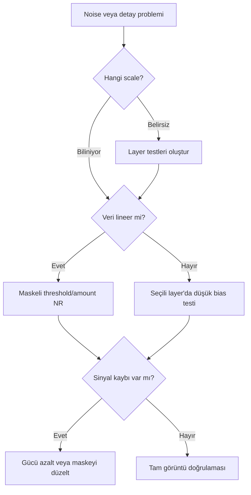

# MultiscaleMedianTransform

## Amaç

MultiscaleMedianTransform (MMT), görüntüyü ölçek katmanlarına ayırarak noise reduction, detail attenuation veya enhancement işlemlerini yapı boyutuna göre kontrol eder. Gücü, tüm görüntüye tek bir “sharpness” uygulamak yerine küçük, orta ve büyük yapıları ayrı değerlendirmesidir.

## Kuramsal Arka Plan ve çok ölçekli işleme felsefesi

Multiscale ayrıştırmada ilk layer'lar en küçük yapıları; ilerleyen layer'lar giderek daha geniş yapıları; residual layer ise ayrıştırma dışında kalan en büyük ölçekli bileşeni taşır. Layer numarası fiziksel nesne sınıfı değildir: görüntü örneklemesi değiştiğinde aynı astronomik yapı farklı layer'a düşebilir.

Noise çoğunlukla küçük ölçeklerde güçlüdür fakat yalnız ilk layer'da bulunmaz. Seeing, resampling, drizzle ve interpolation noise korelasyonunu ve layer dağılımını değiştirir. Bu nedenle bütün küçük layer'ları kapatmak gerçek yıldız profili ve ince filament sinyalini de silebilir.

## Doğrusal ve doğrusal olmayan kullanım

| Özellik | Lineer MMT | Nonlinear MMT |
|---|---|---|
| Tipik amaç | Noise reduction | Detail/texture kontrolü ve sınırlı NR |
| Değerlendirme | Tutarlı STF ile | Gerçek nonlinear tonlarla |
| Maske | SNR/luminance ağırlığı | Yapı, range ve yıldız maskeleri |
| Risk | Zayıf sinyalin noise sanılması | Yapay texture ve halo |

## Ne zaman kullanılır?

- Lineer veride ölçek bağımlı noise reduction gerektiğinde.
- Nonlinear veride belirli boyuttaki ayrıntı kontrollü güçlendirilecekse.
- Küçük ölçekli noise ile orta ölçekli yapı ayrılabiliyorsa.
- NoiseXTerminator sonucuna scale-specific ince ayar gerekiyorsa.

## Ne zaman kullanılmaz?

- Gradient veya global ton dengesini düzeltmek için.
- Hedef yapının scale dağılımı bilinmeden tüm layer'lara agresif değerlerle.
- Clipped veya undersampled yıldızları “onaracağı” varsayımıyla.
- Düşük SNR veride maskesiz enhancement amacıyla.

## Giriş Gereksinimleri ve iş akışı position

Lineer MMT için görüntü kalibre, integrate ve gradient-corrected olmalıdır. Nonlinear enhancement için stretch kontrollü ve noise seviyesi değerlendirilmiş olmalıdır. Her durumda maskenin geometrisi hedefle eşleşmeli; aynı STF/zoom ile before-after kıyası yapılmalıdır.

## Parametre yaklaşımı

| Kontrol | Amacı | Artırma gerekçesi | Azaltma gerekçesi | Risk |
|---|---|---|---|---|
| Layer enable/disable | Ölçekleri işleme dahil eder | İlgili ölçekte sorun varsa | Sinyal zarar görüyorsa | Detay kaybı veya eksik işlem |
| Bias | Layer katkısını değiştirir | Gerçek detay enhancement gerekiyorsa | Halo/noise artıyorsa | Yapay keskinlik |
| Noise reduction threshold | Layer'da korunacak/işlenecek ayrım | Noise kalıyorsa | Zayıf sinyal siliniyorsa | Plastik görünüm |
| Amount | Noise reduction gücü | Noise kalıyorsa | Doku kayboluyorsa | Over-smoothing |
| Iterations | İşlem tekrarını artırır | Tek geçiş yetersizse | Artefakt başlıyorsa | Aşırı işlem ve performans maliyeti |
| Scaling function | Ayrıştırma geometrisini etkiler | Yalnız test ve teknik gerekçeyle | Varsayılan yaklaşım yeterliyse | Ölçek davranışının yanlış yorumlanması |

!!! warning
    Parametrelerin tam adları ve kullanılabilir seçenekleri PixInsight 1.9.3 UI kanıtıyla doğrulanmalıdır. Buradaki tablo sabit varsayılan değer veya undocumented algoritma iddiası değildir.

## Adım adım lineer noise reduction

1. Küçük, orta ve zayıf sinyal içeren representative preview'lar oluşturun.
2. [Luminance Mask](../11-maskeler/luminance-mask.md) ile yüksek SNR yapıları koruyun.
3. İlk layer'dan başlayıp her layer'ın noise/sinyal katkısını ayrı değerlendirin.
4. Threshold ve amount'u zayıf gerçek yapıyı silmeyecek şekilde ayarlayın.
5. Tutarlı STF ile before-after kıyaslayın; otomatik STF farkını sonuç sanmayın.
6. Background RMS görünümü, yıldız profili ve filament sürekliliğini birlikte kontrol edin.

## Adım adım nonlinear detay iyileştirme

1. Hedef detayın hangi layer'larda bulunduğunu test görüntüleriyle belirleyin.
2. Arka plan, yıldız ve düşük SNR alanları koruyan maske kullanın.
3. Yalnız gerekli layer'larda küçük positive bias/katkı değişimi uygulayın.
4. Bright ve dark halo, granular texture ve yıldız çekirdeği kontrolü yapın.
5. [CurvesTransformation](../13-final/curves-transformation.md) ile global ton dengesini yeniden değerlendirin.

## MMT ve NoiseXTerminator

| Ölçüt | MMT | NoiseXTerminator |
|---|---|---|
| Kontrol modeli | Açık layer/threshold yaklaşımı | Model tabanlı plugin kontrolleri |
| Güçlü yön | Scale-specific müdahale | Hızlı ve genel noise reduction workflow'u |
| Kullanım | Tanısal ve hassas layer ayarı | Başlangıç veya ana NR geçişi |
| Risk | Yanlış layer'da sinyal kaybı | Model artefaktı veya aşırı smoothing |

İki araç zorunlu rakip değildir. NoiseXTerminator sonrası MMT yalnız kalan belirli ölçekli problemi çözmek için kullanılabilir; iki güçlü NR geçişini üst üste uygulamak doku kaybını büyütür.

## Hedef/veri stratejileri

| Durum | Yaklaşım | Neden |
|---|---|---|
| Low SNR mono/narrowband | Lineer, güçlü maske, küçük layer odaklı | Zayıf sinyal noise ile örtüşür |
| High SNR LRGB | Hafif lineer NR veya nonlinear detail | Ölçek ayrımı daha güvenilir |
| OSC/light pollution | Chroma ve luminance noise'u ayrı denetle | Gradient/chroma noise yapı sanılabilir |
| Galaxy | Küçük noise ve orta kol yapısını ayır | Dust lane sürekliliğini korur |
| Emission nebula | Filament layer'larını koru | İnce gerçek sinyal küçük scale'dedir |

## Pratik Karar Rehberi

| Durum | Önerilen İşlem | Gerekçe |
|---|---|---|
| Scale-specific linear noise | MMT | Threshold ve amount layer bazında yönetilir |
| Genel model tabanlı NR | NoiseXTerminator | Daha doğrudan workflow sağlar |
| Parlak çekirdek | HDRMT | Sorun noise değil dinamik aralıktır |
| Orta ölçek lokal kontrast | LHE | Kernel tabanlı contrast amplification uygundur |

## Sorun giderme

| Belirti | Olası neden | Doğrulama | Düzeltme |
|---|---|---|---|
| Plastik yüzey | Fazla amount/iteration | Düşük ayarla kıyaslayın | Gücü azaltın |
| Granular texture | Küçük layer enhancement | Noise-only alanda inceleyin | Bias'ı azaltın veya layer'ı kapatın |
| Bright/dark halo | Orta layer aşırı güçlendirilmiş | Yüksek kontrast sınırına bakın | Layer katkısını azaltın |
| Faint detail kaybı | Threshold gerçek sinyali kapsamış | Zayıf filament preview'ı | Threshold/maske revizyonu |
| Background damage | Maskesiz veya gradient'li girdi | Arka plan farkını inceleyin | Önce gradient, sonra maskeli MMT |
| Noise kalıyor | Yalnız ilk layer işlenmiş | Layer testlerini kıyaslayın | Noise'un yayıldığı diğer scale'i kontrollü ekleyin |

## Performans ve En İyi Uygulamalar

Çok sayıda aktif layer, iteration ve büyük görüntü maliyeti artırır. Preview ile arama yapın; final ayarı tam çözünürlükte doğrulayın. Her layer değişikliğinin nedenini not edin ve process icon ile tekrarlanabilir hale getirin.

## Teknik doğrulama durumu

Multiscale katman felsefesi resmi PixInsight eğitim materyaliyle uyumludur. MMT'nin 1.9.3 UI kontrol adları, scaling function seçenekleri ve sayısal sınırları ekran kanıtıyla doğrulanmalıdır.

## İlgili bölümler

[NoiseXTerminator](../06-ai-eklentileri/noisexterminator.md) · [BlurXTerminator](../06-ai-eklentileri/blurxterminator.md) · [Maskeler](../11-maskeler/index.md) · [LHE](local-histogram-equalization.md)

## Referanslar

- [PixInsight Workshop — Multiscale processing](https://pixinsight.com/workshops/atlanta-201603/VPeris_Astrophoto.pdf)
