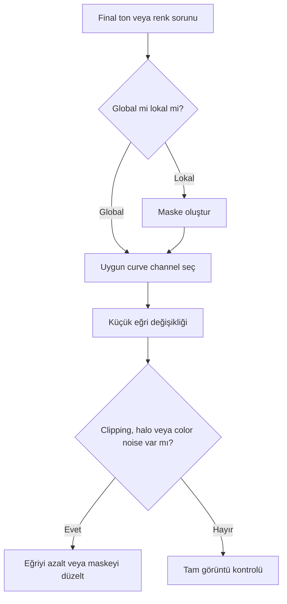

# CurvesTransformation

!!! info "Sayfa Bilgisi"
    **Kategori:** Son İşlemler · **Düzey:** Intermediate · **Tahmini okuma:** 3 dk
    **Anahtar kelimeler:** `CurvesTransformation` · `Curves Transformation` · `overprocessed image` · `aşırı işlenmiş görüntü` · `final processing` · `son işlemler`
    **Önerilen ön bilgiler:** [Stretch](../07-stretch/index.md) · [Maskeler](../11-maskeler/index.md)

## Amaç

CurvesTransformation, giriş değerlerini kullanıcı tanımlı eğrilerle çıkış değerlerine eşleyerek final contrast ve color refinement sağlar. Gücü, global ton dönüşümünü maskelerle yapısal olarak sınırlandırabilmesidir.

## Kuramsal Arka Plan ve bilimsel arka plan

Eğri üzerindeki her nokta bir giriş değerinin hangi çıkış değerine taşınacağını belirler. Diyagonalin üstündeki bölüm ilgili aralığı yükseltir, altındaki bölüm azaltır. Eğrinin yerel eğimi kontrastı etkiler: eğim artarsa yakın değerler ayrışır; azalırsa sıkışır. Aşırı yatay veya dik bölgeler ton ayrımını kaybettirebilir.

## Kanal felsefesi

| Eğri | Temel işlev | Kullanım | Başlıca risk |
|---|---|---|---|
| RGB/K | RGB kanallarını birlikte tonal eşleme | Genel brightness/contrast | Black/white clipping, renk kayması |
| Luminance | Algılanan parlaklık yapısı | Rengi daha sınırlı etkileyen contrast | Renk uzayı etkileşimi doğrulanmalı |
| Saturation | Renk yoğunluğu | Seçici color refinement | Chroma noise ve color clipping |
| Hue | Hue yeniden eşleme | Dar renk düzeltmeleri | Renk kimliğinin yapay değişmesi |
| CIE a*, b*, c* | CIE renk bileşenleri | İnce color balance/chroma kontrolü | Renk uzayı davranışını yanlış yorumlama |

!!! warning
    Tam kanal adları ve CIE eğrilerinin PixInsight 1.9.3 davranışı UI kanıtıyla doğrulanmalıdır. Kanal eğrileri fiziksel renk kalibrasyonunun yerine geçmez.

## İş Akışındaki Yeri

Curves çoğunlukla stretch, noise reduction ve ana lokal kontrast işlemlerinden sonra kullanılır. [SPCC](../05-color-calibration/spcc.md) veya PCC ile kurulan renk kalibrasyonunu estetik olarak rafine edebilir; kalibrasyon hatasını gizlemek için kullanılmamalıdır.

## Ne zaman kullanılır?

- Galaxy kolları ile çekirdek arasındaki tonal hiyerarşiyi düzenlerken.
- Nebula sinyalini arka plandan kontrollü ayırırken.
- Maskeli saturation veya belirli hue ailesi üzerinde çalışırken.
- Final black point'e yaklaşmadan önce midtone kontrastı kurarken.

## Ne zaman kullanılmaz?

- Lineer veriyi ilk kez stretch etmek için HistogramTransformation daha ölçülebilir olabilir.
- Gradient, calibration veya channel mapping hatasını düzeltmek için.
- Clipped siyah/beyaz veriyi geri getirmek amacıyla.
- Maskesiz güçlü S-curve ile düşük SNR arka planı zorlamak için.

## Curves karşılaştırmaları

| Karşılaştırma | CurvesTransformation | Diğer araç |
|---|---|---|
| Curves vs HistogramTransformation | Serbest biçimli ve çok kanallı final eşleme | HT black point/midtone/white point için daha doğrudan |
| Curves vs LHE | Global veya maskeyle bölgesel ton eşleme | LHE kernel tabanlı lokal contrast üretir |
| Curves vs ColorMask | İşlem etkisini uygular | ColorMask yalnız seçim/ağırlık üretir |

## Giriş Gereksinimleri ve parametre yaklaşımı

Girdi nonlinear, gradient-corrected ve renk kalibrasyonu tamamlanmış olmalıdır. Histogram uçlarında headroom bırakılmalı; maske hedefle aynı geometride olmalıdır.

| Kontrol | Amaç | Muhafazakâr yaklaşım | Hata belirtisi |
|---|---|---|---|
| Curve control points | Ton eşlemesini şekillendirir | Az sayıda, yumuşak nokta | Ton kırılması veya posterization |
| Channel selector | İşlenecek bileşeni belirler | İşlem amacına uygun tek kanal ailesi | Beklenmeyen renk/brightness değişimi |
| Real-time preview | Sonucu iteratif izler | 1:1 ve uzak görünümü birlikte kullan | Preview ölçeğinde artefaktın kaçması |
| Mask | Etki dağılımını sınırlar | Yumuşak grayscale maske | Halo ve sert sınır |

## Galaxy ve nebula iş akışı'ları

### Galaxy

1. Luminance/RangeMask ile arka planı ve parlak çekirdeği koruyun.
2. RGB/K veya luminance üzerinde hafif S-curve ile kol kontrastını artırın.
3. StarMask ile yıldızları koruyup saturation'ı küçük miktarda düzenleyin.
4. Çekirdek sararması ve dış halo kaybını kontrol edin.

### Nebula

1. Hedef yapıyı [RangeMask](../11-maskeler/range-mask.md) ile ayırın.
2. ColorMask gerekiyorsa belirli hue ailesini seçin.
3. Luminance kontrastı ile saturation'ı ayrı geçişlerde yönetin.
4. Background chroma noise ve yıldız rengi clipping'ini kontrol edin.

## Koruyucu İş Akışları

- StarMask: yıldız çekirdeği ve saturation koruması.
- Luminance Mask: etkiyi SNR/parlaklığa göre dağıtma.
- RangeMask: background veya çekirdek koruması.
- ColorMask: saturation/hue işlemini belirli renk ailesine sınırlama.

## Beklenen Görsel Sonuç

| Durum | Görsel işaret |
|---|---|
| Beklenen iyileşme | Tonlar ayrışır; arka plan, yıldız ve hedef doğal sürekliliğini korur |
| Under-processing | Görüntü hâlâ flat; hedef arka plandan ayrılmıyor |
| Over-processing | Black/white clipping, sert S-curve, aşırı renk |
| Tipik artefakt | Halo, posterization, magenta yıldız, chroma noise |

## Pratik Karar Rehberi

| Durum | Önerilen İşlem | Gerekçe |
|---|---|---|
| Flat global contrast | Curves RGB/K veya Luminance | Midtone ilişkisini serbestçe düzenler |
| Lokal nebula kontrastı | LHE | Komşuluk ölçeğini hedefler |
| İlk nonlinear stretch | HistogramTransformation/GHS | Stretch davranışı daha sistematik yönetilir |
| Oversaturated stars | Maskeli Saturation curve | Yıldızları ayrı korumaya izin verir |

## Sorun giderme ve En İyi Uygulamalar

| Belirti | Olası neden | Düzeltme |
|---|---|---|
| Black clipping | Sol uç fazla aşağı çekilmiş | Black point headroom'u geri verin |
| White clipping | Sağ uç/üst tonlar aşırı yükseltilmiş | Highlights'ı sıkıştırın |
| Renk kayması | Kanal bazlı curve veya maske contamination | Kanalları ölçün, doğru maskeyi kullanın |
| Crunchy görünüm | Fazla dik yerel eğim | Daha yumuşak ve az noktalı eğri |
| Arka plan gürültüsü | Maskesiz contrast/saturation | Background koruma maskesi |
| Halo | Sert maske sınırı | Maskeyi yumuşatın |

## Performans Değerlendirmesi

Curves hesaplama açısından genellikle hafiftir; asıl maliyet real-time preview ve büyük maskelerin yeniden değerlendirilmesidir. Representative preview kullanın, final kontrolü tam görüntüde yapın.

## Teknik doğrulama durumu ve referanslar

Eğri eşleme teorisi genel ve sürümden bağımsızdır. Kanal adları, CIE bileşenleri ve UI davranışı PixInsight 1.9.3 ekran kanıtıyla doğrulanmalıdır.

- [PixInsight Resources](https://www.pixinsight.com/resources/)
- [Maskeler ve seçici işleme](../11-maskeler/index.md)

## Teknik Doğrulama Durumu

| Alan | Durum |
| --- | --- |
| Hedeflenen PixInsight Sürümü | 1.9.3 |
| Teknik İnceleme Durumu | Kısmen Doğrulandı |
| Resmî Kaynak Kontrolü | Kısmi |
| İş Akışı Tutarlılığı | Doğrulandı |
| Kanıt Düzeyi İncelemesi | Güncellendi |
| Son Teknik İnceleme | Phase 6.4 |

Canlı PixInsight uygulama testi yapılmadı. UI ekran kanıtı, statik ifade/iş akışı incelemesi ve yayımlanmış birincil kaynak kontrolü birbirinin yerine kullanılmamıştır.

## İlgili Süreçler

- [SCNR](scnr.md)
- [Doygunluk](saturation.md)
- [Dışa Aktarım](export.md)

## İlgili İş Akışları

- [LRGB Galaksi](../15-workflows/lrgb-galaxy.md)
- [SHO ve HOO Narrowband](../15-workflows/sho-hoo.md)
- [M31 LRGB + Ha](../20-uygulamalar/m31-lrgb-ha/index.md)
- [NGC 6888 SHO](../20-uygulamalar/ngc6888-sho/index.md)

## Önceki Bölüm

[← Son İşlemler](index.md)

## Sonraki Bölüm

[SCNR →](scnr.md)
