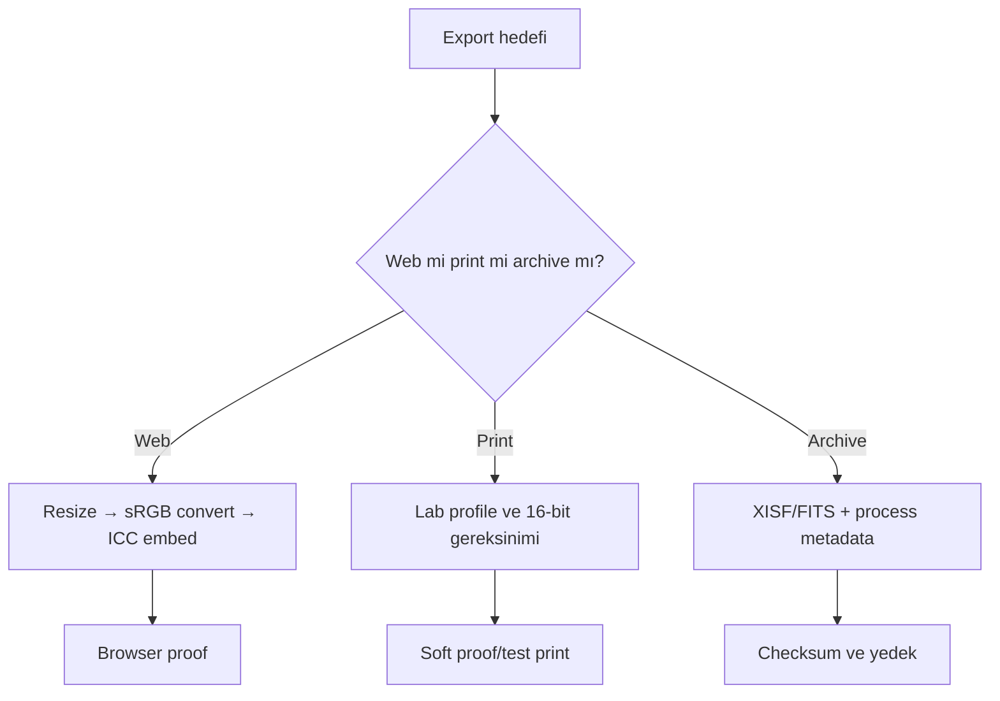

# Export

## Purpose

Export, PixInsight çalışma verisini hedef ortama uygun bit depth, file format, color space ve metadata ile teslim eder. Master arşivi, web görüntüsü ve print dosyası aynı gereksinimlere sahip değildir; tek export her kullanım için doğru değildir.

## Scientific background

Bit depth, kanal başına temsil edilebilen kod değerlerini etkiler; color space ise bu değerlerin hangi renkleri temsil ettiğini tanımlar. ICC profile, dosyadaki sayıları renk yönetimli uygulamanın yorumlayacağı uzaya bağlar. Profile assign etmek ile bir profile convert etmek aynı işlem değildir.

!!! info "Evidence Level — Official Documentation"
    PixInsight staff tarafından yayımlanan web workflow'u, görüntüyü sRGB'ye dönüştürmeyi ve export sırasında ICC profile'ı gömmeyi önerir. Bu, farklı görüntüleyiciler arasındaki bütün farkları garantiyle ortadan kaldırmaz.

## Format karşılaştırması

| Format | Sık kullanım | Avantaj | Sınırlama |
|---|---|---|---|
| XISF/FITS | Çalışma master'ı ve yeniden işleme | Yüksek hassasiyet/astro metadata | Web veya genel görüntüleyici uyumu sınırlı |
| TIFF | Print, edit interchange, yüksek kaliteli teslim | 16-bit ve ICC desteği yaygın | Büyük dosya, uygulama uyumluluğu test edilmeli |
| PNG | Web ve lossless ekran teslimi | Lossless, 8/16-bit seçenekleri | Fotoğraf için dosya boyutu yüksek olabilir |
| JPEG | Web/social media | Küçük ve yaygın | Lossy compression; yeniden kaydetme artefakt üretir |

## 8-bit vs 16-bit

| Özellik | 8-bit | 16-bit |
|---|---|---|
| Kod değeri | Kanal başına 256 seviye | Kanal başına 65.536 seviye |
| Kullanım | Final web/JPEG teslimi | TIFF/PNG interchange ve print hazırlığı |
| Risk | Agresif sonraki düzenlemede banding | Daha büyük dosya/uyumluluk gereksinimi |
| Karar | Son boyut ve tonlar hazırsa | Sonraki düzenleme veya hassas gradient varsa |

Bit depth gerçek sinyal kalitesini artırmaz. 8-bit'e dönüşümden önce resample ve final tonal işlemleri tamamlamak quantization riskini azaltır.

## Color spaces ve ICC

| Uzay | Kullanım | Güçlü yön | Risk |
|---|---|---|---|
| sRGB | Web, browser, social media | En geniş pratik uyumluluk | Gamut daha sınırlı |
| Adobe RGB | Renk yönetimli print/edit workflow | Bazı cyan/green bölgelerde daha geniş gamut | Profil yok sayılırsa renkler sönük/yanlış görünür |

Web için sRGB genellikle güvenli teslim uzayıdır. Print için matbaa/lab ICC gereksinimi esas alınmalıdır; rastgele Adobe RGB seçmek otomatik olarak daha iyi print üretmez.

## Web, print ve archive strategy

### Web/social media

1. Çalışma master'ından kopya üretin.
2. Hedef piksel boyutuna resample edin.
3. Output sharpening'i küçültülmüş görüntüde değerlendirin.
4. sRGB'ye **convert** edin ve profili embed edin.
5. PNG veya yüksek kaliteli JPEG üretin.
6. Browser ve en az bir ikinci color-managed viewer ile proof yapın.

### Print

1. Lab'ın color space, ICC ve bit-depth gereksinimini alın.
2. Native çözünürlüğü ve hedef print boyutunu eşleştirin.
3. Soft proof mümkünse output profile ile yapın.
4. 16-bit TIFF gibi kabul edilen lossless formatı kullanın.
5. Test print ile black point ve shadow detail kontrolü yapın.

### Archive

XISF/FITS çalışma master'ını, process icon/history kayıtlarını ve final 16-bit/32-bit interchange kopyasını saklayın. Web JPEG'ini tek arşiv master'ı yapmayın.

## Metadata considerations

Astrometric çözüm, acquisition notları, copyright ve ICC bilgisi farklı formatlarda farklı ölçüde korunabilir. Privacy gerektiren konum/kimlik metadata'sını paylaşım öncesi denetleyin. Export sonrası dosyayı yeniden açıp profile ve metadata varlığını doğrulayın.

## PNG vs TIFF ve Web vs Print

| İhtiyaç | PNG | TIFF |
|---|---|---|
| Lossless web | Uygun | Genellikle tarayıcı sunumu için gereksiz |
| Print/edit interchange | Uygulama desteğine bağlı | Genellikle daha yerleşik |
| ICC/bit-depth | Uygulama zinciriyle test edilmeli | Yaygın fakat reader uyumluluğu doğrulanmalı |
| Dosya boyutu | Fotoğrafta büyük olabilir | Compression'a bağlı büyük olabilir |

## Visual Result Expectation

| Durum | Görsel işaret |
|---|---|
| Beklenen sonuç | PixInsight ve hedef ortamda benzer ton/renk, korunmuş shadow detail |
| Under-processing | Web boyutunda soft görünüm, yetersiz output sharpening |
| Over-processing | JPEG ringing, oversharpening, clipped highlights |
| Tipik artefakt | Color shift, banding, block artefact, metadata/profile kaybı |

## Practical Decision Guide

| Situation | Recommended Output | Why |
|---|---|---|
| Web/social media | sRGB + PNG veya yüksek kaliteli JPEG | Tarayıcı/platform uyumluluğu |
| Print master | Lab profiline göre 16-bit TIFF | Ton ve renk yönetimi headroom'u |
| Uzun süreli archive | XISF/FITS + yüksek bit-depth kopya | Yeniden işleme ve metadata |
| Sonraki harici edit | 16-bit TIFF + embedded ICC | Quantization ve profil sürekliliği |

## Troubleshooting

| Belirti | Olası neden | Düzeltme |
|---|---|---|
| Export siyah | Yalnız STF kullanılmış | Kalıcı stretch uygulayın |
| Renk farklı | Yanlış/eksik ICC veya viewer | Convert/embed ve color-managed proof |
| Social media shift | Platform recompression/profile handling | sRGB, hedef boyut ve test upload |
| Banding | 8-bit erken dönüşüm | 16-bit workflow'u sona kadar koruyun |
| JPEG block/ringing | Quality düşük/çoklu kayıt | Tek final encode, daha yüksek kalite |
| Print shadow kaybı | Ekran çok parlak veya black point | Kalibre display ve test print |

## Performance ve best practices

Master üzerinde export işlemi yapmayın; türetilmiş kopya kullanın. Resample, profile conversion ve bit-depth dönüşüm sırasını kayıt altına alın. Export edilen dosyayı PixInsight dışında yeniden açarak gerçek teslimi doğrulayın.

## Referanslar

- [PixInsight Forum — Saving for web, staff workflow](https://pixinsight.com/forum/index.php?threads/saving-for-web.6641/)
- [PixInsight Forum — TIFF and ICC troubleshooting](https://pixinsight.com/forum/index.php?threads/best-format-for-publication-export.15394/)
