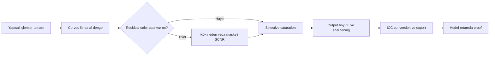

# Son İşlemler

## Amaç

Final processing, önceki aşamalarda kurulmuş sinyali bozmadan tonal hiyerarşi, renk yoğunluğu ve teslim formatını tamamlar. Bu bölüm “son rötuş” adı altında kök sorunları gizlemek yerine, her değişikliği ölçülebilir bir amaca bağlar.

## Bölüm akışı

1. [CurvesTransformation](curves-transformation.md): global ve maskeli contrast/color refinement.
2. [SCNR](scnr.md): doğrulanmış residual chromatic bileşenin azaltılması.
3. [Saturation](saturation.md): global ve seçici renk yoğunluğu.
4. [Export](export.md): web, print ve archive teslim stratejisi.
5. [Hata Kütüphanesi](../14-hata-kutuphanesi/index.md): final görüntüde görülen sorunun kök aşamasına dönme.

## son işlemler kontrol matrisi

| Kontrol | Sorulacak soru | Geri dönülecek bölüm |
|---|---|---|
| Ton | Black/white clipping var mı? | [Stretch](../07-stretch/index.md) veya Curves |
| Renk | Cast calibration mı final refinement mı? | [Color Calibration](../05-color-calibration/index.md) |
| Yapı | Crunchy, soft veya halo var mı? | [Detail Enhancement](../12-detay-ve-kontrast/index.md) |
| Yıldız | Renk/profil/recombination doğru mu? | [AI Plugins](../06-ai-eklentileri/index.md) ve [PixelMath](../10-pixelmath/index.md) |
| Arka plan | Gradient/noise residual var mı? | [Gradient](../04-gradient/index.md) ve [Calibration](../03-kalibrasyon/index.md) |
| Teslim | ICC, bit depth ve format doğru mu? | Export |

## Pratik Karar Rehberi

| Durum | Önerilen İşlem | Gerekçe |
|---|---|---|
| Flat contrast | CurvesTransformation | Final midtone ilişkisini düzenler |
| Hafif doğrulanmış green cast | Maskeli SCNR | Residual bileşeni sınırlar |
| Zayıf color separation | Maskeli Saturation curve | Hedef/yıldız/background ayrımı sağlar |
| Web teslimi | sRGB PNG/JPEG | Yaygın uyumluluk sağlar |
| Sorunun kökü belirsiz | Hata Kütüphanesi | Belirtiyi workflow aşamasına bağlar |

## En İyi Uygulamalar

- Final işlemleri ayrı process icon'larıyla küçük adımlara bölün.
- Her adım öncesi clone veya history checkpoint oluşturun.
- 1:1, fit-to-window ve export boyutunda ayrı inceleme yapın.
- Histogram, channel readout ve görsel değerlendirmeyi birlikte kullanın.
- Web/print çıktısını hedef uygulamada yeniden açmadan tamamlanmış saymayın.

## Beklenen Görsel Sonuç

İyi final görüntüde background headroom'u, yıldız renk çeşitliliği ve hedef içindeki düşük/orta/yüksek frekans yapıları birlikte korunur. Under-processing yalnız “sönük” görünüm değildir; tonal hiyerarşinin okunmamasıdır. Over-processing ise clipping, halo, crunchy texture veya tekdüze/neon renklerle kendini gösterir.

## Teknik doğrulama durumu

Bu sayfa workflow özetidir. UI ve format ayrıntılarının doğrulama durumu ilgili process sayfalarında belirtilmiştir.

## Önceki Bölüm

[← DarkStructureEnhance](../12-detay-ve-kontrast/dark-structure-enhance.md)

## Sonraki Bölüm

[CurvesTransformation →](curves-transformation.md)
