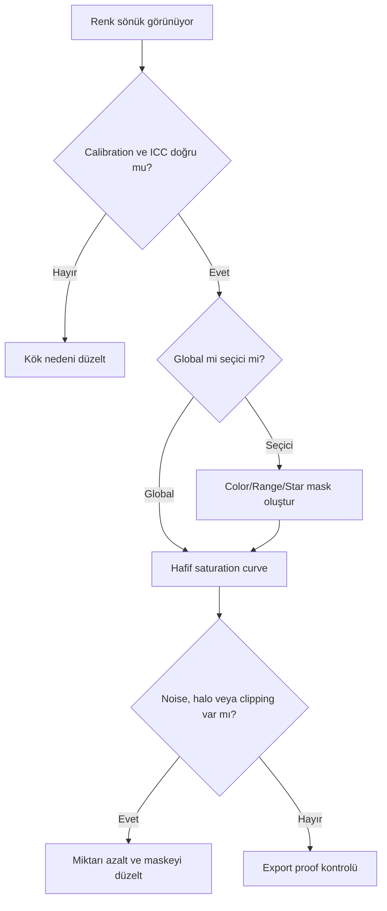

# Doygunluk

!!! info "Sayfa Bilgisi"
    **Kategori:** Son İşlemler · **Düzey:** Intermediate · **Tahmini okuma:** 3 dk
    **Anahtar kelimeler:** `Doygunluk` · `Saturation` · `color saturation` · `final processing` · `son işlemler` · `export`
    **Önerilen ön bilgiler:** [Stretch](../07-stretch/index.md) · [Maskeler](../11-maskeler/index.md)

## Amaç

Saturation işlemi renklerin nötr eksenden uzaklığını değiştirir. Amaç rengi yalnızca “daha güçlü” yapmak değil; kalibre edilmiş hue ilişkisini, yıldız çeşitliliğini ve düşük SNR alanlarda chroma noise sınırını korumaktır.

## Kuramsal Arka Plan ve bilimsel arka plan

Saturation, brightness veya hue ile aynı değildir. Düşük saturation alanında küçük kanal farkları büyük hue oynaklığı yaratabilir; bu nedenle background noise saturation artışıyla renkli beneklere dönüşür. Kanal clipping'i oluştuğunda renk oranları geri döndürülemez biçimde bozulabilir.

## Doğal ve seçici doygunluk

“Natural saturation” sabit bir hedef değildir; filter response, color calibration, display ve estetik amaca bağlıdır. Güvenli yaklaşım global artış yerine farklı yapıları maskelerle ayrı ağırlıklandırmaktır.

| Maske | Koruduğu/hedeflediği alan | Kullanım |
|---|---|---|
| StarMask | Yıldız çekirdeği ve halo | Oversaturated/magenta star önleme |
| RangeMask | Background veya parlak hedef | Düşük SNR renk gürültüsünü dışlama |
| Luminance Mask | Sinyal gücüne göre ağırlık | Parlak yapıda kontrollü saturation |
| ColorMask | Belirli hue ailesi | Nebula veya galaxy bölgesel renk düzenleme |

## Ne zaman kullanılır?

- SPCC/PCC ve stretch sonrası renk yoğunluğu kontrollü artırılacaksa.
- Galaxy ile yıldız saturation'ı ayrı yönetilecekse.
- SHO/HOO palette içinde hue bölgeleri birbirinden ayrılacaksa.
- Final görüntü display/export koşulunda sönük görünüyorsa ve profil sorunu yoksa.

## Ne zaman kullanılmaz?

- Color calibration veya background cast sorununu gizlemek için.
- Kanal clipping'i olan görüntüde kayıp rengi geri getirmek için.
- Düşük SNR arka plana maskesiz global artış olarak.
- Export color mismatch sorununu çözmek için; önce ICC/color space kontrol edilmelidir.

## İş Akışındaki Yeri

Color calibration sonrasında, çoğunlukla nonlinear aşamada uygulanır. Ana contrast işlemleri saturation algısını değiştirebildiği için final Curves geçişleriyle iteratif çalışılır. Noise reduction sonrasında bile chroma noise yeniden kontrol edilmelidir.

## parametre yaklaşımı

| Kontrol | Amaç | Artırma koşulu | Azaltma koşulu | Risk |
|---|---|---|---|---|
| Saturation curve/amount | Renk yoğunluğu | Kalibre renkler sönükse | Noise/clipping başlıyorsa | Yapay renk ve channel clipping |
| Hue range | Seçici renk ailesi | Hedef ton varyasyonu genişse | Komşu renk contamination varsa | Sert hue sınırı |
| Mask weight | Spatial etki | Hedef yetersiz seçilmişse | Star/background etkileniyorsa | Halo ve renk kopması |

## Galaxy, nebula ve yıldız koruması

- **Galaxy:** Luminance/RangeMask ile dış kol sinyalini ağırlıklandırın; sarı çekirdeği ve blue star-forming bölgeleri ayrı kontrol edin.
- **Emission nebula:** ColorMask ile hedef hue'yu seçin; background chroma noise'u koruyun.
- **Reflection nebula:** Mavi kanal noise ve yıldız halolarına özellikle bakın.
- **SHO/HOO:** Kanal mapping'i saturation ile “düzeltilmez”; önce mapping ve normalization doğrulanır.
- **Yıldız:** StarMask ile çekirdek/halo saturation'ını ana hedeften ayrı yönetin.

## Beklenen Görsel Sonuç

| Durum | Görsel işaret |
|---|---|
| Beklenen iyileşme | Renk ayrımı artar; yıldız çeşitliliği ve nötr background korunur |
| Under-processing | Kalibre hue'lar birbirinden zor ayrılır |
| Over-processing | Neon renk, magenta star, cyan contamination, color clipping |
| Tipik artefakt | Chroma noise, hue sınırı, renkli halo |

## Pratik Karar Rehberi

| Durum | Önerilen İşlem | Gerekçe |
|---|---|---|
| Global hafif renk artışı | Curves Saturation | Kontrollü ve iteratif eşleme |
| Tek hue ailesi | ColorMask + Curves | Komşu renkleri korur |
| Oversaturated stars | StarMask ile azaltma | Stellar renkleri ayrı yönetir |
| Renkli background noise | Önce chroma NR/mask | Saturation sorunu büyütür |

## Yaygın Hatalar ve sorun giderme

| Belirti | Neden | Düzeltme |
|---|---|---|
| Chroma noise | Background maskesiz | Range/Luminance Mask kullanın |
| Magenta stars | Yıldız kanalları clipping'e yakın | StarMask ile miktarı azaltın |
| Cyan nebula | Hue contamination veya SCNR etkisi | Kanal/hue dağılımını geri denetleyin |
| Yellow core | Luminance blend veya channel balance | LRGB ve calibration aşamasına dönün |
| Neon görünüm | Global amount fazla | Birden fazla hafif seçici geçiş |
| Hue banding | Sert ColorMask | Maske geçişini yumuşatın |

## Performans ve En İyi Uygulamalar

Saturation işlemi genellikle hafiftir; büyük maskeler preview maliyetini artırır. Her geçişte histogram kanallarını, yıldızları, background ve hedefi ayrı kontrol edin. Web küçültme sonrası saturation algısı değişebileceği için export boyutunda proof yapın.

## Teknik doğrulama durumu ve ilgili süreçler

Saturation/hue ilişkisi genel renk teorisidir. Curves kanal adları ve UI davranışı PixInsight 1.9.3 ekran kanıtıyla doğrulanmalıdır.

[CurvesTransformation](curves-transformation.md) · [SCNR](scnr.md) · [ColorMask](../11-maskeler/color-mask.md) · [Export](export.md)

## İlgili Süreçler

- [CurvesTransformation](curves-transformation.md)
- [SCNR](scnr.md)
- [Dışa Aktarım](export.md)

## İlgili İş Akışları

- [LRGB Galaksi](../15-workflows/lrgb-galaxy.md)
- [SHO ve HOO Narrowband](../15-workflows/sho-hoo.md)
- [M31 LRGB + Ha](../20-uygulamalar/m31-lrgb-ha/index.md)
- [NGC 6888 SHO](../20-uygulamalar/ngc6888-sho/index.md)

## Önceki Bölüm

[← SCNR](scnr.md)

## Sonraki Bölüm

[Dışa Aktarım →](export.md)
