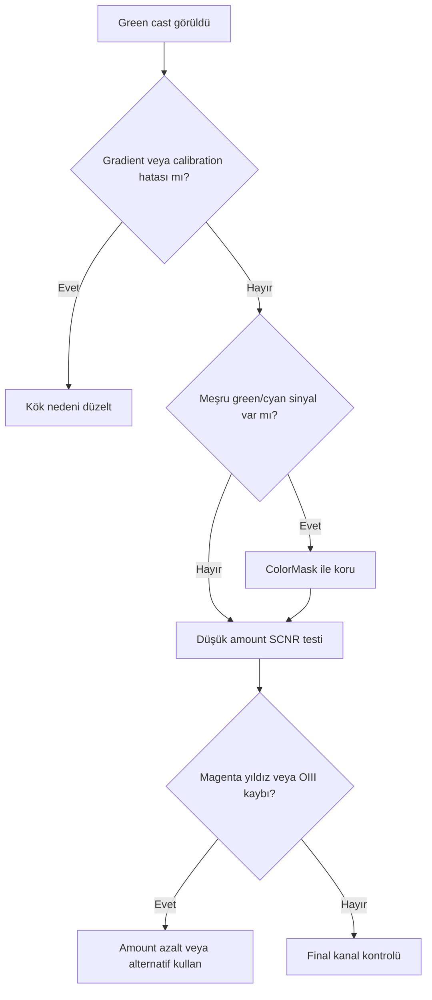

# SCNR

## Amaç

SCNR, seçilen chromatic bileşenin diğer kanallara göre aşırı katkısını azaltmak için kullanılır. Astrofotoğraf workflow'unda en yaygın kullanım residual green cast kontrolüdür; araç renk kalibrasyonunun yerine geçmez.

## Yeşil giderme felsefe

Yeşil baskı; background neutralization eksikliği, gradient, filter response, OSC matrix, channel balance, stretch veya noise nedeniyle oluşabilir. Bununla birlikte gerçek OIII katkısı, yıldız rengi ve bazı broadband yapılar green/cyan bileşen taşıyabilir. SCNR uygulanmadan önce “yeşil neden var?” sorusu cevaplanmalıdır.

!!! warning
    “Astrofotoğrafta yeşil yoktur” mutlak bir kural değildir. SCNR meşru sinyali de değiştirebilir; özellikle OIII/cyan yapı ve yıldız renklerinde maske veya alternatif düzeltme gerekir.

## Ne zaman kullanılır?

- Renk kalibrasyonu ve gradient düzeltmesi sonrası residual green cast ölçülebiliyorsa.
- Background veya hedefin belirli bölgesi maskeyle ayrılabiliyorsa.
- Final color refinement sırasında düşük amount yeterliyse.

## Ne zaman kullanılmaz?

- SPCC/PCC başarısızlığını gizlemek için.
- Gradient farklı bölgelerde farklı renk baskısı üretiyorsa.
- SHO/HOO mapping içinde yeşil bilimsel/estetik olarak korunacaksa.
- Green channel clipping veya yanlış channel mapping varsa.

## Doğrusal ve doğrusal olmayan

| Aşama | Avantaj | Risk | Yaklaşım |
|---|---|---|---|
| Lineer | Renk oranları stretch ile değişmemiştir | STF görüntüsü gerçek veriyi yanıltabilir | Ölçüm ve düşük amount; kalibrasyonu önce doğrula |
| Nonlinear | Görsel cast kolay değerlendirilir | Saturation/clipping etkisi büyümüştür | Maske ve kanal histogramı ile kontrol |

## Parametreler

| Parametre | Amaç | Kullanım kararı | Risk |
|---|---|---|---|
| Color to remove | Azaltılacak chromatic bileşen | Sorun ölçümle doğrulandıktan sonra | Yanlış renk seçimi |
| Amount | Düzeltme karışım gücü | En küçük yeterli değer | Meşru sinyal kaybı, magenta bias |
| Protection method | Nötrleştirme sınırını belirler | Average Neutral ve Maximum Neutral preview ile kıyaslanır | Veri setine bağlı ton/renk değişimi |
| Preserve lightness | Lightness davranışını sınırlar | Renk dışında parlaklık değişimi istenmiyorsa | Tam davranış UI kanıtı gerektirir |

### Average Neutral ve Maximum Neutral

Bu seçenekler azaltılan bileşenin kalan kanallara göre nasıl sınırlandığını değiştirir. Biri her veri setinde “doğru” değildir. Background, hedef ve yıldız örneklerinde ayrı preview üretip kanal readout ve görsel renk sürekliliğini birlikte değerlendirin.

## Alternatif Yaklaşımlar

| Sorun | Alternatif | Neden |
|---|---|---|
| Global green cast | SPCC/PCC ve BackgroundNeutralization'ı yeniden denetle | Kök nedeni düzeltir |
| Lokal green contamination | [ColorMask](../11-maskeler/color-mask.md) + Curves | Yalnız problemli hue/alanı hedefler |
| Kanal ilişkisi biliniyor | [PixelMath](../10-pixelmath/index.md) | Açık ve ölçülebilir ifade kurulabilir |
| Gradient kaynaklı cast | GradientCorrection/DBE | Spatially varying problemi modeller |

## Adım adım korumalı iş akışı

1. Gradient ve color calibration durumunu doğrulayın.
2. Background, hedef ve yıldızlarda channel readout alın.
3. Green/cyan sinyalin meşru olup olmadığını belirleyin.
4. Gerekirse ColorMask/RangeMask ile sorunlu alanı sınırlayın.
5. Average Neutral ve Maximum Neutral sonuçlarını düşük amount ile preview'da kıyaslayın.
6. Magenta stars, OIII kaybı ve neutral background kontrolü yapın.

## SCNR karşılaştırmaları

| Ölçüt | SCNR | ColorMask + Curves | PixelMath |
|---|---|---|---|
| Hız | Doğrudan | Daha seçici | İfade tasarımı gerekir |
| Spatial control | Harici maskeye bağlı | Hue + maske | Tam ifade kontrolü |
| Ana risk | Meşru green kaybı | Hue contamination | Yanlış formül/range |
| Tercih | Basit residual cast | Lokal renk sorunu | Ölçülebilir kanal modeli |

## Beklenen Görsel Sonuç

| Durum | Görsel işaret |
|---|---|
| Beklenen iyileşme | Nötr bölgede residual cast azalır; yıldız ve OIII korunur |
| Under-processing | Background/hale hâlâ yeşil baskılı |
| Over-processing | Magenta yıldızlar, cyan/OIII kaybı, yapay nötrlük |
| Tipik artefakt | Renk dengesizliği ve hue kopması |

## Pratik Karar Rehberi

| Durum | Önerilen İşlem | Gerekçe |
|---|---|---|
| Ölçülmüş hafif green background | Maskeli SCNR | Residual bileşeni kontrollü azaltır |
| Spatial green gradient | DBE/GradientCorrection | Sorun global chromatic excess değildir |
| Meşru OIII yanında contamination | ColorMask + Curves | Hue/spatial seçim sağlar |
| Yanlış color calibration | SPCC/PCC tekrar | Kök nedeni düzeltir |

## Yaygın Hatalar ve sorun giderme

- Renk kalibrasyonundan önce SCNR uygulamak.
- Amount değerini otomatik olarak maksimum kullanmak.
- Green cast yerine green gradient'i hedeflemek.
- OIII/cyan yapıyı korumamak.
- Yıldızları ayrı kontrol etmemek.
- SCNR sonrası magenta bias'ı görmezden gelmek.

## Teknik doğrulama durumu ve referanslar

SCNR'nin green-removal kullanımı yaygın ve gözlemlenebilir bir workflow'dur. Protection method ve preserve-lightness davranışının PixInsight 1.9.3 ayrıntıları UI/primary documentation ile doğrulanmalıdır.

- [PixInsight Resources](https://www.pixinsight.com/resources/)
- [Color calibration](../05-color-calibration/index.md)

## İlgili Süreçler

- [CurvesTransformation](curves-transformation.md)
- [Doygunluk](saturation.md)
- [Dışa Aktarım](export.md)

## İlgili İş Akışları

- [LRGB Galaksi](../15-workflows/lrgb-galaxy.md)
- [SHO ve HOO Narrowband](../15-workflows/sho-hoo.md)
- [M31 LRGB + Ha](../20-uygulamalar/m31-lrgb-ha/index.md)
- [NGC 6888 SHO](../20-uygulamalar/ngc6888-sho/index.md)

## Önceki Bölüm

[← CurvesTransformation](curves-transformation.md)

## Sonraki Bölüm

[Doygunluk →](saturation.md)
