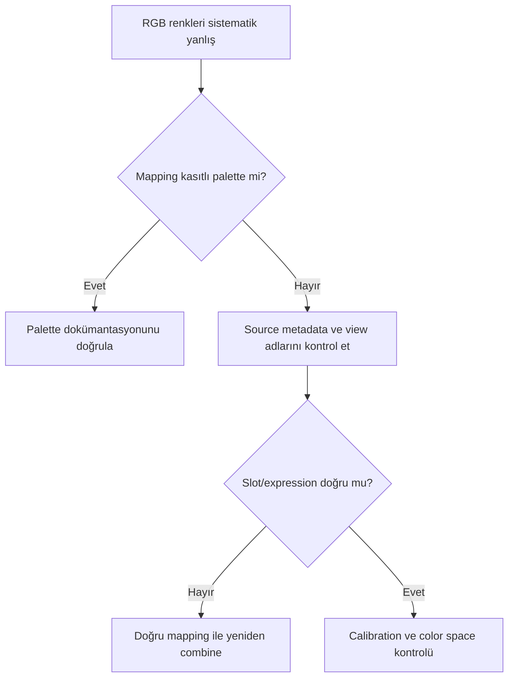

# ChannelCombination RGB Hatası

## Error severity summary

| Alan | Değer |
|---|---|
| Severity | 🔴 Critical |
| Detectability | Easy |
| Recoverability | Requires Partial Reprocessing |
| Typical Detection Stage | After PixelMath / ChannelCombination |

## Symptoms

- Görüntü beklenen RGB renklerinden tamamen farklıdır.
- Kırmızı nebula cyan/blue, mavi bölgeler sarı/kırmızı görünebilir.
- BackgroundNeutralization veya SCNR sonrasında da temel renk ilişkisi düzelmez.
- Kanal histogramları beklenen hedef sinyaliyle uyuşmaz.

## Visual appearance

Yanlış channel mapping global, yapısal bir renk dönüşümü üretir. Lokal cast'ten farklı olarak belirli nesne sınıfları sistematik biçimde yanlış hue'ya taşınır. Narrowband mapping kasıtlıysa bu bir hata değildir; sorun, hedeflenen mapping ile uygulanan mapping'in uyuşmamasıdır.

## Likely causes

- R, G ve B source view'ların yanlış slotlara atanması.
- PixelMath symbols veya channel expression'larının karıştırılması.
- Dosya/view adlarının acquisition filter'ını yanlış temsil etmesi.
- SHO/HOO mapping'in RGB beklenerek yorumlanması.
- Mono kanalların registration/geometri uyumsuzluğu.

## Verification steps

1. Her mono kanalı ayrı açın ve hedef yapıları blink ile karşılaştırın.
2. FITS/XISF metadata ve acquisition kayıtlarından filter kimliğini doğrulayın.
3. ChannelCombination slotları veya PixelMath RGB expressions'ı okuyun.
4. Process icon instance'ını uygulanan history adımıyla eşleştirin.
5. Küçük bir preview'da açık test mapping'i üretin.

## Corrective workflow

1. Hatalı combined görüntüyü final Curves ile düzeltmeye çalışmayın.
2. Güvenilir mono masters veya channel-separated checkpoint'e dönün.
3. Registration ve geometry eşleşmesini doğrulayın.
4. Kaynakları açıkça `R`, `G`, `B` veya `SII`, `Ha`, `OIII` olarak yeniden adlandırın.
5. Doğru mapping'i [ChannelCombination](../08-lrgb/channel-combination.md) veya PixelMath ile yeniden üretin.
6. Ardından color calibration/normalization aşamasını tekrarlayın.

## Prevention

- Acquisition metadata'yı koruyun.
- Process icon adında mapping'i yazın: `RGB_R-G-B`, `SHO_S-H-O` gibi.
- Source view adlarını kısa ama benzersiz tutun.
- Combine öncesi her kanalı görsel ve metadata ile doğrulayın.

## Common traps

- Yanlış mapping'i SCNR ile “normalleştirmek”.
- SHO palette'i doğal RGB hatası sanmak.
- Kanal boyutları farklıyken yalnız renk sorununa odaklanmak.
- PixelMath output range/clipping ayarını gözden kaçırmak.
- Hatalı combined görüntü üzerinde uzun final workflow sürdürmek.

## Evidence Level

**Verified Workflow:** Source-slot/expression eşleştirmesi doğrudan process instance ve output üzerinden doğrulanabilir. Belirli palette'in estetik yorumu veri setine bağlıdır.

## Related processes

[PixelMath](../10-pixelmath/index.md) · [LRGB](../08-lrgb/index.md) · [Color Calibration](../05-color-calibration/index.md) · [Hata Kütüphanesi](index.md)
