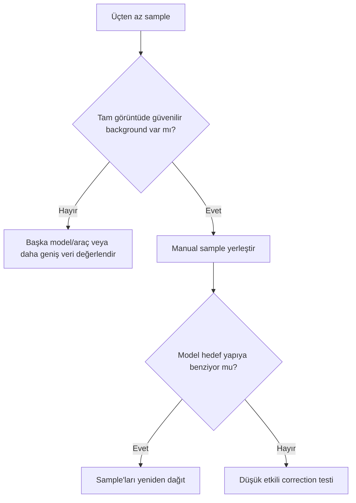

# DBE: Less Than Three Samples

## Error severity summary

| Alan | Değer |
|---|---|
| Severity | 🟡 Moderate |
| Detectability | Easy |
| Recoverability | Fully Recoverable |
| Typical Detection Stage | Gradient Correction |

## Symptoms

- DBE uygulaması `Less than three samples were generated` mesajıyla durur.
- Otomatik sample generation hedef üzerinde yeterli geçerli sample üretmez.
- Background model oluşturulamaz.

## Visual appearance

Hata çoğunlukla görüntüyü değiştirmeden process'i durdurur. Ancak hata mesajını aşmak için yanlış yerlere sample eklemek, daha sonra nebula benzeri model veya residual gradient üretebilir.

## Likely causes

- Sample generation koşulları için uygun background alanı çok azdır.
- Tolerance veya sample radius, görüntü istatistiğiyle uyuşmuyordur.
- Preview/ROI ya da küçük crop yeterli spatial coverage sağlamıyordur.
- Yoğun nebula/galaxy alanı güvenilir background noktalarını sınırlar.
- Mevcut sample'lar silinmiş veya geçersiz konumdadır.

## Verification steps

1. Hedefin tam görüntü mü preview mı olduğunu kontrol edin.
2. DBE sample overlay'inde gerçekten kaç geçerli sample bulunduğunu sayın.
3. Sample'ların yıldız, nebula, galaxy halo ve dark structure üzerinde olmadığını kontrol edin.
4. Tolerance/radius değişikliklerini tek tek preview edin.
5. Güvenilir background alanı yoksa DBE'nin uygun araç olup olmadığını yeniden değerlendirin.

## Corrective workflow

1. Hata veren instance'ı sıfırlamak yerine sample koşullarını kaydedin.
2. Tam görüntü üzerinde birkaç güvenilir manual sample ile başlayın.
3. Spatial coverage'ı görüntüye yayın; sample sayısını yalnız eşiği geçmek için artırmayın.
4. Model görüntüsünü inceleyin. Astronomik hedefe benziyorsa sample seçimi yanlıştır.
5. [Division vs Subtraction](../04-gradient/division-vs-subtraction.md) kararını gradient tipine göre verin.
6. Corrected image ve model/residual'ı birlikte değerlendirin.

## Prevention

- DBE öncesinde gradient diagnostic yapın.
- Sample'ları hedef dışı güvenilir background'a koyun.
- Küçük crop yerine yeterli alanı modelleyin.
- Tolerance ve radius için sabit reçete kullanmayın.
- Model görüntüsünü her zaman saklayıp inceleyin.

## Evidence Level

**Verified Workflow:** Minimum sample hatası console mesajıyla doğrudan gözlenir. Tolerance/radius seçimi **Practical Recommendation** olarak veri setine bağlıdır.

## Related processes

[DBE](../04-gradient/dbe.md) · [Sample Placement](../04-gradient/sample-placement.md) · [Gradient Diagnostics](../04-gradient/gradient-diagnostics.md) · [Hata Kütüphanesi](index.md)
