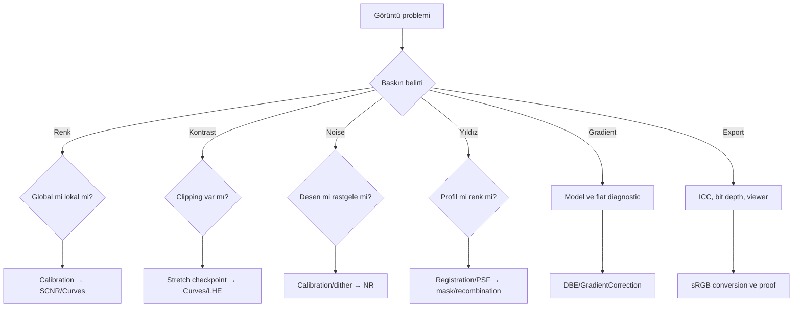

# Hata Kütüphanesi

## Amaç

Bu kütüphane, görünen artefaktı rastgele process uygulayarak bastırmak yerine kök aşamaya bağlar. Teşhis sırası: belirtiyi sınıflandır, veride ölç, hatanın ilk göründüğü history adımını bul, en erken güvenilir checkpoint'e dön ve yalnız ilgili aşamayı yeniden işle.

## Önem düzeyi standardı

| Önem Düzeyi | Tanım | Örnek |
|---|---|---|
| 🔴 Critical | Ciddi/geri döndürülemez veri kaybı veya geçersiz sonuç | Black/white clipping, yanlış channel mapping |
| 🟠 Major | Kaliteyi önemli ölçüde düşürür; çoğu kez kısmi yeniden işleme gerekir | Güçlü gradient, luminance/recombination hatası, walking noise |
| 🟡 Moderate | Lokal veya ek kontrollü işlemle düzeltilebilir | Flat contrast, hafif cast, aşırı sharpening |
| 🔵 Minor | Sınırlı kozmetik/teslim etkisi | Küçük export artefaktı, hafif renk farkı |

Severity, görüntünün estetik etkisinden çok veri bütünlüğü ve gereken geri dönüş derinliğini anlatır.

## Ana diagnostic tree

## Renk sorunları

| Belirti | Önem Düzeyi | Muhtemel kök | Doğrulama | Düzeltme İş Akışı |
|---|---|---|---|---|
| Green cast | 🟡/🟠 | Calibration, gradient, residual green | Kanal readout ve spatial dağılım | SPCC/PCC/gradient kontrolü; gerekirse [SCNR](../13-final/scnr.md) |
| Magenta stars | 🟡 | SCNR, saturation, clipped green | Star core kanal değerleri | StarMask ile koru; SCNR/saturation adımına dön |
| Yellow galaxy core | 🟠 | Luminance blend veya channel balance | RGB/L master blink | [LRGB](../08-lrgb/index.md) birleşimini yeniden kur |
| Blue background | 🟠 | Background calibration veya gradient | Background preview ölçümleri | SPCC/BN ve gradient modelini kontrol et |
| Cyan nebula | 🟡 | OIII dengesi, SCNR veya mapping | Kanal/hue dağılımı | [OIII kaybı](oiii-kaybolmasi.md) ve ColorMask kontrolü |
| Residual color cast | 🟡/🟠 | Kalibrasyon sonrası spatial/nonspatial hata | Birden çok background ROI | Kök nedene göre calibration, gradient veya maskeli Curves |
| Color contamination | 🟡 | Sert ColorMask, halo veya channel leakage | Maskeyi tek başına incele | Maskeyi yumuşat, kanal işlemini azalt |

## Ton ve detay sorunları

| Belirti | Önem Düzeyi | Doğrulama | Düzeltme İş Akışı |
|---|---|---|---|
| Flat-looking image | 🟡 | Histogram ve local contrast kıyası | [Curves](../13-final/curves-transformation.md) veya [LHE](../12-detay-ve-kontrast/local-histogram-equalization.md) |
| Overprocessed image | 🟠 | Önceki checkpoint ile blink | En erken artefakt adımına dön; miktarı azalt |
| Crunchy detail | 🟡 | 1:1'de granular texture | LHE/MMT/sharpening gücünü azalt |
| Black clipping | 🔴 | Histogram sıfır yığılması, pixel readout | Stretch checkpoint'e dön |
| White clipping | 🔴 | Kanal maksimum yığılması | Stretch/saturation öncesine dön |
| Over-sharpening | 🟡 | Bright/dark edge halo | BXT/MMT/LHE miktarını azalt |
| Soft image | 🟡 | PSF/FWHM ve 1:1 kıyas | Data quality, BXT veya scale-specific enhancement kontrolü |

## Noise, gradient ve yıldız sorunları

| Belirti | Önem Düzeyi | Muhtemel kök | Düzeltme İş Akışı |
|---|---|---|---|
| Banding | 🟠 | Sensor/readout veya calibration residual | Calibration master, rejection ve background modelini denetle |
| Walking noise | 🟠 | Yetersiz dither/integration | Acquisition ve integration'a dön; final NR ile gizleme |
| Noise amplification | 🟡 | Stretch, LHE, saturation | Maskeli NR ve enhancement azaltma |
| Residual gradients | 🟠 | Yetersiz/yanlış model veya flat residual | [Gradient diagnostics](../04-gradient/gradient-diagnostics.md) |
| Halo artifacts | 🟠 | Deconvolution, mask veya local contrast | İşlemi azalt; maske/PSF/scale düzelt |
| Star halos | 🟡/🟠 | Optik, channel PSF, mask veya stretch | Kanal profili, StarMask ve BXT/recombination kontrolü |
| Dark halos | 🟠 | Aşırı sharpening/HDR/DSE | İlgili structural process checkpoint'e dön |

## İş Akışı ve matematik sorunları

| Belirti | Önem Düzeyi | Tanı sayfası/iş akışı |
|---|---|---|
| Incorrect luminance blend | 🟠 | [LRGB workflow](../08-lrgb/index.md), registration ve normalization |
| Starless recombination artifact | 🟠 | Star/starless toplamını, range ve residual'ı kontrol et |
| PixelMath mistakes | 🔴 | Expression, symbols, output range ve channel mapping'i kontrol et |
| Mask failures | 🟡/🟠 | [Maske tüm görüntüyü kaplıyor](maske-tum-goruntuyu-kapliyor.md) |
| Channel mapping error | 🔴 | [ChannelCombination RGB Hatası](channel-combination-rgb-error.md) |
| Missing source view | 🟡 | [LRGB Source Image Not Found](lrgb-source-image-not-found.md) |
| DBE sample hata | 🟡 | [Less Than Three Samples](dbe-less-than-three-samples.md) |

## Dışa Aktarım sorunları

| Belirti | Önem Düzeyi | Doğrulama | Düzeltme İş Akışı |
|---|---|---|---|
| Export color mismatch | 🟡 | ICC tag, conversion ve ikinci viewer | [Export](../13-final/export.md) sRGB/ICC workflow'u |
| Social media color shift | 🔵/🟡 | Browser ve test upload kıyası | sRGB, hedef boyut, embedded profile |
| Export banding | 🟡 | 8-bit ve 16-bit dosyayı kıyasla | Dönüşümü sona bırak, 16-bit master koru |
| Export siyah | 🟠 | STF kapatıldığında görüntü | Kalıcı HistogramTransformation stretch uygula |

## Sistematik Düzeltme İş Akışı

1. Sorunun ilk göründüğü history adımını bulun.
2. Aynı STF/zoom/color-managed viewer ile karşılaştırın.
3. Histogram, channel readout, mask ve residual/model görüntüsünü inceleyin.
4. Final process ile gizlemek yerine kök adıma dönün.
5. Representative preview'da tek değişkenli test yapın.
6. Düzeltmeyi tam görüntü ve export proof üzerinde doğrulayın.

## Pratik Karar Rehberi

| Durum | İlk kontrol | Neden |
|---|---|---|
| Renk hatası | Calibration → gradient → final color | En erken doğru aşamayı bulur |
| Contrast hatası | Clipping → global → local | Kayıp veri ile düşük kontrastı ayırır |
| Noise hatası | Pattern → scale → process | Acquisition/calibration kökünü ayırır |
| Star hatası | Registration/PSF → mask → recombination | Profil, renk ve katman hatalarını ayırır |
| Export hatası | Permanent stretch → ICC → bit depth | Veri ile viewer problemini ayırır |

## Kanıt Düzeyi

Bu katalogdaki teşhis akışı **Verified Workflow** ve muhafazakâr **Practical Recommendation** niteliğindedir. Tek bir belirti tek bir kök nedeni kanıtlamaz; verification adımları atlanmamalıdır.
