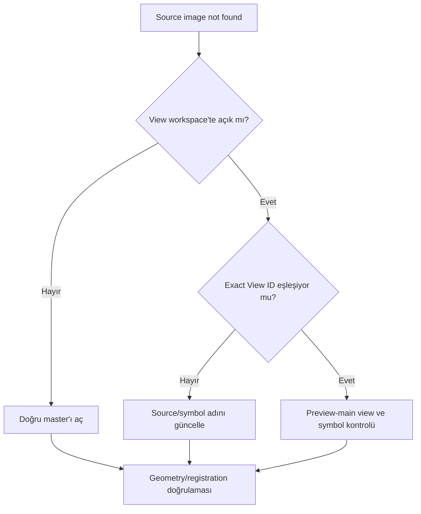

# LRGB Source Image Not Found

## Hata Önem Düzeyi Özeti

| Alan | Değer |
|---|---|
| Önem Düzeyi | 🟡 Moderate |
| Detectability | Easy |
| Recoverability | Fully Recoverable |
| Typical Detection Aşama | LRGB Combination / After PixelMath |

## Belirtiler

- LRGBCombination veya PixelMath, belirtilen source view'ı bulamadığını bildirir.
- Process icon başka session'da çalışırken mevcut workspace'te başarısız olur.
- Expression içindeki symbol kırmızı/invalid görünür veya console missing identifier bildirir.

## Görsel Görünüm

Process çoğunlukla çıktı üretmeden durur. Benzer adlı yanlış source seçilirse hata mesajı yerine yanlış luminance blend, renk kayması veya geometry artefaktı oluşabilir; bu daha zor tespit edilir.

## Olası Nedenler

- View ID değiştirilmiş, pencere kapatılmış veya image identifier farklıdır.
- Process icon eski session'ın source adını taşır.
- Source image preview ID'si ile main view ID'si karıştırılmıştır.
- PixelMath symbol tanımlanmamıştır.
- Kaynak başka container/workspace'te açık değildir.

## Doğrulama Adımları

1. Workspace'teki exact view ID'leri okuyun; dosya adıyla karıştırmayın.
2. L, R, G, B kaynaklarının açık ve doğru main view olduğunu kontrol edin.
3. PixelMath Symbols ve Expressions alanlarını birlikte inceleyin.
4. Boyut, channel count ve registration eşleşmesini doğrulayın.
5. Process icon'ın hangi session/view adlarına bağlı olduğunu kaydedin.

## Düzeltme İş Akışı

1. Hedeflenen master'ları yeniden açın.
2. View ID'leri açık, kısa ve benzersiz hale getirin.
3. Process source selector veya PixelMath symbol'larını güncelleyin.
4. Registration ve geometry eşleşmesini doğrulayın.
5. Küçük preview yerine clone üzerinde test combine üretin.
6. Renk, luminance ağırlığı ve star profile sonucunu kontrol edin.

## Önleme

- Process icon'ları source-specific olduklarında isimlerine bağımlılığı yazın.
- Workspace temizlemeden önce source view/process icon ilişkisini kaydedin.
- Dosya adı, window ID ve preview ID kavramlarını ayırın.
- Yeniden kullanılabilir PixelMath ifadelerinde explicit Symbols kullanın.

## Yaygın Tuzaklar

- Benzer adlı ama farklı processing stage'deki master'ı seçmek.
- Source bulundu diye geometry eşleşmesini varsaymak.
- Preview ID'yi main view yerine kullanmak.
- Starless ve stars katmanlarını ters bağlamak.
- Hata sonrası expression'ı rastgele yeniden adlandırmak.

## Kanıt Düzeyi

**UI-Observed / Verified Workflow:** View ID bağımlılığı workspace ve process instance üzerinden doğrulanabilir. Exact console metni process ve sürüme göre UI kanıtı gerektirir.

## İlgili Süreçler

[LRGB](../08-lrgb/index.md) · [PixelMath](../10-pixelmath/index.md) · [Process Icons](../02-pixinsight-temelleri/process-icons.md) · [Hata Kütüphanesi](index.md)
