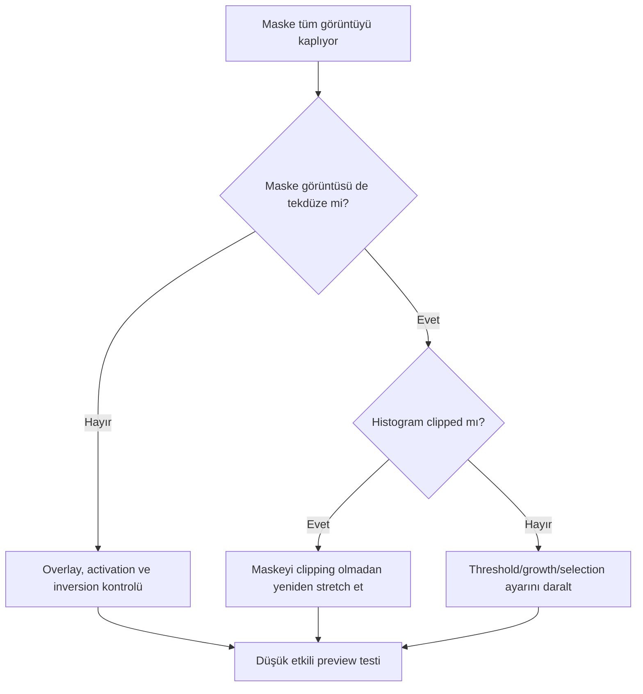

# Maske Tüm Görüntüyü Kaplıyor

## Hata Önem Düzeyi Özeti

| Alan | Değer |
|---|---|
| Önem Düzeyi | 🟡 Moderate |
| Detectability | Easy |
| Recoverability | Fully Recoverable |
| Typical Detection Aşama | During Final Processing |

## Belirtiler

- Maske overlay'i görüntünün neredeyse tamamında aynı yoğunluktadır.
- Process beklenenden çok az etki eder veya tüm görüntüye uygulanır.
- Inversion sonrası sonuç tamamen ters davranır fakat seçicilik oluşmaz.
- Maskenin histogramı siyah ya da beyaz uca yığılmıştır.

## Görsel Görünüm

Overlay tekdüze kırmızı veya neredeyse görünmez olabilir. Bu durum her zaman hata değildir: maskenin görünürlüğü kapalı olabilir. Asıl doğrulama, maske görüntüsünün grayscale dağılımı ve process'in hedef üzerindeki farkıdır.

## Olası Nedenler

- RangeMask threshold'ları tüm histogramı kapsıyordur.
- Maskeye aşırı stretch/clipping uygulanmıştır.
- Yanlış image maske olarak bağlanmıştır.
- Inversion/polarity yanlış yorumlanmıştır.
- Maske ve hedef geometry'si veya processing stage'i uyuşmuyordur.
- StarMask growth/smoothness seçimleri yapıları birleştirmiştir.

## Doğrulama Adımları

1. Maskeyi hedef bağlantısından bağımsız ayrı görüntü olarak açın.
2. Histogramda minimum, maksimum ve ara ton dağılımını inceleyin.
3. Overlay görünürlüğü ile mask activation durumunu ayırın.
4. Inversion'ı değiştirip işlenen/korunan alanı küçük preview'da test edin.
5. Maskenin target ile aynı boyut ve geometride olduğunu doğrulayın.

## Düzeltme İş Akışı

1. Hedefteki process'i geri alın; maskeyi devre dışı bırakın.
2. Maske source'u tek başına inceleyin.
3. Range/Star/Color seçim parametrelerini hedef yapıya göre yeniden kurun.
4. Grayscale ara tonları koruyun; binary clipping'den kaçının.
5. Gerekirse [PixelMath](../10-pixelmath/index.md) ile iki maskeyi kesiştirin veya çıkarın.
6. Overlay ve preview üzerinden polarity'yi doğrulayın.

## Önleme

- Maskeyi bağlamadan önce ayrı pencerede 1:1 inceleyin.
- Histogram uçlarını kesmeyin.
- Process icon ile birlikte maske üretim stage'ini kaydedin.
- Her target/process için inversion durumunu tekrar kontrol edin.
- Maske görünürlüğü ile aktifliği aynı kavram sanmayın.

## Yaygın Tuzaklar

- Kırmızı overlay'i gerçek maske rengi sanmak.
- Maskeyi gizleyince devre dışı kaldığını varsaymak.
- Binary maskeyi her işlem için ideal görmek.
- Gürültüyü grayscale ağırlığa taşımak.
- Target değiştiğinde eski maskeyi yeniden kullanmak.

## Kanıt Düzeyi

**Verified Workflow:** Maske histogramı, overlay ve preview etkisi doğrudan doğrulanabilir. UI control konumları PixInsight 1.9.3 ekran kanıtı gerektirir.

## İlgili Süreçler

[Maske Mantığı](../11-maskeler/maske-mantigi.md) · [RangeMask](../11-maskeler/range-mask.md) · [StarMask](../11-maskeler/star-mask.md) · [Hata Kütüphanesi](index.md)
