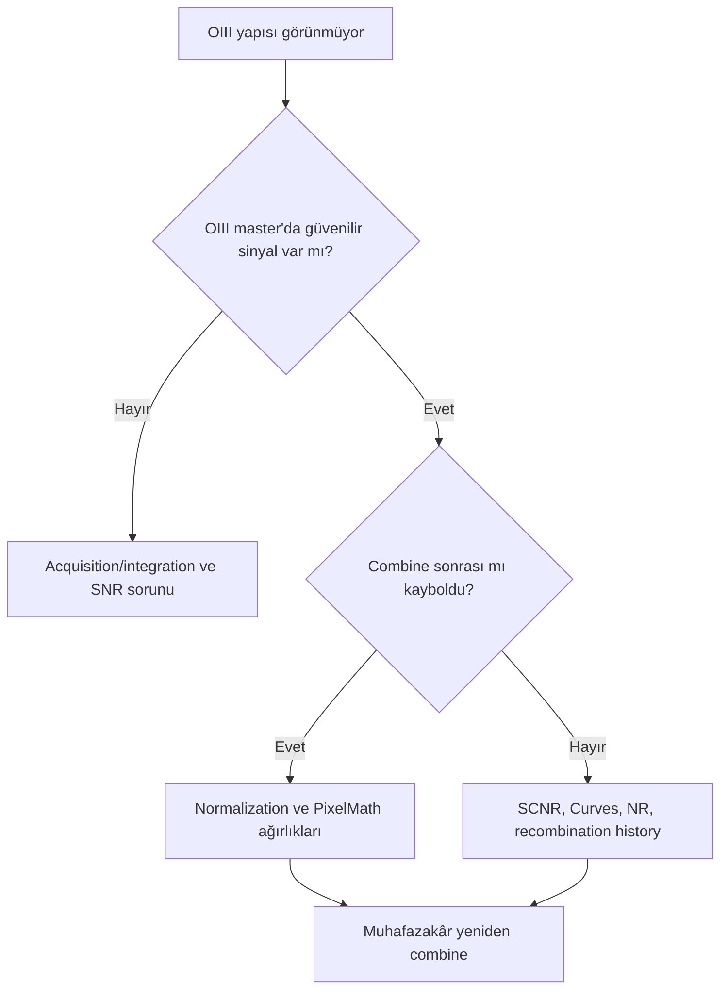

# OIII Kaybolması

!!! info "Sayfa Bilgisi"
    **Kategori:** Sorun Giderme · **Düzey:** Intermediate · **Tahmini okuma:** 3 dk
    **Anahtar kelimeler:** `OIII Kaybolması` · `no OIII signal` · `OIII sinyali yok` · `narrowband channel loss` · `troubleshooting` · `sorun giderme` · `PixInsight error`

## Hata Önem Düzeyi Özeti

| Alan | Değer |
|---|---|
| Önem Düzeyi | 🟠 Major |
| Detectability | Moderate |
| Recoverability | Requires Partial Reprocessing |
| Typical Detection Aşama | After Color Calibration / During Final Processing |

## Belirtiler

- OIII master'da bulunan yapı HOO/SHO birleşiminden sonra zayıflar veya görünmez olur.
- Cyan/blue bölgeler Ha ağırlığı altında tekdüze kırmızı/magenta görünür.
- SCNR veya saturation sonrasında OIII ile ilişkili hue ayrımı kaybolur.
- Starless recombination OIII halo/filamentini bastırır.

## Görsel Görünüm

Gerçek OIII kaybı, yalnız cyan rengin değişmesi değildir. OIII master'da ölçülebilen yapının combined luminance/chrominance içinde contrast veya ağırlık kaybetmesidir. Palette tercihi hue'yu değiştirebilir; source sinyalin tamamen yok olması ayrı sorundur.

## Olası Nedenler

- Kanal normalization veya PixelMath ağırlıkları Ha'yı aşırı baskın yapmıştır.
- OIII master düşük SNR'dır ve noise reduction/stretch ince sinyali silmiştir.
- SCNR meşru green/cyan bileşeni azaltmıştır.
- Luminance blend OIII yapısını yeterince taşımıyordur.
- Starless/star recombination range veya expression hatası üretmiştir.
- ColorMask/hue curve OIII geçişini yanlışlıkla dışlamıştır.

## Doğrulama Adımları

1. OIII master'ı aynı geometry ve kontrollü STF ile inceleyin.
2. Combined görüntüyle OIII master arasında yapı konumlarını blink edin.
3. PixelMath channel expressions, Symbols ve output range'i kaydedin.
4. SCNR, Curves, NR ve recombination adımlarını history içinde tek tek devre dışı kıyaslayın.
5. OIII-only yapıların background noise'dan istatistiksel/görsel olarak ayrıldığını doğrulayın.

## Düzeltme İş Akışı

1. OIII'nin ilk kaybolduğu history checkpoint'i belirleyin.
2. Source master'ların registration ve normalization ilişkisini kontrol edin.
3. [PixelMath](../10-pixelmath/index.md) expression'ını açık kanal katkılarıyla test edin.
4. SCNR varsa meşru OIII alanını ColorMask ile koruyun veya SCNR'yi kaldırın.
5. Noise reduction ve stretch'i OIII filamentini koruyacak maskeyle yeniden uygulayın.
6. Starless recombination'da stars + starless residual ve output range'i kontrol edin.

## Önleme

- OIII master için ayrı SNR ve structure checkpoint tutun.
- Combine öncesi channel normalization gerekçesini kaydedin.
- PixelMath ifadelerini symbols ve açıklayıcı process icon adlarıyla saklayın.
- SCNR öncesi OIII/cyan yapıları koruyan maske kullanın.
- Her büyük aşamada OIII reference preview ile blink yapın.

## Yaygın Tuzaklar

- OIII görünmüyor diye yalnız saturation artırmak.
- Noise'u OIII sinyali sanmak veya gerçek zayıf sinyali noise sanmak.
- Ha/OIII ağırlığını sabit reçeteden almak.
- SCNR'yi otomatik final adımı yapmak.
- Palette hue değişimini source signal kaybıyla karıştırmak.

## Kanıt Düzeyi

Kanal katkısı ve history karşılaştırması **Verified Workflow** düzeyindedir. HOO/SHO ağırlıkları veri setine bağlı **Practical Recommendation** gerektirir; sabit oran önerilmez.

## İlgili Süreçler

[PixelMath Kanal Karışımları](../10-pixelmath/kanal-karisimlari.md) · [SCNR](../13-final/scnr.md) · [Saturation](../13-final/saturation.md) · [Hata Kütüphanesi](index.md)

## Önceki Bölüm

[← LRGB Source Image Not Found](lrgb-source-image-not-found.md)

## Sonraki Bölüm

[Maske Tüm Görüntüyü Kaplıyor →](maske-tum-goruntuyu-kapliyor.md)
