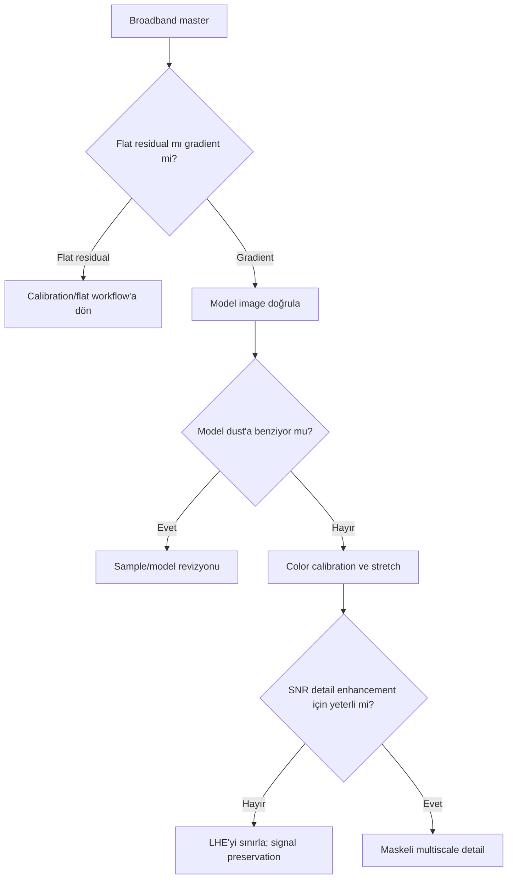

# Broadband Reflection and Dark Nebula Workflow

## Goal

Reflection nebula'nın yumuşak mavi continuum'unu ve dark nebula/molecular cloud yapısını background, gradient ve chroma noise ile karıştırmadan ortaya çıkarmak.

## Dataset assumptions, calibration ve integration quality

OSC veya mono RGB/LRGB broadband veri; matched dark/flat seti; dust/vignetting residual'ı düşük. Integration, geniş faint dust yapısını noise tabanından ayıracak SNR'a ve dither'a sahip olmalıdır. Poor flats varsa final DBE ile saklamak yerine calibration yeniden değerlendirilir.

## Exposure strategy ve philosophy

Subexposure, stars/core clipping olmadan sky background'u güvenilir örneklemelidir; toplam süre faint dust için belirleyicidir. Reflection/dark nebula geniş ve düşük frekanslı olduğundan background modelleme en kritik karardır.

## Complete sequence

1. [WBPP](../03-kalibrasyon/wbpp.md), rejection map ve walking-noise kontrolü.
2. [Gradient diagnostic](../04-gradient/gradient-diagnostics.md); flat residual ile sky gradient'i ayırın.
3. Muhafazakâr DBE/GradientCorrection; model dust'a benziyorsa sample'ları reddedin.
4. SPCC/PCC ve background neutrality.
5. Linear noise reduction; faint dust maskesiyle sinyal koruması.
6. GHS/HT ile black point headroom bırakarak stretch.
7. Büyük-kernel düşük-amount LHE; yıldızlar maskeli.
8. Curves, selective saturation ve sRGB/export proof.

## Decision points ve alternative branches

- **Urban/heavy LP:** Daha fazla model geçişi değil, model residual ve target preservation kontrolü.
- **Dark sky:** Gradient process zorunlu değildir; temiz background'u bozmayın.
- **No calibration frames:** Scientific/technical güvenilirlik sınırlıdır; synthetic düzeltmeyi calibration eşdeğeri saymayın.

## Mask, PixelMath, detail, final ve export

Luminance/RangeMask faint dust'ı NR ve Curves'ten korur; StarMask LHE ve saturation sırasında yıldızları ayırır. PixelMath yalnız maskeleri birleştirmek veya doğrulanmış channel blend için kullanılır. Reflection nebula'da düşük amount ve büyük scale, dark nebula'da DSE yerine önce LHE/Curves kıyası tercih edilir.

## Visual checkpoints

| Step | Expected | Normal variation | Warning/failure | Recovery |
|---|---|---|---|---|
| Gradient | Background dengeli, dust korunmuş | Geniş gerçek sky variation | Model nebula gibi | Sample/model revizyonu |
| Stretch | Dust belirir, black clipped değil | Faint contrast | Black crush | Stretch'e dön |
| Detail | Yumuşak yapı okunur | Dataset SNR farkı | Crunchy/noisy dust | LHE/NR azalt |
| Color | Reflection hue ve neutral background | Dust rengi değişebilir | Blue cast/cyan noise | Calibration/mask kontrolü |

## Applied troubleshooting

| Failure | Cause | Corrective action | Full reprocessing? |
|---|---|---|---|
| Dust kayboldu | Gradient model target'ı çıkardı | Model öncesine dön | Partial |
| Blue background | Calibration/gradient | SPCC/BN ve spatial model | Partial |
| Walking noise | Dither/integration yetersiz | Integration/acquisition çözümü | Gerekebilir |
| Dark halo | DSE/LHE fazla | Miktar/scale/maske azalt | Hayır |

## Practical Decision Guide

| Situation | Recommendation | Reason |
|---|---|---|
| Strong LP | Model image ve residual zorunlu | Faint dust kolay silinir |
| Poor flats | Calibration'a dön | DBE multiplicative hatanın eşdeğeri değildir |
| Low SNR | Sınırlı stretch/detail | Noise'u dust sanmayı önler |
| Excellent calibration | Gereksiz DBE uygulama | Gerçek geniş yapıyı korur |

## Visual Result Expectation

Intermediate: background smooth fakat steril değil; dust sürekliliği korunmuş. Final: reflection hue doğal, dark structures halo olmadan okunur. Under-processing flat/faint; over-processing mottled background, cyan noise ve crunchy dust üretir.

## Effort estimate, limitations, related workflows, references

Calibration review 20–35 dk; gradient 20–45 dk; color/stretch 25–40 dk; detail/final/export 25–45 dk. Temel sınırlamalar sky brightness, flat quality ve toplam SNR'dır.

[OSC Workflow](osc-workflow.md) · [Data Quality Strategies](data-quality-strategies.md) · [Gradient Workflows](../04-gradient/real-workflows.md)

## Evidence Level

Model-image ve residual kontrolü **Verified Workflow**; kernel, amount ve exposure kararları **Practical Recommendation** düzeyindedir.
