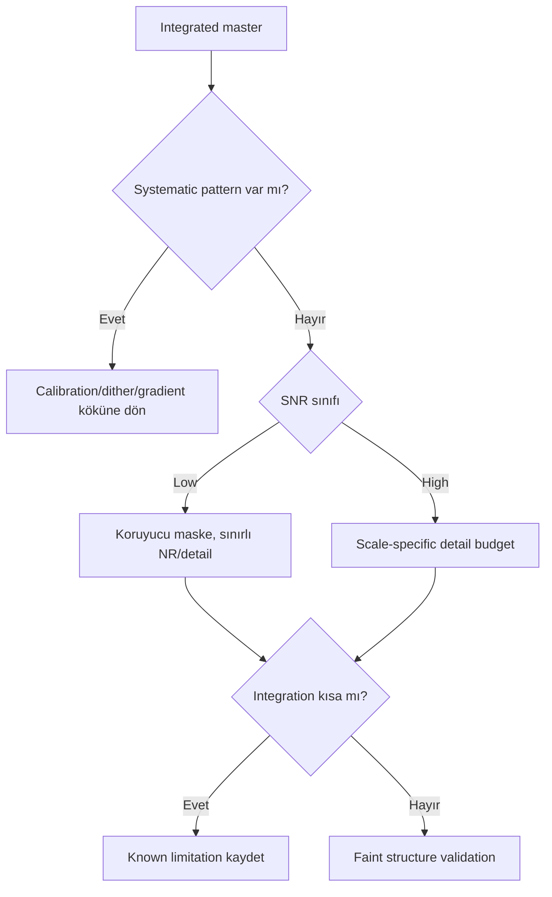

# Data Quality and Integration Strategies

## Goal

Dark sky/urban, low/high SNR ve short/long integration koşullarında aynı process listesini tekrarlamak yerine pipeline'ın hangi kararlarının değişmesi gerektiğini göstermek.

## Dataset assumptions ve calibration frames

Bu workflow target türünden bağımsızdır. Matching calibration frames ve registration tamamlanmıştır. Expected integration quality, rejection map, noise pattern, gradient amplitude, star PSF ve faint structure continuity ile değerlendirilir.

## Exposure ve integration philosophy

Subexposure clipping, tracking, sky background ve filter/camera davranışına bağlıdır. Total integration arttıkça random noise azalabilir ve rejection daha robust olabilir; systematic calibration, gradient veya walking-noise hatası yalnız süre ekleyerek garantiyle çözülmez.

## Complete process sequence

1. Subframe quality ve acquisition metadata incelemesi.
2. Calibration/integration alternatives testleri; rejection maps.
3. Gradient/noise/PSF diagnostics.
4. Hedef workflow'a göre color/channel hazırlama.
5. SNR sınıfına uygun linear NR ve restoration.
6. Headroom koruyan stretch.
7. SNR'a göre mask/detail budget.
8. Final Curves, color ve export proof.

## Condition comparison

| Condition | Priority | Avoid | Recovery |
|---|---|---|---|
| Dark sky | Faint structure preservation | Gereksiz background model | Clean master'ı koru |
| Urban/heavy LP | Gradient ve color cast ayrımı | Global SCNR ile gradient gizleme | Channel/spatial model |
| Low SNR | Signal preservation | Aggressive AI/LHE/saturation | Daha fazla data veya sınırlı işlem |
| High SNR | Scale-specific detail | Headroom'u aşırı kullanma | Maskeli hafif çoklu geçiş |
| Short integration | Noise/rejection sınırlarını kabul | Faint detail uydurma | Acquisition uzat veya muhafazakâr final |
| Long integration | Faint signal ve robust test | “Uzun = hatasız” varsayımı | Systematic residual diagnostic |

## Decision tree ve branches

## Alternative branches

- **Strong moonlight:** Frame subset karşılaştırması; channel gradient güvenilir değilse reject/reacquire.
- **Poor flats:** Flat master/optical train eşleşmesine dönün.
- **No calibration frames:** Cosmetic/gradient düzeltmeyi calibration yerine sunmayın; limitation kaydedin.
- **Weak signal:** PixelMath, AI detail ve saturation ertelenir.
- **Excellent calibration/high SNR:** Process eklemek yerine daha az intervention kullanılabilir.

## Mask, PixelMath, detail, final, export

Low SNR'da luminance/range masks korumacı; high SNR'da structure-specific maskeler daha hassas olabilir. PixelMath yalnız ölçülmüş source ilişkisinde. Multiscale detail low SNR'da minimal, high SNR'da layer/scale testleriyle. Curves her durumda clipping kontrolüyle; export bit depth ve ICC hedefe göre.

## Visual checkpoints ve applied troubleshooting

| Failure | Symptom | Cause | Corrective action | Full? |
|---|---|---|---|---|
| Walking noise | Diagonal/structured pattern | Dither/integration | Acquisition/integration'a dön | Gerekebilir |
| Over-NR | Plastic faint structure | Low SNR zorlanmış | NR checkpoint | Hayır |
| Residual gradient | Spatial background | LP/flat/model | Kök sınıflandırması | Partial |
| False detail | Crunchy/noise texture | AI/LHE/MMT fazla | Amount/scale azalt | Hayır |
| Long stack hâlâ kötü | Systematic hata | Calibration/optics | Kök aşamayı yeniden işle | Gerekebilir |

## Practical Decision Guide

| Situation | Recommendation | Reason |
|---|---|---|
| Short + low SNR | Muhafazakâr stretch ve detail | Veri sınırını aşmaz |
| Long + high SNR | Layer-specific hafif enhancement | Gerçek structure headroom'u vardır |
| Urban gradient | Model/residual checkpoint | Target removal'ı önler |
| Dark sky clean background | Gradient process atla | Gerçek faint signal korunur |

## Case Study: urban broadband imaging

Calibration sonrası LP gradient'i additive/multiplicative olarak sınıflandırılır; model image target'a benzememelidir. Color calibration yalnız clean background sonrası yapılır. Chroma NR ve saturation maskeli uygulanır.

## Case Study: weak narrowband data

En zayıf channel'da structure validity test edilir; PixelMath weight artırmak yerine daha yumuşak stretch ve OIII/SII protection mask kullanılır. Güvenilir olmayan yapı finalde zorlanmaz.

## Visual Result Expectation

Intermediate: systematic artefaktlar random noise'dan ayrılmıştır. Final: low-SNR sonuç daha sakin ve sınırlı; high-SNR sonuç daha ayrıntılı fakat doğal görünür. Under-processing ve over-processing kararı aynı hedefin checkpoint kıyasına dayanır.

## Effort, limitations, related workflows, references

Diagnostic 15–30 dk; integration review 20–45 dk; condition-specific linear/final 30–60 dk. Süreler aktif çalışmadır. Sınırlamalar acquisition'da çözülemeyen sistematik hatalar ve toplam photon budget'tır.

[Calibration](../03-kalibrasyon/index.md) · [Gradient Diagnostics](../04-gradient/gradient-diagnostics.md) · [Hata Kütüphanesi](../14-hata-kutuphanesi/index.md)

## Evidence Level

Rejection, residual ve checkpoint incelemesi **Verified Workflow**; SNR'a bağlı işlem bütçesi **Practical Recommendation** düzeyindedir.
