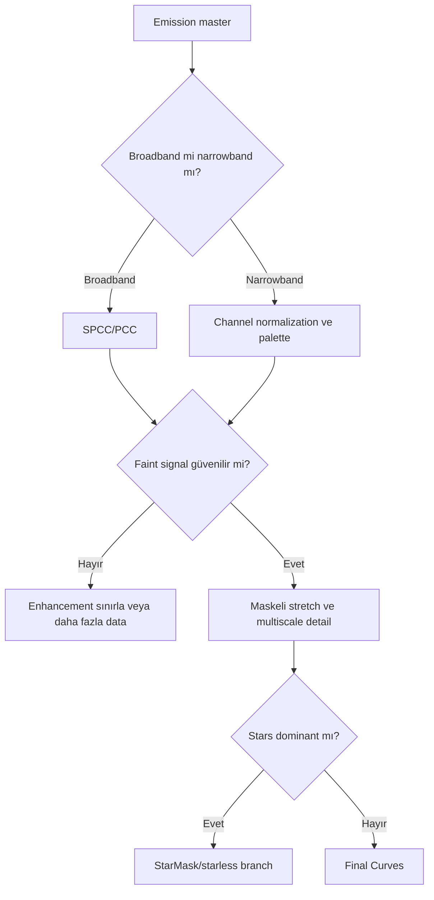

# Emission Nebula Workflow

## Goal

Emission filamentleri, geniş faint halo, star field ve background noise arasında kontrollü ayrım kurmak; broadband veya mono emission veride clipping ve yapay mikro-kontrasttan kaçınmak.

## Dataset assumptions ve required calibration

OSC broadband/dual-band veya mono Ha/OIII veri; uygun dark/flat ve gerekirse bias/dark-flat; registered, integrated masters. Expected quality, filamentlerin birden çok scale'de ve background'dan güvenilir biçimde ayrılmasıdır.

## Exposure strategy ve philosophy

Subexposure stars'ı gereksiz clip etmeden filter/sky koşulunda background'u örneklemeli; toplam integration faint halo için yeterli olmalıdır. Moonlight/LP nedeniyle gradient taşıyan kanallar ayrı modellenir. AI veya multiscale enhancement, faint signal güvenilirliği kanıtlanmadan uygulanmaz.

## Complete process sequence

1. Calibration, CosmeticCorrection gerekiyorsa doğrulama, registration/integration.
2. Gradient diagnostic; channel/model bazlı correction.
3. Broadband ise SPCC; narrowband ise channel normalization/mapping branch.
4. Linear BlurX/NR yalnız PSF ve noise kontrolüyle.
5. Luminance/Range/Star masks oluşturun.
6. HT/GHS ile kontrollü stretch.
7. Filament scale'ine uygun LHE/MMT; bright core varsa HDRMT.
8. Curves, ColorMask saturation, stars ve export.

## Decisions ve branches

- Strong moonlight: channel gradient modelleri target'a benziyorsa frame rejection/acquisition branch.
- Weak signal: PixelMath blend ve LHE geciktirilir; noise reduction gerçek filamentleri koruyacak kadar sınırlı tutulur.
- OSC dual-band: Ha/OIII ayrımı sensor/filter response'a bağlıdır; mono kanal eşdeğeri varsayılmaz.

## Mask, PixelMath, detail, final, export

Range/Luminance Mask faint halo ile bright filament arasında weight kurar; StarMask yıldız halo ve saturation'ı korur. PixelMath yalnız doğrulanmış palette/channel blend için kullanılır. LHE orta scale, MMT layer-specific detail, HDRMT yalnız unclipped bright core içindir. Final Curves global hiyerarşiyi, ColorMask saturation'ı düzenler.

## Visual checkpoints ve troubleshooting

| Stage/failure | Expected/ symptom | Cause | Recovery | Full reprocess? |
|---|---|---|---|---|
| Gradient | Halo korunur; model background | Model nebula gibi | Sample/model revizyonu | Hayır |
| Stretch | Faint halo belirir | Black clipping | Stretch checkpoint | Hayır |
| Detail | Filament doğal | Crunchy/noise | Scale/amount/mask azalt | Hayır |
| Stars | Profil ve renk tutarlı | Halo/recombination | Star mask/layer düzelt | Partial |
| Weak halo yok | SNR veya NR kaybı | Source master/history kontrol | Integration veya partial |

## Practical Decision Guide

| Situation | Recommendation | Reason |
|---|---|---|
| Weak signal | PixelMath/detail'i geciktir | Sinyal güvenilirliğini korur |
| Bright core | Maskeli HDRMT | Lokal dinamik aralık |
| Dominant stars | StarMask/starless branch | Filament contrast'ını ayırır |
| Low SNR | NR + sınırlı LHE | Noise amplification'ı azaltır |

## Visual Result Expectation

Intermediate: lineer master'da gradient residual yok, maskede gerçek emission süreklidir. Final: faint halo ile bright filament birlikte okunur, stars doğal kalır. Under-processing flat/weak structure; over-processing crunchy filament, clipped core ve dark halo üretir.

## Effort, limitations, related workflows, references

Calibration 20–40 dk; gradient/channel 20–40 dk; stretch/masks 20–35 dk; detail/final/export 30–50 dk. Sınırlamalar SNR, filter bandpass, moonlight ve star halo'dur.

[SHO/HOO](sho-hoo.md) · [OSC](osc-workflow.md) · [Maskeler](../11-maskeler/index.md)

## Evidence Level

Linear-to-nonlinear process sırası **Verified Workflow**; maske, AI ve multiscale branch'leri **Practical Recommendation** düzeyindedir.
