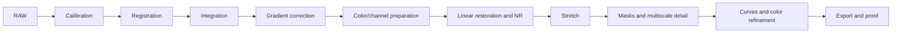
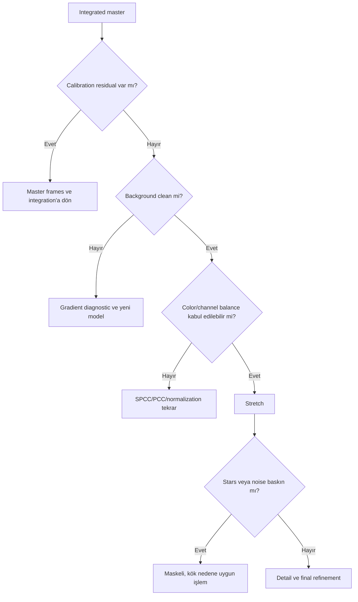

# Uygulamalı İş Akışları

## Amaç

Bu bölüm, process referanslarını gerçekçi veri koşullarında uçtan uca karar zincirlerine dönüştürür. Sabit parametre reçeteleri vermez; her adımda neden, görsel checkpoint, alternatif branch ve recovery noktası tanımlar.

## İş Akışı haritası

| İş Akışı | Ana veri/hedef | Dahil edilen alternatifler |
|---|---|---|
| [LRGB Galaxy](lrgb-galaxy.md) | Mono LRGB galaxy | Luminance olmadan RGB, high/low SNR |
| [LRGB + Ha Galaxy](lrgb-ha-galaxy.md) | M31 tipi broadband + Ha | Weak Ha, star-color protection |
| [Broadband Nebula](broadband-nebula.md) | Reflection ve dark nebula | Urban/dark sky, poor flats |
| [Emission Nebula](emission-nebula.md) | Broadband/mono emission | Weak signal, moonlight |
| [SHO ve HOO](sho-hoo.md) | Narrowband mono/dual-band | SHO without SII, weak OIII |
| [Planetary Nebula](planetary-nebula.md) | Küçük, yüksek dinamik aralıklı hedef | Bright core, star field |
| [OSC](osc-workflow.md) | Bayer/CFA tek kamera | Dual-band, heavy LP |
| [Mono](mono-workflow.md) | Filter-separated acquisition | LRGB/narrowband branch |
| [Data Quality Strategies](data-quality-strategies.md) | SNR ve integration koşulları | Short/long, low/high SNR, urban/dark sky |

## Neden sıra önemlidir?

Calibration ölçüm hatalarını giderir; registration ortak koordinat sistemini kurar; integration SNR ve rejection temelini oluşturur. Gradient ve color calibration lineer veri üzerinde çözülmeden stretch uygulanırsa spatial ve chromatic hatalar büyür. Maskeler, process etkisinin artık belirli yapıya ayrılması gerektiğinde devreye girer. LHE/HDRMT gibi multiscale işlemler çoğunlukla stretch sonrasında, yapı ölçekleri görsel olarak değerlendirilebilirken uygulanır. Curves final tonal hiyerarşiyi kurar; SCNR yalnız doğrulanmış residual bileşen varsa kullanılır.

## Ortak decision kontrol noktaları

## İşleme Felsefesi

- PixelMath, source registration/normalization doğrulanmadan kullanılmaz.
- AI tools, veri model dışı artefakt taşıyorsa veya kontrol sonucu source detail'i değiştiriyorsa ertelenir/atlanır.
- Maske, yalnız işlem başlayacağı için değil hedef ile korunacak alan ayrıştığı için oluşturulur.
- Noise reduction, noise'u gerçek faint structure'dan ayıramıyorsa güçlendirilmez.
- Her büyük adım process icon, clone veya history checkpoint ile geri alınabilir tutulur.

## İş Akışı comparison

| Karşılaştırma | Birinci yaklaşım | İkinci yaklaşım |
|---|---|---|
| LRGB vs SHO | Doğal broadband color + luminance detail | Filter mapping ve kanal dengesine dayalı palette |
| SHO vs HOO | Üç narrowband kanal, palette esnekliği | Ha/OIII ile daha az kanal ve SII gerektirmez |
| OSC vs Mono | Basit acquisition, CFA calibration | Kanal/filter kontrolü ve ayrı exposure stratejisi |
| Galaxy vs Nebula | Core/dust lane/star color | Faint extended signal/filament/background |
| Dark sky vs Urban | Daha az gradient, faint signal headroom | Gradient, color cast ve noise yönetimi öncelikli |
| Low vs High SNR | Koruma ve sınırlı enhancement | Scale-specific detail için daha fazla headroom |
| Short vs Long integration | Noise ve rejection sınırlaması | Faint structure ve robust statistics avantajı |

## Ortak visual kontrol noktaları

| Aşama | Beklenen | Uyarı | Düzeltme |
|---|---|---|---|
| Calibration | Dust/vignetting ve fixed pattern kontrol altında | Residual dust, amp glow, banding | Master eşleşmesini yeniden denetle |
| Integration | Star profile tutarlı, rejection temiz | Walking noise, satellite residual | Dither/rejection/weights aşamasına dön |
| Gradient | Background spatially dengeli, hedef korunmuş | Model hedefe benziyor | Sample/model revizyonu |
| Stretch | Faint signal görünür, uçlar clipped değil | Black/white clipping | Stretch checkpoint'e dön |
| Detail | Yapı okunur, noise/halo büyümemiş | Crunchy texture, halo | Miktar/scale/maske azalt |
| Export | Hedef viewer'da renk/ton tutarlı | Color shift, banding | ICC/bit depth/proof workflow'u |

## Kanıt Düzeyi

Bu bölümdeki process sıraları **Verified Workflow**, veri setine göre branch seçimleri **Practical Recommendation** niteliğindedir. Exposure süreleri ve sabit parametreler kamera, sky, filter ve sampling verisi olmadan önerilmez.

## Kaynaklar

- [Calibration Pipeline](../03-kalibrasyon/calibration-pipeline.md)
- [Gradient Correction](../04-gradient/index.md)
- [Color Calibration](../05-color-calibration/index.md)
- [Hata Kütüphanesi](../14-hata-kutuphanesi/index.md)
