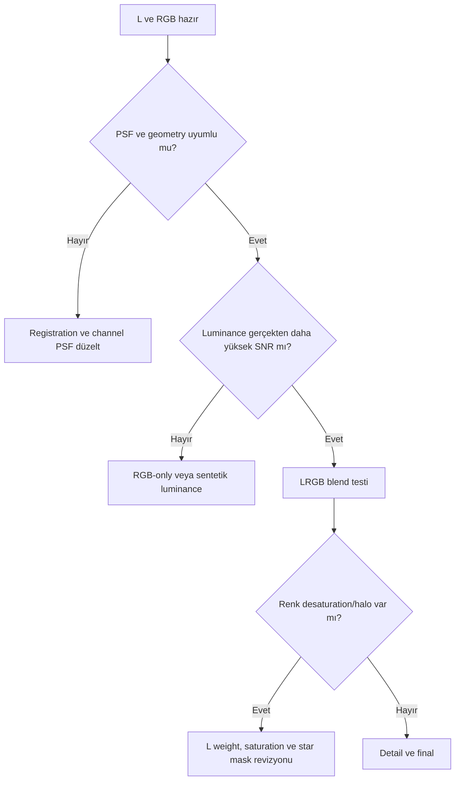

# LRGB Galaksi İş Akışı

## Amaç

Galaxy core, dust lane, dış halo ve star color arasında doğal tonal hiyerarşi kurmak; luminance ayrıntısını RGB chrominance'a halo üretmeden taşımak.

## Veri Seti Varsayımları

Registered L, R, G, B masters; aynı framing ve yakın PSF dağılımı; lineer veri. Bias/dark/flat stratejisi kamera ve exposure eşleşmesine göre kurulmuştur. Expected integration quality, background modellemeye yetecek SNR ve clipped olmayan core gerektirir.

## Gerekli Kalibrasyon Kareleri ve pozlama felsefesi

Uygun master dark/flat ve acquisition modelinin gerektirdiği bias/dark-flat kullanılır. Luminance toplam süresi yalnız “daha fazla detail” için değil, RGB'den daha yüksek SNR structure taşıması için planlanır. RGB kanalları star color ve faint halo'yu güvenilir örnekleyecek kadar entegre edilmelidir; sabit exposure süresi önerilmez.

## İşleme Felsefesi ve complete sequence

1. [WBPP](../03-kalibrasyon/wbpp.md): calibration, registration ve integration; rejection maps incelenir.
2. [Gradient correction](../04-gradient/index.md): L ve RGB kanallarında astronomik halo korunur.
3. RGB channel normalization ve [ChannelCombination](../08-lrgb/channel-combination.md).
4. RGB üzerinde [SPCC](../05-color-calibration/spcc.md); background neutrality doğrulanır.
5. L ve RGB üzerinde uygun linear restoration/NR; PSF ve SNR ayrı değerlendirilir.
6. RGB ve L kontrollü stretch edilir; histogram uçları korunur.
7. [LRGBCombination](../08-lrgb/lrgb-combination.md) veya PixelMath ile luminance blend.
8. Range/Luminance/Star masks ile [HDRMT](../12-detay-ve-kontrast/hdr-multiscale-transform.md), LHE ve Curves.
9. Saturation, star color ve [export](../13-final/export.md) proof.

## Karar Noktaları ve alternatif dallar

- **LRGB without luminance:** RGB'yi tek başına işler veya RGB'den luminance türetirsiniz; düşük kaliteli L'yi sırf mevcut diye kullanmayın.
- **High-noise RGB:** Chrominance NR ve düşük luminance contribution; color blotch kontrolü.
- **Excellent calibration:** Fazladan DBE geçişi zorunlu değildir; clean background'u modelleyerek bozmaktan kaçının.

## Maske ve PixelMath usage

StarMask, blend ve saturation sırasında yıldız profillerini korur. RangeMask core/halo ayrımı sağlar. PixelMath ancak source geometry, normalization ve range doğrulandıktan sonra kullanılır; expression ve weights process icon ile kaydedilir.

## detay, son işlemler ve dışa aktarım strateji

Core clipped değilse maskeli HDRMT; kollar için düşük amount LHE; dust lane için gerekirse DSE. Curves ile global contrast, ardından star-protected saturation. Web için sRGB PNG/JPEG; archive için XISF/FITS ve 16-bit TIFF türevi.

## Adım Kontrol Noktaları

| Adım | Beklenen görsel görünüm | Normal değişkenlik | Uyarı/hata | Düzeltme |
|---|---|---|---|---|
| RGB combine | Doğal kanal ilişkisi | Hafif cast | Sistematik yanlış hue | Mapping/calibration'a dön |
| LRGB blend | Detail artar, renk korunur | Hafif saturation kaybı | Gray galaxy, halo | Weight/PSF/mask revizyonu |
| HDR/LHE | Core ve kollar okunur | Hedefe göre farklı scale | Crunchy lane, dark halo | Miktar/scale azalt |
| Final | Star color ve faint halo korunur | Estetik contrast farkı | Clipping/neon color | Curves/saturation checkpoint |

## Uygulamalı Sorun Giderme

| Hata | Likely cause | Düzeltici eylem | Tam yeniden işleme? |
|---|---|---|---|
| Yellow core | L blend/channel balance | Blend öncesine dön | Hayır, partial |
| Colorless stars | L weight veya mask yetersiz | StarMask ve saturation restore | Hayır |
| Soft galaxy | L düşük SNR/PSF uyumsuz | L kullanımını azalt veya düzelt | Partial |
| Residual gradient | Halo sample sanılmış | Gradient modelini yeniden kur | Partial |

## Pratik Karar Rehberi

| Durum | Öneri | Gerekçe |
|---|---|---|
| Güçlü L, zayıf RGB | Muhafazakâr L weight | Chroma'yı ezmeden detail taşır |
| L düşük kalite | RGB-only branch | Kötü L görüntüyü iyileştirmez |
| Bright core | Maskeli HDRMT | Dinamik aralığı lokal yönetir |
| Dominant stars | StarMask before Curves/LHE | Halo ve color loss'u sınırlar |

## Beklenen Görsel Sonuç

Intermediate: lineer masters clean, RGB calibrated, LRGB blend renk kaybetmeden detail kazanmış olmalıdır. Final: core clipped değil, dust lane doğal, dış halo ve star color görünür. Under-processing flat arms/core; over-processing crunchy dust, gray galaxy ve dark halo ile anlaşılır.

## Tahmini Emek

| Aşama | Tahmini aktif süre |
|---|---|
| Calibration/integration review | 20–40 dk |
| Gradient/color | 20–35 dk |
| Restoration/stretch/blend | 30–50 dk |
| Detail/final/export | 30–50 dk |

Süreler compute time içermez ve veri karmaşıklığına bağlıdır.

## Beklenen Sonuç, sınırlamalar ve ilgili iş akışları

Beklenen sonuç doğal renkli, detail-rich fakat clipped olmayan galaxy'dir. L ve RGB seeing/PSF farkı, düşük RGB SNR ve optical halo temel sınırlamalardır.

[LRGB + Ha](lrgb-ha-galaxy.md) · [Mono Workflow](mono-workflow.md) · [M31 uygulaması](../20-uygulamalar/m31-lrgb-ha/index.md)

## Kanıt Düzeyi

Process sırası **Verified Workflow**; luminance weight, exposure dağılımı ve detail miktarı **Practical Recommendation** düzeyindedir.
