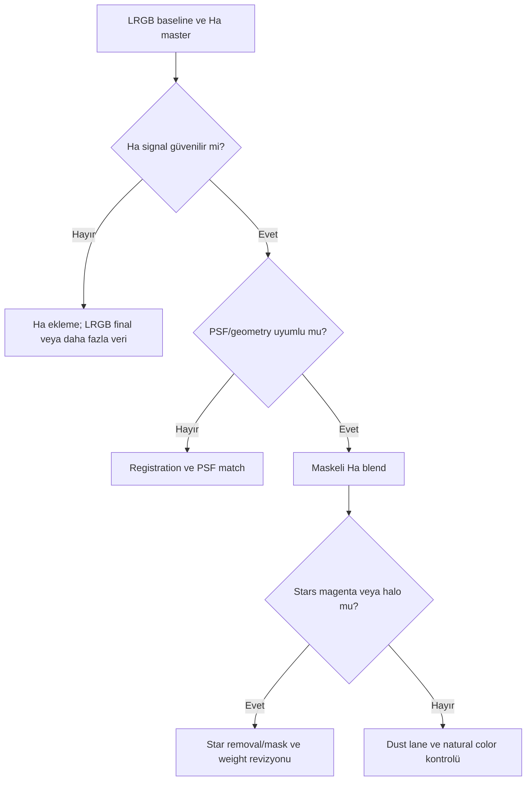

# LRGB + Ha Galaxy Workflow

## Goal

Natural broadband galaxy color'u korurken Ha star-forming regions sinyalini kontrollü eklemek; M31 tipi hedeflerde dust lane ve star color'u bozmamak.

## Dataset assumptions

Registered LRGB ve Ha masters, matched geometry, güvenilir Ha signal ve clipped olmayan galaxy core. Required calibration frames her filter/exposure koşuluyla eşleşir. Expected integration quality, Ha knots'ın background noise'dan ayrılmasını gerektirir.

## Exposure strategy ve processing philosophy

Ha exposure, yalnız parlak HII regions değil zayıf yapı için yeterli SNR sağlamalıdır. Broadband RGB natural color referansıdır; Ha, tüm red channel'ın yerine geçirilmez. PixelMath, kanal normalization ve star removal/halo kontrolü tamamlanana kadar ertelenir.

## Complete process sequence

1. LRGB ve Ha'yı ayrı [calibration/integration](../03-kalibrasyon/calibration-pipeline.md) akışlarında üretin.
2. Tüm masters'ı ortak geometriye register edin; PSF farkını ölçün.
3. Her master'da gradient düzeltin; galaxy halo'yu background sanmayın.
4. RGB combine + SPCC; Ha'yı color calibration reference olarak zorlamayın.
5. Linear NR/restoration; Ha structure mask üretin.
6. LRGB baseline oluşturun ve checkpoint alın.
7. [PixelMath HaRGB](../08-lrgb/pixelmath-lrgb.md) testlerini clone üzerinde yapın.
8. Stars/halo ve galaxy core'u maskelerle koruyun.
9. Curves, selective saturation ve export proof.

## Decision checkpoints ve branches

- **Weak Ha:** Weight artırmak yerine Ha'yı daha güçlü denoise/stretch etmenin sinyal kaybı riskini değerlendirin; gerekirse blend'i erteleyin.
- **Strong moonlight in Ha:** Background model güvenilir değilse Ha contribution uygulanmaz.
- **No luminance:** RGB + Ha workflow yapılabilir; RGB luminance/synthetic L değerlendirilir.

## Mask, PixelMath, detail ve final

Ha structure mask yalnız gerçek emission knots'ı seçer; StarMask stellar Ha contribution'ı kontrol eder. PixelMath expression sabit reçete değildir; Ha normalization ve output range test edilir. LHE dust lane ve arms için, HDRMT yalnız unclipped core için uygulanır. Curves final natural color dengesini geri kurar.

## Visual checkpoints

| Step | Expected | Warning signs | Recovery |
|---|---|---|---|
| Ha master | HII knots background'dan ayrılır | Blotchy noise, halo | Integration/NR veya daha fazla veri |
| Blend | HII bölgeleri artar, continuum korunur | Tüm galaxy kırmızı | Mask/weight azalt |
| Stars | Broadband star color korunur | Magenta/red halo | StarMask/PSF düzelt |
| Final | Ha doğal yapıya gömülür | Neon knots, dust loss | Curves/blend checkpoint |

## Applied troubleshooting

| Failure | Cause | Corrective action | Full reprocessing? |
|---|---|---|---|
| Ha kayboluyor | Weight/mask çok düşük veya NR | Ha master ve blend mask kontrolü | Partial |
| Red contamination | Global Ha addition | Structure mask ve normalization | Hayır |
| Star halo | PSF farkı/stellar Ha | PSF match ve star exclusion | Partial |
| Dust lane zayıf | Red contrast baskın | Luminance structure ve Curves revizyonu | Hayır |

## Practical Decision Guide

| Situation | Recommendation | Reason |
|---|---|---|
| Strong clean Ha | Maskeli düşük contribution | Natural RGB'yi korur |
| Weak Ha | Blend'i geciktir | Noise'u emission sanmayı önler |
| Bright stars | StarMask before PixelMath | Magenta halo riskini azaltır |
| Galaxy core clipped | Short exposure/HDR source | Process kayıp veriyi getiremez |

## Visual Result Expectation

Intermediate: LRGB tek başına tamamlanabilir kaliteye sahip, Ha maskesinde yalnız güvenilir emission görünür. Final: HII regions belirgin ama galaxy bütünü kırmızı değildir; star color ve dust lane korunur. Under-processing Ha etkisiz; over-processing neon red knots ve magenta stars üretir.

## Effort estimate

Calibration 25–45 dk; gradient/color 20–35 dk; LRGB baseline 30–45 dk; Ha blend testleri 25–50 dk; final/export 20–35 dk aktif süre.

## Expected result, limitations, related workflows ve references

Sınırlamalar: Ha ile broadband filter bandpass farkı, PSF mismatch ve low SNR. Gerçek M31 veri ayrıntıları için [M31 LRGB + Ha uygulaması](../20-uygulamalar/m31-lrgb-ha/index.md).

[LRGB Galaxy](lrgb-galaxy.md) · [PixelMath](../10-pixelmath/index.md) · [Maskeler](../11-maskeler/index.md)

## Evidence Level

Registration, source normalization ve maskeli blend sırası **Verified Workflow**; Ha contribution seçimi **Practical Recommendation** düzeyindedir.
