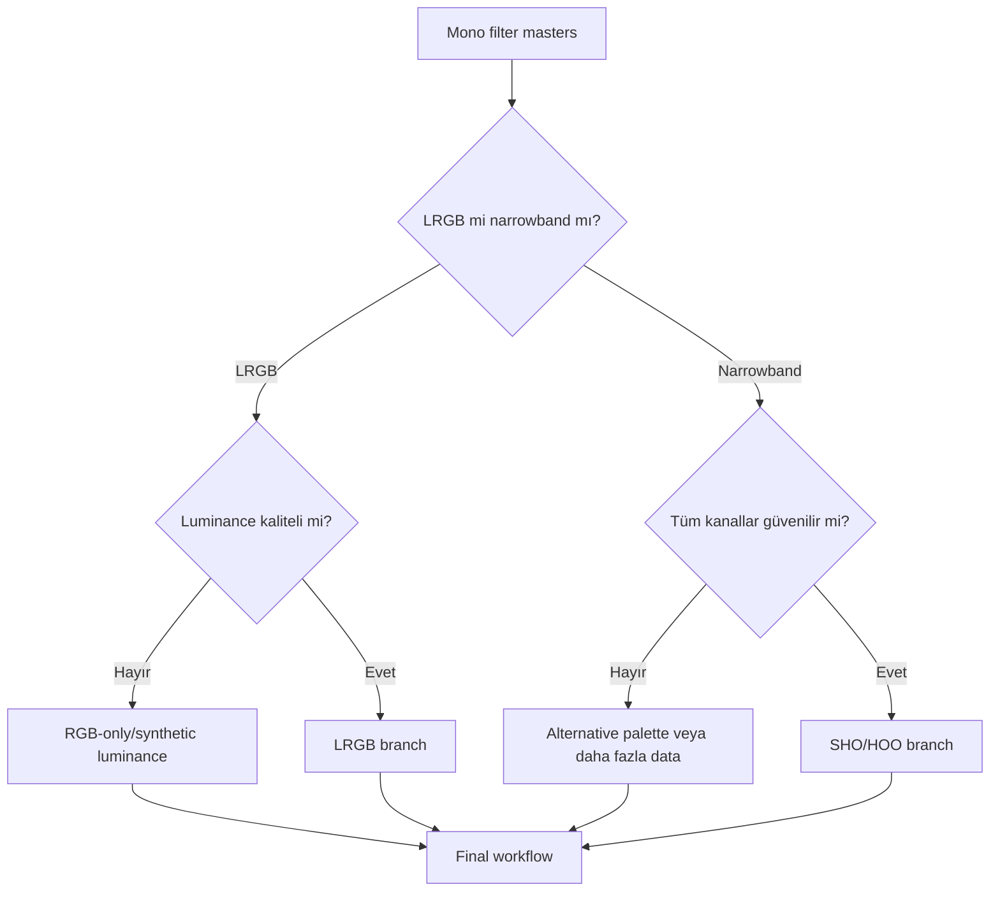

# Mono Workflow

## Goal

Mono camera filter setlerini ayrı calibration, integration, gradient, PSF ve SNR özellikleriyle yönetip LRGB veya narrowband final'e güvenilir biçimde birleştirmek.

## Dataset assumptions ve calibration requirements

Filter-tagged mono lights, matching darks/flats ve acquisition modeline göre bias/dark-flat. Her filter master'ın geometry, exposure metadata ve integration quality'si bilinir. Required calibration frames filter dust/vignetting değişimini temsil etmelidir.

## Exposure strategy ve philosophy

Her filter throughput, sky background ve target spectrum'a göre ayrı toplam süre gerektirir. Eşit sub sayısı eşit SNR değildir. Kanal birleştirme, en zayıf filter güvenilirliği ve PSF uyumu değerlendirildikten sonra yapılır.

## Complete sequence

1. Filter gruplarını WBPP ile doğru metadata/grouping altında calibrate edin.
2. Her master'ın rejection, gradient, noise ve star PSF'sini ayrı inceleyin.
3. Ortak reference ile StarAlignment; geometry doğrulaması.
4. Channel-specific gradient correction ve normalization.
5. LRGB branch: RGB combine + SPCC + L preparation.
6. Narrowband branch: SHO/HOO mapping ve weak-channel kontrolü.
7. Linear restoration/NR; sonra stretch ve blend.
8. Masks, detail, Curves, saturation ve export.

## Decisions ve branches

- **Excellent calibration:** Her kanalda gereksiz DBE uygulamayın.
- **Poor flats:** Filter-specific flat setine dönün.
- **LRGB without L:** RGB-only sonuç teknik olarak geçerlidir.
- **SHO without SII:** HOO veya belgelenmiş alternative mapping.

## Mask, PixelMath, detail, final, export

Channel masks weak signal'i korur; StarMask PSF farkı ve saturation için; luminance mask SNR weighting için kullanılır. PixelMath source IDs, symbols, mapping ve output range açıkça kaydedilir. Detail master/target scale'e göre; Curves ve saturation final combined görüntüde maskeli uygulanır.

## Visual checkpoints ve troubleshooting

| Stage/failure | Expected | Cause | Recovery | Full? |
|---|---|---|---|---|
| Masters | Filter kimliği doğru | Metadata/grouping yanlış | WBPP group'a dön | Partial/full |
| Registration | Star residual düşük | Reference/distortion/PSF | Yeniden register | Partial |
| Combine | Mapping doğru | Source/normalization hatası | Channel/PXMath düzelt | Hayır |
| Blend | Renk/detail dengeli | L/weak channel baskısı | Weight/mask revizyonu | Hayır |

## Practical Decision Guide

| Situation | Recommendation | Reason |
|---|---|---|
| Filter PSF farklı | Match/protect before combine | Color halo'yu azaltır |
| Weak channel | Weight zorlamak yerine SNR kontrolü | Noise contamination önler |
| Poor flats | Calibration'a dön | Gradient process eşdeğer değildir |
| No luminance | RGB-only branch | Düşük kaliteli L'den güvenlidir |

## Visual Result Expectation

Intermediate: filter masters registered, gradient-corrected ve noise karakteri bilinir. Final: channel mapping doğru, halo yok, zayıf channel kaybolmamış. Under-processing channel imbalance; over-processing weak-channel noise ve false color üretir.

## Effort, limitations, related workflows, references

Calibration review 30–60 dk; registration/gradient 25–50 dk; combine/stretch 30–50 dk; detail/final 25–45 dk. Sınırlamalar filter throughput, PSF ve acquisition coverage'dır.

[LRGB Galaxy](lrgb-galaxy.md) · [SHO/HOO](sho-hoo.md) · [ChannelCombination](../08-lrgb/channel-combination.md)

## Evidence Level

Filter identity, geometry ve source mapping kontrolleri **Verified Workflow**; exposure ve weight dağılımı **Practical Recommendation** düzeyindedir.
