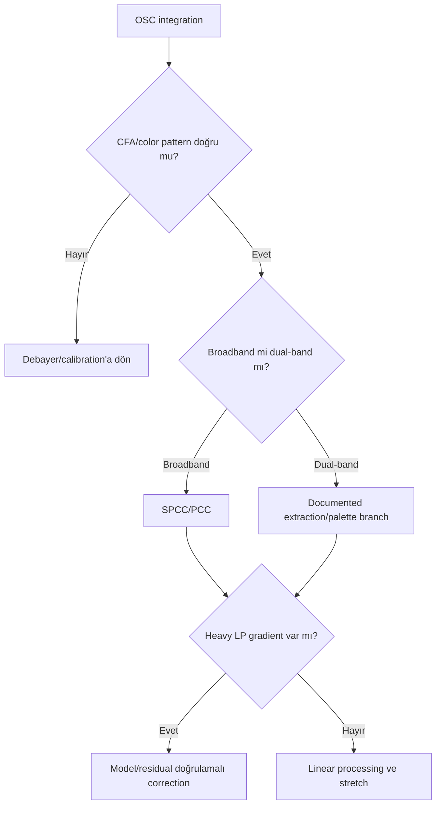

# OSC İş Akışı

!!! info "Sayfa Bilgisi"
    **Kategori:** Uygulamalı İş Akışları · **Düzey:** Advanced · **Tahmini okuma:** 3 dk
    **Anahtar kelimeler:** `OSC İş Akışı` · `OSC` · `One Shot Color` · `color camera` · `workflow` · `iş akışı` · `image processing`

## Amaç

CFA/Bayer tek kamera verisini doğru calibration ve debayer sırasıyla işlemek; broadband veya dual-band acquisition'da gradient, color calibration, chroma noise ve yıldızları kontrollü yönetmek.

## Veri Seti Varsayımları ve kalibrasyon kareleri

Raw CFA lights; matching darks ve flats; acquisition modeline göre bias/dark-flat. CFA pattern, gain/offset, temperature ve geometry metadata'sı korunmuştur. Expected integration quality, debayer artefaktı, walking noise ve rejection residual'ı içermeyen color master'dır.

## Pozlama Stratejisi ve felsefe

Subexposure sky/filter koşuluna bağlıdır; fixed “OSC süresi” yoktur. Dither, color interpolation sonrası correlated noise riskini azaltmak için önemlidir. Dual-band filter output'u gerçek ayrı mono Ha/OIII ölçümüyle eşdeğer varsayılmaz.

## Tam İşlem Sırası

1. [WBPP](../03-kalibrasyon/wbpp.md): CFA calibration, debayer, registration, integration sırasını doğrulayın.
2. Rejection maps, CFA pattern ve star color kontrolü.
3. Gradient diagnostic/DBE/GradientCorrection.
4. Broadband: SPCC/PCC; dual-band: channel/palette branch.
5. Linear BlurX/NoiseX veya conventional NR, maskeli ve kontrollü.
6. HT/GHS stretch.
7. Star/Range/Luminance masks; LHE/MMT/HDRMT ihtiyaca göre.
8. Curves, saturation, gerekirse doğrulanmış SCNR.
9. sRGB web veya TIFF/archive export.

## Kararlar ve alternatifler

- **No calibration frames:** Hot pixels, vignetting ve dust güvenilir biçimde ayrıştırılamaz; synthetic corrections calibration yerine geçmez.
- **Heavy LP:** Background color cast ile global SCNR'yi karıştırmayın.
- **Dual-band:** SHO without SII değildir; HOO-benzeri mapping açıkça belgelenir.

## Maske, PixelMath, detay, son işlemler, dışa aktarım

Luminance/RangeMask düşük SNR background'u korur; StarMask chromatic star halo için kullanılır. PixelMath channel extraction/blend ancak filter response ve source range anlaşılmışsa uygulanır. Chroma noise saturation'dan önce kontrol edilir. Final sRGB conversion ve browser proof yapılır.

## Görsel Kontrol Noktaları ve sorun giderme

| Aşama/hata | Beklenen | Neden | Düzeltme | Tam yeniden işleme? |
|---|---|---|---|---|
| Debayer | Yıldız rengi spatially tutarlı | CFA pattern yanlış | Calibration/debayer'a dön | Evet, partial pipeline |
| Gradient | Hedef korunur | LP model target'ı çıkardı | Model revizyonu | Hayır |
| Color | Nötr background | Calibration/cast | SPCC/BN/gradient review | Partial |
| Final | Chroma noise düşük | Saturation/LHE fazla | Mask/amount azalt | Hayır |

## Pratik Karar Rehberi

| Durum | Öneri | Gerekçe |
|---|---|---|
| Broadband OSC | SPCC/PCC after gradient | Photometric color foundation |
| Dual-band OSC | Açık extraction/mapping | Mono kanal eşdeğeri varsaymaz |
| Heavy LP | Gradient model + color review | Spatial ve global cast'ı ayırır |
| Walking noise | Dither/integration'a dön | Final NR kök nedeni çözmez |

## Beklenen Görsel Sonuç

Intermediate: CFA artefaktı yok, background dengeli, color calibration ölçülebilir. Final: chroma noise ve star halo kontrollü, hedef rengi tutarlı. Under-processing color cast/flat contrast; over-processing neon saturation ve mottled background üretir.

## Tahmini Emek, sınırlamalar, ilgili iş akışları, kaynaklar

Calibration review 20–35 dk; gradient/color 20–40 dk; linear/stretch 25–40 dk; final/export 25–40 dk. Sınırlamalar CFA sampling, filter response, LP ve total SNR'dır.

[Broadband Nebula](broadband-nebula.md) · [SHO/HOO](sho-hoo.md) · [WBPP](../03-kalibrasyon/wbpp.md)

## Kanıt Düzeyi

CFA calibration ve debayer sırasının doğrulanması **Verified Workflow**; dual-band extraction/mapping seçimi **Practical Recommendation** düzeyindedir.

## Kullanılan Süreçler

- [WBPP](../03-kalibrasyon/wbpp.md)
- [ImageCalibration](../03-kalibrasyon/image-calibration.md)
- [DBE](../04-gradient/dbe.md)
- [SPCC](../05-color-calibration/spcc.md)
- [BlurXTerminator](../06-ai-eklentileri/blurxterminator.md)
- [HistogramTransformation](../07-stretch/histogram-transformation.md)
- [CurvesTransformation](../13-final/curves-transformation.md)

## Önceki Bölüm

[← Gezegenimsi Nebula](planetary-nebula.md)

## Sonraki Bölüm

[Mono İş Akışı →](mono-workflow.md)
