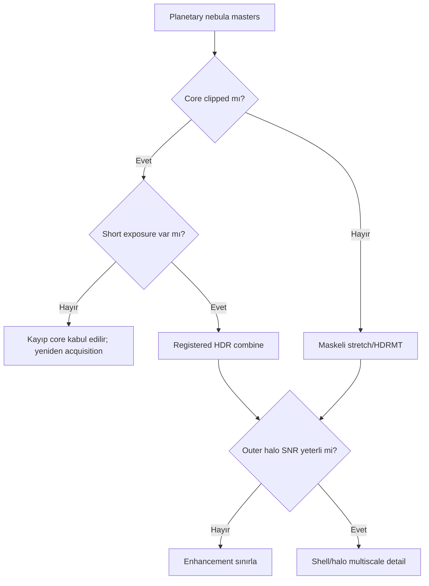

# Gezegenimsi Nebula İş Akışı

!!! info "Sayfa Bilgisi"
    **Kategori:** Uygulamalı İş Akışları · **Düzey:** Advanced · **Tahmini okuma:** 3 dk
    **Anahtar kelimeler:** `Gezegenimsi Nebula` · `planetary nebula` · `narrowband` · `high dynamic range` · `small target` · `workflow`

## Amaç

Küçük açısal boyutlu planetary nebula'da bright core, inner shell, faint outer halo ve yıldız alanını farklı scale ve dinamik aralık gereksinimleriyle birlikte korumak.

## Veri Seti Varsayımları ve kalibrasyon gereksinimleri

OSC, LRGB veya narrowband masters; iyi sampling/focus; uygun dark/flat; registration residual'ı düşük. Expected integration quality, core'un clipped olmaması ve outer halo'nun background noise'dan ayrılmasıdır. Short core exposures varsa HDR branch için ayrıca register edilir.

## Pozlama Stratejisi ve işleme felsefesi

Tek exposure hem bright core hem faint halo'yu kapsamayabilir. Saturated core için postprocessing recovery beklenmez; kısa ve uzun exposure setleri ayrı integrate edilip kontrollü HDR combine yapılır. Küçük hedefte bir kernel/layer değişimi nesnenin büyük kısmını etkileyebilir.

## Tam İşlem Sırası

1. Exposure gruplarını ayrı [calibrate/integrate](../03-kalibrasyon/calibration-pipeline.md) edin.
2. Short/long masters ve channels ortak geometriye register edilir.
3. Gradient correction target'tan uzak background örnekleriyle yapılır.
4. Color calibration veya narrowband mapping.
5. Linear PSF/restoration ve NR; core/halo ayrı maskelenir.
6. Kontrollü stretch veya short/long HDR combine.
7. Maskeli HDRMT core, MMT/LHE shell scale'leri.
8. Star protection, Curves/saturation ve export.

## Kararlar ve alternatifler

- **Strong gradients/moonlight:** Tiny target avantaj sağlar ama background model yıldız halo'larını sample sanmamalıdır.
- **No short exposures:** HDRMT clipped data'yı geri getirmez.
- **High-noise outer halo:** Core için güçlü işlem yapıp halo'yu zorlamayın; iki bölgeyi ayrı maskelerle yönetin.

## Maske, PixelMath, detay, son işlemler, dışa aktarım

RangeMask core/shell/halo bandlarını; StarMask field stars'ı ayırır. PixelMath yalnız registered short/long veya channel blend için, range testleriyle kullanılır. HDRMT core dynamic range; MMT shell detail; büyük radius LHE outer halo için düşük amount ile denenir. Final Curves yıldız/core clipping'i korur.

## Görsel Kontrol Noktaları ve sorun giderme

| Aşama/hata | Beklenen | Neden | Düzeltme | Tam yeniden işleme? |
|---|---|---|---|---|
| Core | İç yapı okunur | Saturation | Short exposure/HDR source | Acquisition gerekebilir |
| Shell | Kenar doğal | Over-sharpening | MMT/BXT azalt | Hayır |
| Halo | Faint ve continuous | Noise/gradient | Mask/gradient/NR review | Partial |
| Stars | Profil tutarlı | Halo/PSF mismatch | StarMask/PSF review | Partial |

## Pratik Karar Rehberi

| Durum | Öneri | Gerekçe |
|---|---|---|
| Clipped core | Short exposure HDR branch | Kayıp veriyi gerçek source ile tamamlar |
| Clean core, high dynamic range | Maskeli HDRMT | Lokal contrast'ı yönetir |
| Weak halo | Daha fazla integration veya sınırlı enhancement | Noise amplification'ı önler |
| Dense stars | StarMask before detail | Yıldız halo'larını sınırlar |

## Beklenen Görsel Sonuç

Intermediate: core unclipped veya HDR source ile tamamlanmış, shell ve halo maskeleri ayrılmıştır. Final: core, shell ve halo birlikte okunur; stars doğal kalır. Under-processing core featureless/halo görünmez; over-processing bright/dark rings ve crunchy shell üretir.

## Tahmini Emek, sınırlamalar, ilgili iş akışları, kaynaklar

Calibration/integration 25–45 dk; HDR/channel prep 25–50 dk; stretch/detail 30–50 dk; final/export 20–30 dk. Sınırlamalar seeing, sampling, core saturation ve halo SNR'dır.

[Emission Nebula](emission-nebula.md) · [HDRMT](../12-detay-ve-kontrast/hdr-multiscale-transform.md) · [StarMask](../11-maskeler/star-mask.md)

## Kanıt Düzeyi

Clipped core için gerçek short-exposure source gereksinimi **Verified Workflow**; scale/detail seçimi **Practical Recommendation** düzeyindedir.

## Kullanılan Süreçler

- [WBPP](../03-kalibrasyon/wbpp.md)
- [DBE](../04-gradient/dbe.md)
- [BlurXTerminator](../06-ai-eklentileri/blurxterminator.md)
- [StarXTerminator](../06-ai-eklentileri/starxterminator.md)
- [GeneralizedHyperbolicStretch](../07-stretch/generalized-hyperbolic-stretch.md)
- [HDRMultiscaleTransform](../12-detay-ve-kontrast/hdr-multiscale-transform.md)

## Önceki Bölüm

[← SHO ve HOO Narrowband](sho-hoo.md)

## Sonraki Bölüm

[OSC İş Akışı →](osc-workflow.md)
