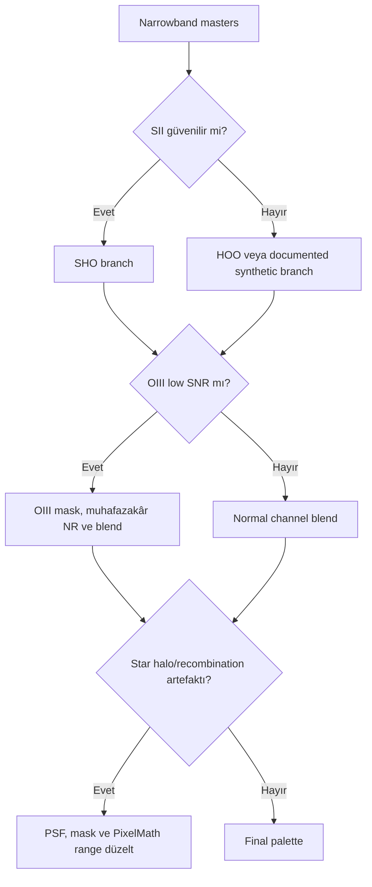

# SHO ve HOO Narrowband İş Akışı

## Amaç

Ha, OIII ve varsa SII sinyalini registration, normalization ve SNR farklarını gözeterek birleştirmek; OIII'yi koruyan, halo üretmeyen ve palette kararını açıkça kaydeden narrowband sonuç üretmek.

## Veri Seti Varsayımları, calibration ve entegrasyon kalitesi

Mono SII/Ha/OIII veya OSC dual-band derived channels; filter/exposure ile eşleşen calibration frames; matched geometry. Her channel master'da gerçek signal structure, gradient ve noise ayrı değerlendirilir. SII/OIII düşük SNR ise palette weight ile gizlenmez.

## Pozlama Stratejisi ve felsefe

Toplam süre target'ın zayıf kanalına göre planlanır; eşit exposure eşit SNR anlamına gelmez. SHO üç kanal mapping esnekliği, HOO iki kanal simplicity sunar. SHO without SII durumunda sahte SII üretmek yerine HOO veya açıkça tanımlı synthetic branch seçilir.

## Tam İşlem Sırası

1. Her filter için calibration/integration ve rejection review.
2. Ortak StarAlignment; PSF/geometry kontrolü.
3. Channel-specific gradient correction.
4. Linear normalization ve NR/restoration.
5. SHO/HOO [PixelMath mapping](../09-narrowband/index.md); expression kaydı.
6. GHS/HT stretch; starless branch varsa stars/starsless residual kontrolü.
7. ColorMask, luminance ve OIII protection masks.
8. LHE/MMT/HDRMT ihtiyaca göre; Curves final palette.
9. Star recombination ve export proof.

## Karar Ağacı ve alternatifler

## SHO ve HOO

| Ölçüt | SHO | HOO |
|---|---|---|
| Channels | SII, Ha, OIII | Ha, OIII |
| Güç | Palette separation | Daha az source ve doğal cyan/red ayrımı |
| Sınırlama | Zayıf SII ve green dominance | İki kanal ayrımı/synthetic green kararı |
| Düzeltme | HOO branch veya daha fazla SII | OIII SNR ve blend revizyonu |

## Maske, PixelMath, detay, son işlemler ve dışa aktarım

OIII mask gerçek cyan structure'ı SCNR/Curves'ten korur; StarMask stellar halo ve recombination'ı sınırlar. PixelMath output range, channel mapping ve symbols açık tutulur. NGC 6888 benzeri hedefte shell/OIII halo için farklı scale maskeleri kullanılır. SCNR zorunlu değildir; meşru green/cyan sinyali silebilir.

## Görsel Kontrol Noktaları ve uygulamalı sorun giderme

| Adım/hata | Beklenen | Neden | Düzeltme | Tam yeniden işleme? |
|---|---|---|---|---|
| Channel prep | Geometry/PSF uyumlu | Registration mismatch | Yeniden register | Partial |
| Palette | Kanallar ayırt edilebilir | Ha dominant | Normalize/weight revizyonu | Hayır |
| OIII kaybı | OIII structure korunur | NR/SCNR/blend | OIII checkpoint/mask | Partial |
| Halo | Stars doğal | PSF/recombination | Star mask/range düzelt | Partial |
| Crunchy shell | Detail doğal | LHE/MMT fazla | Scale/amount azalt | Hayır |

## Pratik Karar Rehberi

| Durum | Öneri | Gerekçe |
|---|---|---|
| SHO without SII | HOO veya açık synthetic branch | Olmayan ölçümü varsaymaz |
| Weak OIII | Maskeli koruma, PixelMath'i geciktir | Noise'u signal sanmayı önler |
| Green palette | SCNR'yi otomatik kullanma | Meşru narrowband mapping korunur |
| Star halo | PSF + StarMask + recombination review | Kök neden ayrılır |

## Vaka Çalışması: NGC 6888 SHO

Focus: Ha shell, OIII outer structure, star halo ve palette balance. Önce kanal registration/gradient; sonra OIII protection mask; kontrollü SHO blend; shell scale'inde LHE; star recombination residual kontrolü. [Ayrıntılı NGC 6888 uygulaması](../20-uygulamalar/ngc6888-sho/index.md).

## Vaka Çalışması: weak narrowband data

En zayıf channel'da structure validity test edilir. Strong stretch veya AI restoration yerine maskeli NR, daha yumuşak GHS ve sınırlı detail uygulanır. Güvenilir olmayan kanal palette ağırlığıyla zorlanmaz.

## Beklenen Görsel Sonuç

Intermediate: her channel kendi structure/noise karakterini korur. Final: palette dengeli, OIII kaybolmamış, halo/recombination temizdir. Under-processing muddy palette; over-processing neon color, black clipping ve crunchy shell üretir.

## Tahmini Emek, sınırlamalar, ilgili iş akışları, kaynaklar

Channel prep 30–50 dk; mapping/stretch 25–45 dk; masks/detail 30–50 dk; final/export 20–35 dk. Sınırlamalar zayıf kanal SNR, filter halo ve PSF farkıdır.

[OIII Kaybolması](../14-hata-kutuphanesi/oiii-kaybolmasi.md) · [Narrowband](../09-narrowband/index.md) · [PixelMath](../10-pixelmath/index.md)

## Kanıt Düzeyi

Channel identity, registration ve expression kaydı **Verified Workflow**; palette ve channel weight seçimleri **Practical Recommendation** düzeyindedir.
